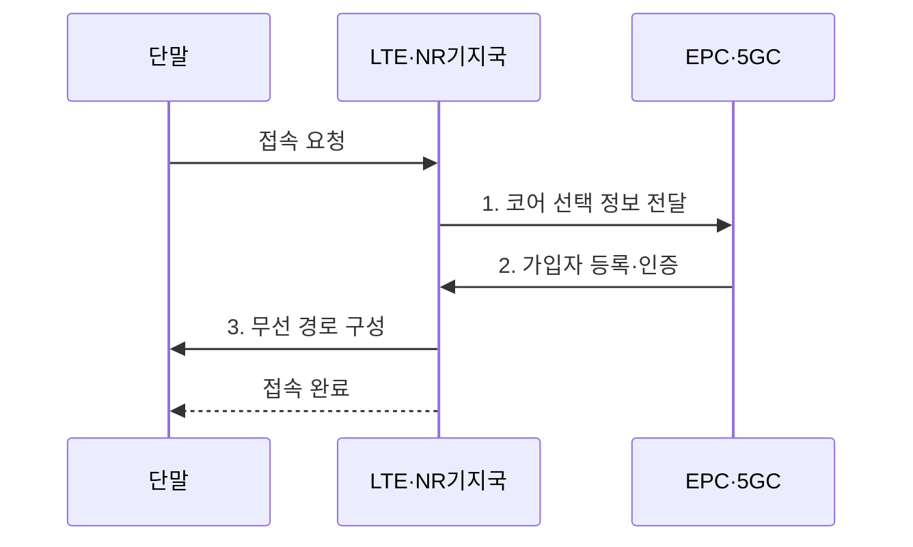

---
sidebar:
  order: 37
  label: "037. 5G SA와 NSA"
  badge: { text: "기출 · 70%", variant: note }
title: "5G SA와 NSA"
date: "2026-07-31T11:02:01+09:00"
tags: ["notes-network"]
weight: 37
extra:
  question_no: "037"
  source_status: "기출"
  source_history: "135회"
  priority: 70
  priority_note: "135회 출제"
---

## Ⅰ. 개요

핵심 용어

- **단독 구성(Standalone, SA)·비단독 구성(Non-Standalone, NSA)**: 롱텀 에볼루션(Long Term Evolution, LTE) 코어 의존 여부에 따라 5세대 이동통신(Fifth Generation, 5G) 무선과 코어망을 구성하는 두 가지 구축 방식
- **5세대 코어(5G Core, 5GC)**: 5G의 가입자 등록·세션·슬라이싱을 제어하는 독립 코어망

- 정의/개념: LTE 코어 의존 여부로 구분하는 **5G 무선·코어 구축 방식**
- 배경/필요성: 전면 5GC 전환은 **투자·단말·음성 호환 부담**

#### 한줄 요약

- NSA는 LTE 동행, SA는 5G 독립 운용이다.

## Ⅱ. 특징

핵심 용어

- **비단독 구성(Non-Standalone, NSA)**: 롱텀 에볼루션(Long Term Evolution, LTE)의 진화형 패킷 코어(Evolved Packet Core, EPC)와 제어망에 5세대 뉴 라디오(5G New Radio, 5G NR)를 결합해 기존 자산으로 빠르게 도입하는 구축 방식
- **단독 구성(Standalone, SA)**: 5G NR과 5세대 코어(5G Core, 5GC)만으로 독립적인 등록·세션을 제공하는 구축 방식
- **뉴 라디오 음성통화(Voice over New Radio, VoNR)**: SA의 5G 무선과 코어에서 종단 음성 서비스를 제공하는 방식

- **NSA의 LTE·EPC 제어 및 NR 이중 연결**
- **SA의 NR·5GC 기반 독립 등록·세션**
- SA의 **슬라이싱·저지연·VoNR**, NSA의 빠른 도입

#### 한줄 요약

- 같은 5G 표시라도 연결된 코어가 다를 수 있다.

## Ⅲ. 구조 및 구성요소

핵심 용어

- **진화형 패킷 코어(Evolved Packet Core, EPC)**: 롱텀 에볼루션(Long Term Evolution, LTE) 가입자 등록과 데이터 세션을 제어하며 비단독 구성(Non-Standalone, NSA)의 코어 역할을 하는 패킷 코어망
- **5세대 코어(5G Core, 5GC)**: 5세대 이동통신(Fifth Generation, 5G)의 가입자·세션·슬라이스를 제어하며 단독 구성(Standalone, SA)을 구성하는 코어망

5세대 뉴 라디오(5G New Radio, 5G NR)는 단말과 기지국 사이의 5G 무선 접속을 제공한다.

| 구성요소 | 책임 |
|:---|:---|
| NSA 단말 | LTE·NR **이중 연결** 역량 제공 |
| LTE·NR 이중 연결 | LTE 제어와 **NR 데이터** 결합 |
| LTE 코어(EPC) | NSA **가입·세션** 제어 |
| SA 단말 | NR·5GC **독립 접속** 역량 제공 |
| NR 단독 연결 | 5GC로 **제어·사용자면** 전달 |
| 5G 코어(5GC) | SA 가입·세션·**슬라이스** 제어 |

#### 한줄 요약

- NSA는 EPC, SA는 5GC가 연결을 지휘한다.

## Ⅳ. 흐름도

핵심 용어

- **이중 연결**: 단말이 롱텀 에볼루션(Long Term Evolution, LTE)과 뉴 라디오(New Radio, NR) 무선 링크를 함께 사용해 제어와 데이터를 전달하는 비단독 구성(Non-Standalone, NSA) 연결 방식
- **NR 단독 연결**: 단말이 LTE 제어망 없이 NR을 통해 5세대 코어(5G Core, 5GC)에 접속하는 단독 구성(Standalone, SA) 연결 방식
- **진화형 패킷 코어(Evolved Packet Core, EPC)**: NSA 가입자 등록과 데이터 세션을 제어하는 LTE 코어망

**동작 원리**

1. **코어 선택 정보 전달**: NSA는 EPC, SA는 5GC 경로 지정
2. **가입자 등록·인증**: 선택된 코어가 가입 권한과 세션 확인
3. **무선 경로 구성**: NSA는 이중 연결, SA는 NR 단독 연결 수립

#### 한줄 요약

- 접속 뒤 실제 제어망과 기능을 확인한다.

## Ⅴ. 종류 및 비교

핵심 용어

- **뉴 라디오 음성통화(Voice over New Radio, VoNR)**: 5세대 이동통신(Fifth Generation, 5G) 무선과 코어에서 종단 음성 서비스를 제공하는 방식
- **네트워크 슬라이싱**: 하나의 5G 망을 서비스 요구별 논리망으로 분리해 자원·정책·품질을 독립 운영하는 기술

단독 구성(Standalone, SA)은 5세대 뉴 라디오(5G New Radio, 5G NR)와 5세대 코어(5G Core, 5GC)를 사용하고, 비단독 구성(Non-Standalone, NSA)은 롱텀 에볼루션(Long Term Evolution, LTE) 제어망을 함께 사용한다.

| 5G 구축 방식 | SA | NSA |
|:---|:---|:---|
| 적용 기준 | **슬라이싱·저지연·VoNR** | 빠른 도입·**LTE 자산** 활용 |
| 핵심 특징 | **NR·5GC** 독립 구성 | **LTE 제어·NR** 결합 |
| 한계 | **전환 비용**·단말 호환 | **LTE 의존**·기능 제한 |

> 요약: 5GC 기능·LTE 자산으로 구성 선택

#### 한줄 요약

- 빠른 전환은 NSA, 5G 완전 기능은 SA이다.

## Ⅵ. 실무 고려사항 및 대책

핵심 용어

- **통화 연속성**: 단독 구성(Standalone, SA) 전환이나 이동 중에도 단말의 음성 통화가 끊기지 않고 이어지는 성질
- **과금 기록**: 코어망이 세션별 사용량과 정산 근거를 기록한 데이터이다.

단독 구성(Standalone, SA)과 비단독 구성(Non-Standalone, NSA)의 전환기에는 5세대 이동통신(Fifth Generation, 5G) 뉴 라디오 음성통화(Voice over New Radio, VoNR), 롱텀 에볼루션(Long Term Evolution, LTE), 진화형 패킷 코어(Evolved Packet Core, EPC)를 함께 검증한다.

| 문제 | 대책 | 효과 |
|:---|:---|:---|
| **SA 단말·음성** 미지원 | 단말·VoNR·로밍 조합 시험 | 전환 중 **통화 연속성** 보장 |
| **NSA의 LTE 의존** | EPC 용량·장애 영향 계측 | **5G 서비스 연속성** 확보 |
| **이중 코어 과금** 불일치 | 세션·과금 기록 교차 검증 | **정산 오류** 방지 |

#### 한줄 요약

- SA 전환 전에 단말이 새 코어와 음성 방식을 지원하는지 확인해 통화 중단을 피한다.

## Ⅶ. 결론

핵심 용어

- **전환 기준**: 필요한 5세대 이동통신(Fifth Generation, 5G) 코어(5G Core, 5GC) 기능과 기존 롱텀 에볼루션(Long Term Evolution, LTE) 자산의 가치·단말 호환성을 비교해 단독 구성(Standalone, SA) 도입 시점을 정하는 기준

비단독 구성(Non-Standalone, NSA)은 기존 자산 활용에, 뉴 라디오 음성통화(Voice over New Radio, VoNR)는 5G 독립 음성 제공에 적합하다.

- LTE 자산·호환 유지 시 **NSA**, 슬라이싱·VoNR 필요 시 **SA** 전환

#### 한줄 요약

- 필요한 5G 코어 기능과 기존 LTE 자산의 가치를 비교해 독립 전환 시점을 정해야 한다.
