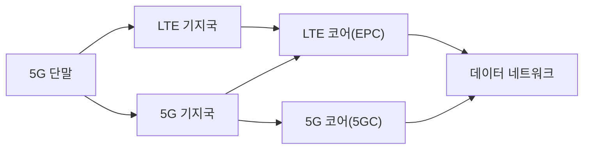
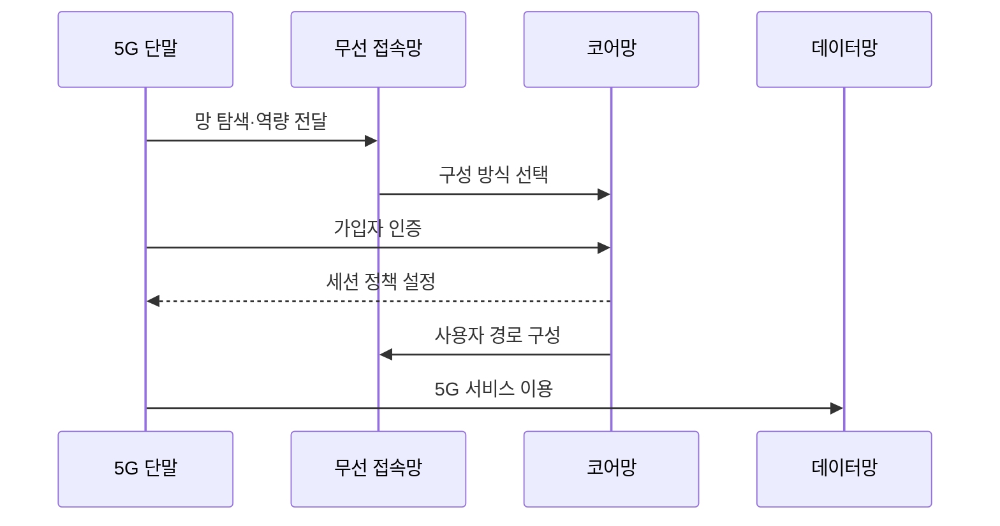

---
sidebar:
  order: 37
  label: "037. 5G SA와 NSA"
  badge: { text: "기출 · 70%", variant: note }
title: "5G SA와 NSA"
date: "2026-07-25T19:37:00+09:00"
tags: ["notes-network"]
weight: 37
extra:
  question_no: "037"
  source_status: "기출"
  source_history: "135회"
  priority: 70
  priority_note: "135회 출제"
---

## 미리 알고가기

- **비단독 구성(Non-Standalone, NSA)**: ‘엔에스에이’로 읽고 영문 핵심어의 머리글자를 딴 표기이며 LTE 코어와 제어망에 5G 무선을 결합함
- **단독 구성(Standalone, SA)**: ‘에스에이’로 읽고 Standalone을 두 의미 단위의 머리글자로 나타낸 관례 표기이며 5G 무선과 5G 코어로 독립 구성함
- **세대 표기(4G·5G)**: 각각 ‘포지·파이브지’로 읽고 이동통신 세대를 숫자와 Generation의 머리글자 G로 나타내며 LTE와 5G 서비스 세대를 구분함
- **장기 진화(Long Term Evolution, LTE)**: ‘엘티이’로 읽고 세 영문 단어의 머리글자를 딴 표기이며 4G 무선 접속 규격임
- **진화 패킷 코어(Evolved Packet Core, EPC)**: ‘이피시’로 읽고 세 영문 단어의 머리글자를 딴 표기이며 LTE의 가입자·세션을 제어함
- **5G 코어(5G Core, 5GC)**: ‘파이브지 코어’로 읽고 세대 표기 5G 뒤에 Core의 C를 붙인 표기이며 5G의 가입자·세션·슬라이스를 제어함
- **새 무선(New Radio, NR)**: ‘엔알’로 읽고 두 영문 단어의 머리글자를 딴 표기이며 5G 무선 접속 규격임
- **이중 연결**: LTE와 NR을 함께 연결
- **새 무선 기반 음성(Voice over New Radio, VoNR)**: ‘브이오엔알’로 읽고 Voice over의 Vo와 New Radio의 머리글자를 결합한 표기이며 5G 무선·코어에서 제공하는 음성 서비스임

## Ⅰ. 개요

- **정의/개념**: 5G 코어 독립 여부에 따른 망 구성
- **배경/필요성**: LTE 자산 재사용과 5G 기능의 선택

### 쉽게 이해하기 (학습용)

- NSA는 LTE 동행, SA는 5G 독립 운용이다.

## Ⅱ. 특징

- NSA는 LTE 제어망과 자산을 재사용한다.
- NSA는 LTE·NR 이중 연결로 데이터를 나눈다.
- SA는 5GC가 등록·세션·정책을 제어한다.
- SA는 5G 기능을 온전히 쓰지만 전환 비용이 든다.

### 쉽게 이해하기 (학습용)

- 같은 5G 표시라도 연결된 코어가 다를 수 있다.

## Ⅲ. 아키텍처 및 구성요소

| 설계 요소 | 설명 |
|:---|:---|
| 5G 단말 | LTE·NR 역량과 접속 요청 제공 |
| LTE 기지국 | NSA 제어 연결의 기준점 |
| 5G 기지국 | NR 무선 접속 제공 |
| LTE 코어(EPC) | NSA 가입·세션 제어 |
| 5G 코어(5GC) | SA 가입·세션·슬라이스 제어 |
| 데이터 네트워크 | 인터넷·기업 서비스 제공 |

### 쉽게 이해하기 (학습용)

- NSA는 EPC, SA는 5GC가 연결을 지휘한다.

## Ⅳ. 원리 및 절차 흐름도

| 절차 | 설명 |
|:---|:---|
| 망 탐색·역량 전달 | 단말이 LTE·NR 지원 정보 제공 |
| 구성 방식 선택 | NSA 또는 SA 접속 경로 결정 |
| 가입자 인증 | 선택 코어가 가입 권한 확인 |
| 세션 정책 설정 | 주소·품질·과금 정책 부여 |
| 사용자 경로 구성 | 무선과 코어 전달 경로 연결 |
| 5G 서비스 이용 | 데이터·음성·슬라이스 사용 |

> 요약: 연결 코어에 따라 5G 기능 범위 결정

### 쉽게 이해하기 (학습용)

- 접속 뒤 실제 제어망과 기능을 확인한다.

## Ⅴ. 종류 및 비교

| 판단 기준 | SA | NSA |
|:---|:---|:---|
| 핵심 특징 | NR과 5GC 독립 구성 | LTE 제어와 NR 결합 |
| 적용 기준 | 슬라이싱·저지연·VoNR | 빠른 5G 도입·자산 활용 |
| 주요 위험 | 전환 비용·단말 호환 | LTE 의존·기능 제한 |

> 요약: 5GC 기능·LTE 자산으로 구성 선택

### 쉽게 이해하기 (학습용)

- 빠른 전환은 NSA, 5G 완전 기능은 SA이다.

## Ⅵ. 실무 사례

1. SA 전환 전 단말·음성·과금 호환성 검증
2. 특화망은 로컬 5GC와 데이터 경계 설정

### 쉽게 이해하기 (학습용)

- SA 전환 전에 단말이 새 코어와 음성 방식을 지원하는지 확인해 통화 중단을 피한다.
- 특화망은 현장에 둘 제어·데이터 처리와 외부망에 맡길 범위를 나눈다.

## Ⅶ. 결론

- 5GC 기능·LTE 자산으로 SA·NSA 전환 결정

### 쉽게 이해하기 (학습용)

- 필요한 5G 코어 기능과 기존 LTE 자산의 가치로 독립 전환 시점을 정한다.
