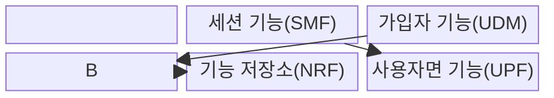
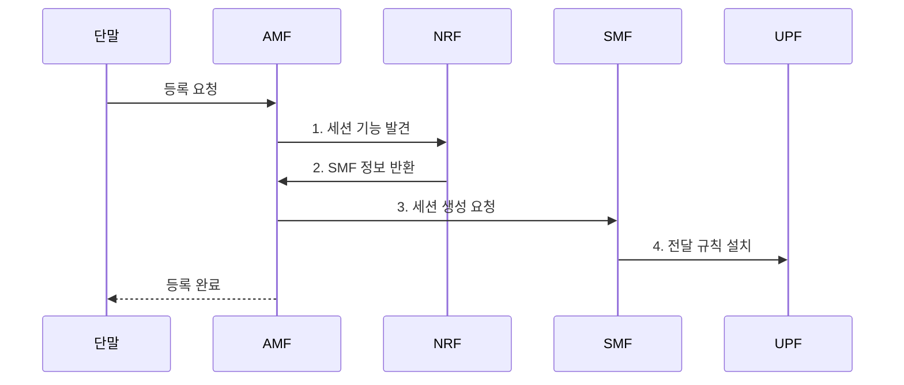

---
sidebar:
  order: 38
  label: "038. 5G 코어 SBA"
  badge: { text: "기출 · 70%", variant: note }
title: "5G 코어 SBA"
date: "2026-07-31T16:34:00+09:00"
tags: ["notes-network"]
weight: 38
extra:
  question_no: "038"
  source_status: "기출"
  source_history: "135회"
  priority: 70
  priority_note: "135회 출제"
---

## Ⅰ. 개요

핵심 용어

- **서비스 기반 아키텍처(Service-Based Architecture, SBA)**: 5세대 이동통신(Fifth Generation, 5G) 코어의 망 기능을 등록·발견 가능한 서비스 호출로 연결하는 아키텍처

- 정의/개념: 5G 코어 망 기능을 연결하는 **서비스 등록·발견·호출 구조**
- 배경/필요성: 4세대 이동통신(Fourth Generation, 4G) 노드 간 **고정 연결·확장 경직성** 해소

#### 한줄 요약

- 코어 기능이 필요한 서비스를 찾아 호출한다.

## Ⅱ. 특징

핵심 용어

- **망 기능(Network Function, NF)**: 5세대 이동통신(Fifth Generation, 5G) 코어에서 독립적으로 배치·확장하며 서비스를 제공하는 기능 단위
- **망 기능 저장소(Network Repository Function, NRF)**: 망 기능의 등록·상태·발견 정보를 제공하는 저장소 기능
- **세션 관리 기능(Session Management Function, SMF)**: 데이터 세션 정책과 사용자면 전달 규칙을 제어하는 망 기능
- **사용자면 기능(User Plane Function, UPF)**: SMF가 설치한 규칙에 따라 사용자 패킷을 전달하는 망 기능
- **느슨한 결합**: 기능이 상대의 고정 위치보다 서비스 인터페이스에 의존해 독립적으로 변경·확장되는 구조적 성질

- NRF 기반 **망 기능 등록·발견**
- 서비스 인터페이스의 **느슨한 결합**
- SMF 제어면·UPF 사용자면의 **역할 분리**

#### 한줄 요약

- 판단 기능과 실제 패킷 전달 기능을 나눈다.

## Ⅲ. 구조 및 구성요소

핵심 용어

- **접속·이동성 관리 기능(Access and Mobility Management Function, AMF)**: 단말의 등록·인증·이동성을 제어하는 5세대 이동통신(Fifth Generation, 5G) 코어 망 기능
- **세션 관리 기능(Session Management Function, SMF)·사용자면 기능(User Plane Function, UPF)**: SMF가 데이터 세션 정책과 전달 규칙을 제어하고 UPF가 그 규칙에 따라 패킷을 전달하는 제어·전달 기능
- **통합 데이터 관리(Unified Data Management, UDM)**: 가입자 식별·인증·서비스 정보를 관리하는 망 기능
- **망 기능 저장소(Network Repository Function, NRF)**: 망 기능의 등록·상태·발견 정보를 제공하는 저장소 기능

| 구성요소 | 책임 |
|:---|:---|
| 접속·이동 기능(AMF) | 단말 **등록·인증·이동성** 제어 |
| 서비스 통신 계층 | 제어 기능 간 **서비스 호출** 전달 |
| 세션 기능(SMF) | 세션 정책과 **UPF 규칙** 제어 |
| 가입자 기능(UDM) | **가입자·인증 정보** 관리 |
| 기능 저장소(NRF) | 망 기능 **등록·상태·발견** 제공 |
| 사용자면 기능(UPF) | 설치된 규칙에 따라 **패킷 전달** |

#### 한줄 요약

- 제어 기능은 서로 호출하고 UPF는 패킷을 보낸다.

## Ⅳ. 흐름도

핵심 용어

- **망 기능 저장소(Network Repository Function, NRF)**: 망 기능의 등록·상태·발견 정보를 제공해 필요한 서비스 인스턴스를 찾게 하는 저장소 기능
- **전달 규칙**: 세션 관리 기능(Session Management Function, SMF)이 사용자면 기능(User Plane Function, UPF)에 설치해 사용자 패킷의 경로와 처리 동작을 지정하는 제어 정보
- **접속·이동성 관리 기능(Access and Mobility Management Function, AMF)**: 단말의 등록과 세션 생성 요청을 중계하는 제어 기능

**동작 원리**

1. **세션 기능 발견**: AMF가 NRF에서 가용 SMF 검색
2. **SMF 정보 반환**: NRF가 가용 기능 정보 제공
3. **세션 생성 요청**: AMF가 품질·주소·정책 생성을 요청
4. **전달 규칙 설치**: SMF가 UPF 경로 규칙 설정

#### 한줄 요약

- 안내 기능을 찾아 경로를 만든 뒤 데이터를 보낸다.

## Ⅴ. 종류 및 비교

핵심 용어

- **서비스 인터페이스**: 5세대 이동통신(Fifth Generation, 5G) 코어의 제어 기능들이 기능명과 응용 프로그래밍 인터페이스(Application Programming Interface, API)로 서로 호출하는 규격
- **고정 인터페이스**: 정해진 노드 쌍 사이의 전용 연결로 기능을 결합하는 코어망 통신 방식

서비스 기반 아키텍처(Service-Based Architecture, SBA)는 5G 코어 기능을 서비스 단위로 연결하고, 4세대 이동통신(Fourth Generation, 4G)은 노드 간 고정 인터페이스를 주로 사용한다.

| 코어망 연결 구조 | 5G SBA | 4G 고정 인터페이스 |
|:---|:---|:---|
| 적용 기준 | **기능별 확장·슬라이싱** | **고정 구성·단순 운영** |
| 핵심 특징 | **서비스 등록·발견·호출** | 노드 간 **전용 연결** |
| 한계 | **호출 장애·보안** 복잡성 | **결합도·증설** 경직성 |

> 요약: SBA는 기능 독립성과 호출 의존성 공존

#### 한줄 요약

- 연결이 유연해진 대신 발견과 호출을 관리해야 한다.

## Ⅵ. 실무 고려사항 및 대책

핵심 용어

- **회로 차단기**: 연속 실패한 서비스 호출을 일정 시간 차단해 장애가 다른 기능으로 확산되는 것을 막는 패턴
- **상호 전송 계층 보안(mutual Transport Layer Security, mTLS)**: 서비스 호출 양쪽의 인증서를 검증해 망 기능의 상호 신원을 확인하는 전송 계층 보안(Transport Layer Security, TLS) 방식
- **망 기능 저장소(Network Repository Function, NRF)**: 가용 망 기능의 등록·상태·발견 정보를 관리하는 저장소 기능
- **응용 프로그래밍 인터페이스(Application Programming Interface, API)**: 망 기능 사이의 서비스 요청·응답 규격

| 문제 | 대책 | 효과 |
|:---|:---|:---|
| **NRF 만료 기능** 반환 | 상태 검사·등록 만료 자동화 | **호출 실패** 감소 |
| **서비스 API** 무단 호출 | mTLS·토큰·권한 범위 적용 | **제어면 접근** 통제 |
| **연쇄 호출 장애** 확산 | 시간제한·회로 차단기·대체 기능 | **코어 장애** 격리 |

#### 한줄 요약

- NRF에서 응답하지 않는 망 기능의 등록 정보를 지워 다른 인스턴스를 찾게 한다.

## Ⅶ. 결론

핵심 용어

- **서비스 발견**: 호출자가 망 기능 저장소(Network Repository Function, NRF)에서 요구 기능과 상태 조건에 맞는 망 기능 인스턴스를 찾는 과정
- **서비스 기반 아키텍처(Service-Based Architecture, SBA)**: 망 기능을 등록·발견·호출 가능한 서비스로 연결하는 5세대 이동통신(Fifth Generation, 5G) 코어 구조

- 기능별 독립 확장이 필요하면 **SBA** 적용과 **발견·호출 장애** 통제

#### 한줄 요약

- 망 기능을 독립 확장하려면 NRF 등록 상태와 서비스 호출 실패를 함께 통제해야 한다.
