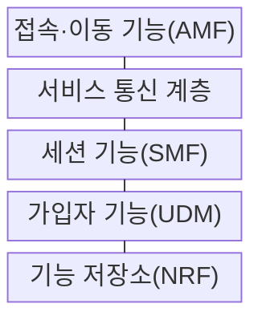
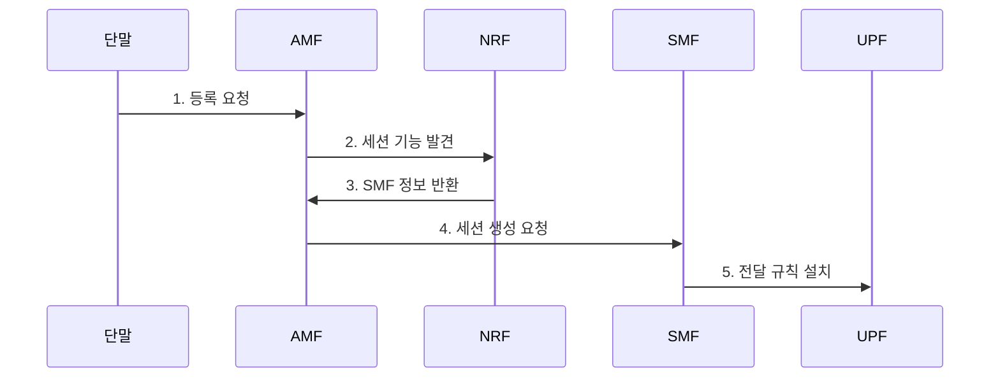

---
sidebar:
  order: 38
  label: "038. 5G 코어 SBA"
  badge: { text: "기출 · 70%", variant: note }
title: "5G 코어 SBA"
date: "2026-07-29T22:30:00+09:00"
tags: ["notes-network"]
weight: 38
extra:
  question_no: "038"
  source_status: "기출"
  source_history: "135회"
  priority: 70
  priority_note: "135회 출제"
---

## 미리 알고가기

- **서비스 기반 아키텍처(Service-Based Architecture, SBA)**: ‘에스비에이’로 읽고 세 영문 단어의 머리글자를 딴 표기이며 5G 코어 망 기능을 등록·발견 가능한 서비스 호출로 연결함
- **망 기능(Network Function, NF)**: ‘엔에프’로 읽고 두 영문 단어의 머리글자를 딴 표기이며 5G 코어의 독립 배치·확장 기능 단위임
- **서비스 인터페이스**: 제어 기능 간 호출 규격
- **망 저장소 기능(Network Repository Function, NRF)**: ‘엔알에프’로 읽고 세 영문 단어의 머리글자를 딴 표기이며 망 기능의 등록·상태·발견 정보를 제공함
- **접속 및 이동성 관리 기능(Access and Mobility Management Function, AMF)**: ‘에이엠에프’로 읽고 핵심 영문 단어의 머리글자를 딴 표기이며 단말 등록·인증·이동성을 제어함
- **세션 관리 기능(Session Management Function, SMF)**: ‘에스엠에프’로 읽고 세 영문 단어의 머리글자를 딴 표기이며 데이터 세션 정책과 UPF 전달 규칙을 제어함
- **사용자면 기능(User Plane Function, UPF)**: ‘유피에프’로 읽고 세 영문 단어의 머리글자를 딴 표기이며 설치된 규칙에 따라 사용자 패킷을 전달함
- **통합 데이터 관리(Unified Data Management, UDM)**: ‘유디엠’으로 읽고 세 영문 단어의 머리글자를 딴 표기이며 가입자와 인증 정보를 관리함

## Ⅰ. 개요

- 정의/개념: 망 기능의 **서비스 등록·발견·호출 구조**
- 배경/필요성: 4G 노드 간 **고정 연결·확장 경직성** 해소

### 쉽게 이해하기 (학습용)

- 코어 기능이 필요한 서비스를 찾아 호출한다.

## Ⅱ. 특징

- NRF 기반 **망 기능 등록·발견**
- 서비스 인터페이스의 **느슨한 결합**
- SMF 제어면·UPF 사용자면의 **역할 분리**

### 쉽게 이해하기 (학습용)

- 판단 기능과 실제 패킷 전달 기능을 나눈다.

## Ⅲ. 구조 및 구성요소

| 구성요소 | 책임 |
|:---|:---|
| 접속·이동 기능(AMF) | 등록·인증·이동성 제어 |
| 서비스 통신 계층 | 제어 기능 간 서비스 전달 |
| 세션 기능(SMF) | 세션 정책과 UPF 규칙 제어 |
| 가입자 기능(UDM) | 가입자와 인증 정보 관리 |
| 기능 저장소(NRF) | 기능 등록·상태·발견 제공 |

### 쉽게 이해하기 (학습용)

- 제어 기능은 서로 호출하고 UPF는 패킷을 보낸다.

## Ⅳ. 흐름도

**동작 원리**

1. **등록 요청**: 단말이 망 접속과 인증 요청
2. **세션 기능 발견**: AMF가 가용 SMF 검색
3. **SMF 정보 반환**: NRF가 가용 기능 정보 제공
4. **세션 생성 요청**: 품질·주소·정책 생성을 요청
5. **전달 규칙 설치**: SMF가 UPF 경로 규칙 설정

### 쉽게 이해하기 (학습용)

- 안내 기능을 찾아 경로를 만든 뒤 데이터를 보낸다.

## Ⅴ. 종류 및 비교

| 코어망 연결 구조 | 5G SBA | 4G 고정 인터페이스 |
|:---|:---|:---|
| 적용 기준 | 기능별 확장·슬라이싱 | 고정 구성·단순 운영 |
| 핵심 특징 | 서비스 등록·발견·호출 | 노드 간 전용 연결 |
| 한계 | 호출 장애·보안 복잡성 | 결합도·증설 경직성 |

> 요약: SBA는 기능 독립성과 호출 의존성 공존

### 쉽게 이해하기 (학습용)

- 연결이 유연해진 대신 발견과 호출을 관리해야 한다.

## Ⅵ. 실무 고려사항 및 대책

| 고려사항 | 대책 | 효과 |
|:---|:---|:---|
| NRF의 만료 기능 반환 | 상태 검사·등록 만료 자동화 | 호출 실패 감소 |
| 서비스 API 무단 호출 | mTLS·토큰·권한 범위 적용 | 제어면 접근 통제 |
| 연쇄 호출 장애 확산 | 시간제한·차단기·대체 기능 | 코어 장애 격리 |

### 쉽게 이해하기 (학습용)

- NRF에서 응답하지 않는 망 기능의 등록 정보를 지워 다른 인스턴스를 찾게 한다.

## Ⅶ. 결론

- **발견·인증·호출 실패를 통제한 5G 코어 서비스 기반 구조**

### 쉽게 이해하기 (학습용)

- 망 기능을 독립 확장하려면 NRF 등록 상태와 서비스 호출 실패를 함께 통제해야 한다.
