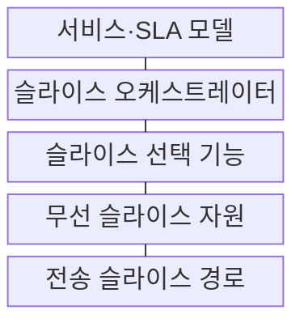
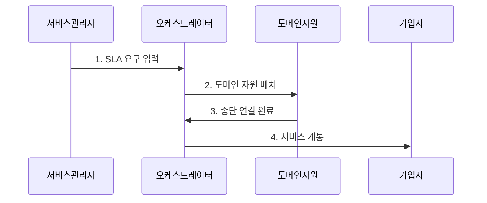

---
sidebar:
  order: 39
  label: "039. 5G 네트워크 슬라이싱"
  badge: { text: "기출 · 70%", variant: note }
title: "5G 네트워크 슬라이싱"
date: "2026-07-29T22:30:00+09:00"
tags: ["notes-network"]
weight: 39
extra:
  question_no: "039"
  source_status: "기출"
  source_history: "126회, 137회"
  priority: 70
  priority_note: "126·137회 출제"
---

## 미리 알고가기

- **네트워크 슬라이스**: 공유 물리망의 자원과 기능을 서비스 목적별로 묶고 격리한 종단 논리망
- **서비스 수준 협약(Service Level Agreement, SLA)**: ‘에스엘에이’로 읽고 세 영문 단어의 머리글자를 딴 표기이며 슬라이스가 보장할 지연·용량·가용성 목표를 약속함
- **자원 격리**: 다른 서비스의 영향 차단
- **네트워크 슬라이스 선택 기능(Network Slice Selection Function, NSSF)**: ‘엔에스에스에프’로 읽고 네 영문 단어의 머리글자를 딴 표기이며 가입·지역·가용성에 맞는 슬라이스를 선택함
- **접속 및 이동성 관리 기능(Access and Mobility Management Function, AMF)**: ‘에이엠에프’로 읽고 핵심 영문 단어의 머리글자를 딴 표기이며 단말 접속과 이동성을 제어함
- **세션 관리 기능(Session Management Function, SMF)**: ‘에스엠에프’로 읽고 세 영문 단어의 머리글자를 딴 표기이며 데이터 세션 정책을 제어함
- **사용자면 기능(User Plane Function, UPF)**: ‘유피에프’로 읽고 세 영문 단어의 머리글자를 딴 표기이며 슬라이스 경로로 사용자 패킷을 전달함
- **오케스트레이터**: 자원 배치·수명주기 자동화

## Ⅰ. 개요

- 정의/개념: 공유 자원의 **서비스별 종단 논리망 격리**
- 배경/필요성: 단일 망의 **이질적 SLA 동시 보장 한계** 해소

### 쉽게 이해하기 (학습용)

- 하나의 망을 목적별 전용 통로처럼 나눈다.

## Ⅱ. 특징

- 무선·전송·코어의 **종단 자원 조립**
- 서비스별 **기능·경로 차등 배치**
- 슬라이스 간 **자원·장애 격리**

### 쉽게 이해하기 (학습용)

- 우선순위뿐 아니라 논리망 전체를 따로 운영한다.

## Ⅲ. 구조 및 구성요소

| 구성요소 | 책임 |
|:---|:---|
| 서비스·SLA 모델 | 지연·용량·가용성 목표 정의 |
| 슬라이스 오케스트레이터 | 논리망 배치와 수명주기 관리 |
| 슬라이스 선택 기능 | 가입자별 적합 슬라이스 선택 |
| 무선 슬라이스 자원 | 대역·스케줄링 자원 배정 |
| 전송 슬라이스 경로 | 격리된 전달 경로 제공 |

### 쉽게 이해하기 (학습용)

- 목표를 세 영역의 자원과 기능으로 조립한다.

## Ⅳ. 흐름도

**동작 원리**

1. **SLA 요구 입력**: 지연·용량·가용성 목표 전달
2. **도메인 자원 배치**: 기능·격리 템플릿에 따라 무선·전송·코어 자원 생성
3. **종단 연결 완료**: 영역별 논리망을 연결하고 결과를 보고
4. **서비스 개통**: 가입자 선택과 사용을 허용

### 쉽게 이해하기 (학습용)

- 만든 뒤에도 목표 위반을 보고 자원을 조정한다.

## Ⅴ. 종류 및 비교

| 서비스 차등 방식 | 네트워크 슬라이싱 | 서비스 품질 제어 |
|:---|:---|:---|
| 적용 기준 | 서비스별 기능·자원 분리 | 같은 망의 트래픽 차등 |
| 핵심 특징 | 종단 논리망 구성·격리 | 흐름 우선순위 조정 |
| 한계 | 격리 실패·운영 복잡성 | 공유 자원 간섭 |

> 요약: 슬라이싱은 품질 제어를 포함한 논리망

### 쉽게 이해하기 (학습용)

- 줄의 순서 조정과 전용 통로 구성의 차이다.

## Ⅵ. 실무 고려사항 및 대책

| 고려사항 | 대책 | 효과 |
|:---|:---|:---|
| 이름뿐인 논리 분리 | 무선·전송·코어 자원 보장 | 종단 SLA 확보 |
| 공유 자원 간섭 | 최소 예약·상한·선점 정책 | 슬라이스 격리 |
| 도메인별 지표 불일치 | 종단 공통 SLI·연결 식별자 | 위반 원인 추적 |

### 쉽게 이해하기 (학습용)

- 산업 제어용 논리망에 지연 자원을 예약해 혼잡 때도 제어 트래픽을 먼저 보낸다.

## Ⅶ. 결론

- **종단 자원 보장과 격리를 갖춘 5G 네트워크 슬라이스**

### 쉽게 이해하기 (학습용)

- 슬라이스 이름뿐 아니라 서비스 목표에 맞는 종단 자원과 격리 수준을 배정해야 한다.
