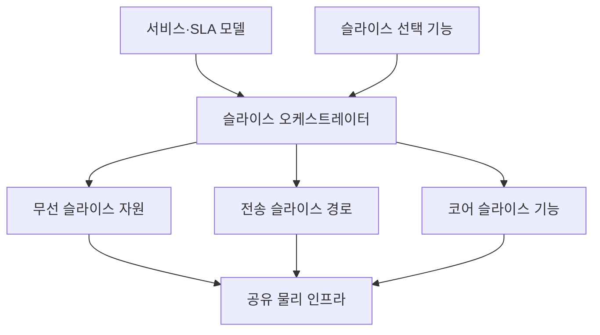
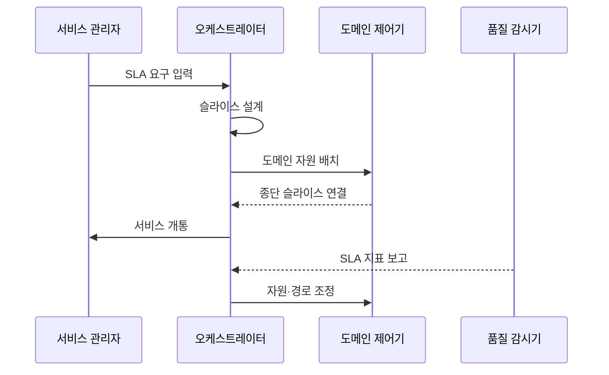

---
sidebar:
  order: 39
  label: "039. 5G 네트워크 슬라이싱"
  badge: { text: "기출 · 70%", variant: note }
title: "5G 네트워크 슬라이싱"
date: "2026-07-25T19:39:00+09:00"
tags: ["notes-network"]
weight: 39
extra:
  question_no: "039"
  source_status: "기출"
  source_history: "126회, 137회"
  priority: 70
  priority_note: "126·137회 출제"
---

## 미리 알고가기

- **네트워크 슬라이스**: 공유 물리망의 자원과 기능을 서비스 목적별로 묶고 격리한 종단 논리망
- **서비스 수준 협약(Service Level Agreement, SLA)**: ‘에스엘에이’로 읽고 세 영문 단어의 머리글자를 딴 표기이며 슬라이스가 보장할 지연·용량·가용성 목표를 약속함
- **자원 격리**: 다른 서비스의 영향 차단
- **네트워크 슬라이스 선택 기능(Network Slice Selection Function, NSSF)**: ‘엔에스에스에프’로 읽고 네 영문 단어의 머리글자를 딴 표기이며 가입·지역·가용성에 맞는 슬라이스를 선택함
- **접속 및 이동성 관리 기능(Access and Mobility Management Function, AMF)**: ‘에이엠에프’로 읽고 핵심 영문 단어의 머리글자를 딴 표기이며 단말 접속과 이동성을 제어함
- **세션 관리 기능(Session Management Function, SMF)**: ‘에스엠에프’로 읽고 세 영문 단어의 머리글자를 딴 표기이며 데이터 세션 정책을 제어함
- **사용자면 기능(User Plane Function, UPF)**: ‘유피에프’로 읽고 세 영문 단어의 머리글자를 딴 표기이며 슬라이스 경로로 사용자 패킷을 전달함
- **오케스트레이터**: 자원 배치·수명주기 자동화

## Ⅰ. 개요

- **정의/개념**: 공유 자원을 서비스별 종단 논리망으로 격리
- **배경/필요성**: 서로 다른 SLA의 한 물리망 수용

### 쉽게 이해하기 (학습용)

- 하나의 망을 목적별 전용 통로처럼 나눈다.

## Ⅱ. 특징

- 무선·전송·코어 자원을 종단으로 묶는다.
- 서비스별 기능과 경로를 다르게 배치한다.
- 다른 슬라이스의 혼잡 영향을 제한한다.
- 격리가 약하면 한 슬라이스의 혼잡이 다른 곳으로 번진다.

### 쉽게 이해하기 (학습용)

- 우선순위뿐 아니라 논리망 전체를 따로 운영한다.

## Ⅲ. 아키텍처 및 구성요소

| 설계 요소 | 설명 |
|:---|:---|
| 서비스·SLA 모델 | 지연·용량·가용성 목표 정의 |
| 슬라이스 오케스트레이터 | 논리망 배치와 수명주기 관리 |
| 슬라이스 선택 기능 | 가입자별 적합 슬라이스 선택 |
| 무선 슬라이스 자원 | 대역·스케줄링 자원 배정 |
| 전송 슬라이스 경로 | 격리된 전달 경로 제공 |
| 코어 슬라이스 기능 | 제어·세션·사용자면 기능 제공 |
| 공유 물리 인프라 | 공통 서버·회선·무선 자원 제공 |

### 쉽게 이해하기 (학습용)

- 목표를 세 영역의 자원과 기능으로 조립한다.

## Ⅳ. 원리 및 절차 흐름도

| 절차 | 설명 |
|:---|:---|
| SLA 요구 입력 | 지연·용량·가용성 목표 전달 |
| 슬라이스 설계 | 기능·격리·자원 템플릿 선택 |
| 도메인 자원 배치 | 무선·전송·코어 자원 생성 |
| 종단 슬라이스 연결 | 영역별 논리망을 하나로 연결 |
| 서비스 개통 | 가입자 선택과 사용을 허용 |
| SLA 지표 보고 | 종단 품질과 자원 상태 수집 |
| 자원·경로 조정 | 위반 시 확장·우회·축소 |

> 요약: SLA를 종단 자원·운영 정책으로 변환

### 쉽게 이해하기 (학습용)

- 만든 뒤에도 목표 위반을 보고 자원을 조정한다.

## Ⅴ. 종류 및 비교

| 판단 기준 | 네트워크 슬라이싱 | 서비스 품질 제어 |
|:---|:---|:---|
| 핵심 특징 | 종단 논리망 구성·격리 | 흐름 우선순위 조정 |
| 적용 기준 | 서비스별 기능·자원 분리 | 같은 망의 트래픽 차등 |
| 주요 위험 | 격리 실패·운영 복잡성 | 공유 자원 간섭 |

> 요약: 슬라이싱은 품질 제어를 포함한 논리망

### 쉽게 이해하기 (학습용)

- 줄의 순서 조정과 전용 통로 구성의 차이다.

## Ⅵ. 실무 사례

1. 산업 제어 슬라이스는 지연 자원·선점 예약
2. 공유 장비 장애의 슬라이스 간 전파 시험

### 쉽게 이해하기 (학습용)

- 산업 제어용 논리망에 지연 자원을 예약해 혼잡 때도 제어 트래픽을 먼저 보낸다.
- 공유 장비에 장애를 내 한 논리망의 실패가 다른 논리망으로 번지는지 확인한다.

## Ⅶ. 결론

- SLA별 종단 자원·격리 수준으로 슬라이스 설계

### 쉽게 이해하기 (학습용)

- 이름만 나눈 논리망이 아니라 서비스 목표에 맞는 종단 자원과 격리 수준을 배정한다.
