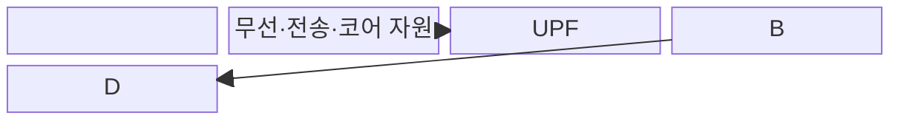
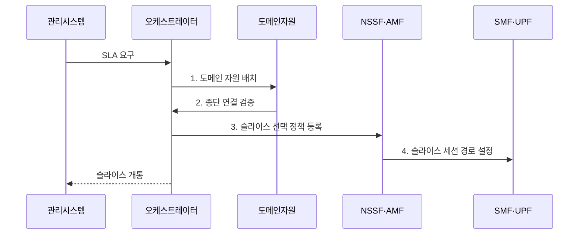

---
sidebar:
  order: 39
  label: "039. 5G 네트워크 슬라이싱"
  badge: { text: "기출 · 70%", variant: note }
title: "5G 네트워크 슬라이싱"
date: "2026-07-31T16:40:00+09:00"
tags: ["notes-network"]
weight: 39
extra:
  question_no: "039"
  source_status: "기출"
  source_history: "126회, 137회"
  priority: 70
  priority_note: "126·137회 출제"
---

## 미리 알고가기

- **네트워크 슬라이스**: 공유 물리망의 자원과 기능을 서비스 목적별로 묶고 격리한 종단 논리망
- **서비스 수준 협약(Service Level Agreement, SLA)**: 슬라이스가 보장할 지연·용량·가용성 목표
- **자원 격리**: 다른 서비스의 영향 차단
- **네트워크 슬라이스 선택 기능(Network Slice Selection Function, NSSF)**: 가입·지역·가용성에 맞는 슬라이스를 선택하는 망 기능
- **접속 및 이동성 관리 기능(Access and Mobility Management Function, AMF)**: 단말 접속과 이동성을 제어하는 망 기능
- **세션 관리 기능(Session Management Function, SMF)**: 데이터 세션 정책을 제어하는 망 기능
- **사용자면 기능(User Plane Function, UPF)**: 슬라이스 경로로 사용자 패킷을 전달하는 망 기능
- **오케스트레이터**: 자원 배치·수명주기 자동화

> **키워드:** 5G 네트워크 슬라이싱

## Ⅰ. 개요

- 정의/개념: 공유 물리망의 기능·자원을 **서비스별 종단 논리망**으로 구성·격리하는 기술
- 배경/필요성: 단일 망의 **이질적 SLA 동시 보장 한계** 해소

### 쉽게 이해하기 (학습용)

- 하나의 망을 목적별 전용 통로처럼 나눈다.

## Ⅱ. 특징

- 무선·전송·코어의 **종단 자원 조립**
- 서비스별 **기능·경로 차등 배치**
- 슬라이스 간 **자원·장애 격리**

### 쉽게 이해하기 (학습용)

- 우선순위뿐 아니라 논리망 전체를 따로 운영한다.

## Ⅲ. 구조 및 구성요소

| 구성요소 | 책임 |
|:---|:---|
| 서비스·SLA 모델 | 지연·용량·가용성 **목표 정의** |
| 슬라이스 오케스트레이터 | 논리망 배치와 **수명주기** 관리 |
| 무선·전송·코어 자원 | 종단 **자원 예약·격리** |
| NSSF | 가입자별 적합 **슬라이스 선택** |
| AMF | 단말 **접속·이동성** 제어 |
| SMF | 슬라이스 **세션 정책** 제어 |
| UPF | 슬라이스 경로로 **패킷 전달** |

### 쉽게 이해하기 (학습용)

- 목표를 세 영역의 자원과 기능으로 조립한다.

## Ⅳ. 흐름도

**동작 원리**

1. **도메인 자원 배치**: 템플릿에 따라 무선·전송·코어 자원 생성
2. **종단 연결 검증**: 영역별 논리망의 연결성과 격리 확인
3. **슬라이스 선택 정책 등록**: 가입·지역·가용성별 선택 기준 설정
4. **슬라이스 세션 경로 설정**: SMF 정책과 UPF 전달 경로 결합

### 쉽게 이해하기 (학습용)

- 만든 뒤에도 목표 위반을 보고 자원을 조정한다.

## Ⅴ. 종류 및 비교

| 서비스 차등 방식 | 네트워크 슬라이싱 | 서비스 품질 제어 |
|:---|:---|:---|
| 적용 기준 | 서비스별 **기능·자원 분리** | 같은 망의 **트래픽 차등** |
| 핵심 특징 | **종단 논리망** 구성·격리 | 흐름 **우선순위** 조정 |
| 한계 | **격리 실패**·운영 복잡성 | **공유 자원** 간섭 |

> 요약: 슬라이싱은 품질 제어를 포함한 논리망

### 쉽게 이해하기 (학습용)

- 줄의 순서 조정과 전용 통로 구성의 차이다.

## Ⅵ. 실무 고려사항 및 대책

| 고려사항 | 대책 | 효과 |
|:---|:---|:---|
| 이름뿐인 **논리 분리** | 무선·전송·코어 자원 보장 | **종단 SLA** 확보 |
| **공유 자원** 간섭 | 최소 예약·상한·선점 정책 | **슬라이스 격리** 확보 |
| 도메인별 **지표 불일치** | 종단 공통 SLI·연결 식별자 | **위반 원인** 추적 |

### 쉽게 이해하기 (학습용)

- 산업 제어용 논리망에 지연 자원을 예약해 혼잡 때도 제어 트래픽을 먼저 보낸다.

## Ⅶ. 결론

- 서비스별 격리가 필요하면 **종단 슬라이스** 구성과 **SLA 자원** 배정

### 쉽게 이해하기 (학습용)

- 슬라이스 이름뿐 아니라 서비스 목표에 맞는 종단 자원과 격리 수준을 배정해야 한다.
