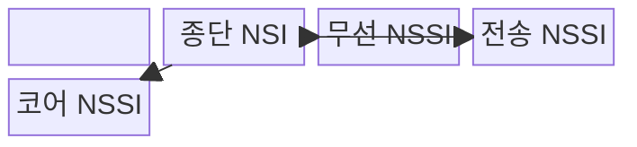
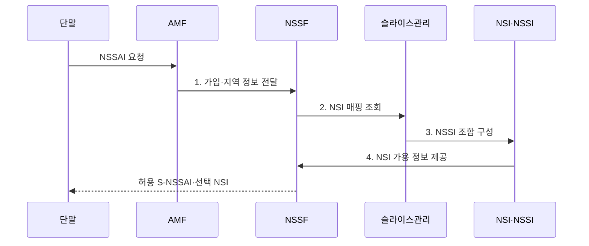

---
sidebar:
  order: 40
  label: "040. NSSAI·NSI·NSSI"
  badge: { text: "기출 · 50%", variant: note }
title: "네트워크 슬라이스 식별 체계"
date: "2026-07-31T16:46:00+09:00"
tags: ["notes-network"]
weight: 40
extra:
  question_no: "040"
  source_status: "기출"
  source_history: "137회"
  priority: 50
  priority_note: "137회 출제"
---

## 미리 알고가기

- **네트워크 슬라이스 선택 지원 정보(Network Slice Selection Assistance Information, NSSAI)**: 단말이 요청하거나 망이 허용하는 슬라이스 식별자 목록
- **단일 NSSAI(Single-NSSAI, S-NSSAI)**: 하나의 슬라이스를 선택하는 식별자
- **슬라이스·서비스 유형(Slice/Service Type, SST)**: S-NSSAI의 서비스 유형 값
- **슬라이스 구분자(Slice Differentiator, SD)**: 같은 SST의 슬라이스를 구분하는 선택 값
- **네트워크 슬라이스 인스턴스(Network Slice Instance, NSI)**: 종단 논리망의 실제 운영 인스턴스
- **네트워크 슬라이스 서브넷 인스턴스(Network Slice Subnet Instance, NSSI)**: 무선·전송·코어 영역별 하위 슬라이스 인스턴스
- **접속 및 이동성 관리 기능(Access and Mobility Management Function, AMF)**: 단말 접속과 이동성을 제어하는 망 기능
- **네트워크 슬라이스 선택 기능(Network Slice Selection Function, NSSF)**: 요청에 맞는 슬라이스를 선택하는 망 기능

## Ⅰ. 개요

- 정의/개념: 슬라이스 **식별 정보 NSSAI**를 운영 단위 NSI·NSSI에 연결하는 체계
- 배경/필요성: 식별자만으로는 **실제 종단망 선택 불가**

### 쉽게 이해하기 (학습용)

- 요청 이름표를 실제 논리망과 하위망에 연결한다.

## Ⅱ. 특징

- SST·SD 기반 **S-NSSAI 식별**
- 가입·지역·가용성 기반 **NSI 선택**
- 영역별 NSSI의 **종단 NSI 조립**

### 쉽게 이해하기 (학습용)

- 같은 이름표도 지역과 정책에 따라 다른 망을 쓴다.

## Ⅲ. 구조 및 구성요소

| 구성요소 | 책임 |
|:---|:---|
| NSSAI | 요청·허용 **S-NSSAI 목록** 제공 |
| S-NSSAI(SST·SD) | 서비스 유형과 **슬라이스 구분자** 결합 |
| AMF·NSSF | 가입·지역·가용성 기반 **슬라이스 선택** |
| 종단 NSI | 서비스용 **종단 논리망** 제공 |
| 무선 NSSI | **무선 접속 자원**과 기능 제공 |
| 전송 NSSI | 영역 간 **격리 경로** 제공 |
| 코어 NSSI | 세션·정책·사용자면 **코어 기능** 제공 |

### 쉽게 이해하기 (학습용)

- 종단 논리망은 영역별 하위망을 조립해 만든다.

## Ⅳ. 흐름도

**동작 원리**

1. **가입·지역 정보 전달**: AMF가 단말 요청과 접속 정보를 NSSF에 제공
2. **NSI 매핑 조회**: NSSF가 S-NSSAI에 맞는 종단망 검색
3. **NSSI 조합 구성**: 무선·전송·코어 하위망을 종단망으로 연결
4. **NSI 가용 정보 제공**: 구성된 종단망의 지역·상태 정보 반환

### 쉽게 이해하기 (학습용)

- 이름표가 있어도 가용한 실제 망이 필요하다.

## Ⅴ. 종류 및 비교

| 슬라이스 정보 단위 | NSSAI | NSI | NSSI |
|:---|:---|:---|:---|
| 적용 기준 | **접속 요청·선택** | **종단 서비스** 운영 | **영역 조립·공유** |
| 핵심 특징 | **슬라이스 식별자** 목록 | **종단 논리망** 인스턴스 | **영역별 하위망** 인스턴스 |
| 한계 | 식별자 **정책 불일치** | 종단 품질·**수명주기 오류** | **공유 자원** 간섭 |

> 요약: NSSAI는 식별 정보, NSI·NSSI는 운영 단위

### 쉽게 이해하기 (학습용)

- 목록에서 고른 이름을 실제 논리망에 연결한다.

## Ⅵ. 실무 고려사항 및 대책

| 고려사항 | 대책 | 효과 |
|:---|:---|:---|
| 가입·지역 **매핑 불일치** | S-NSSAI 허용표 자동 대조 | **오접속** 방지 |
| **NSI·NSSI 수명주기** 단절 | 종단·도메인 인스턴스 연결 관리 | **고아 자원** 방지 |
| 동일 식별자의 **품질 편차** | 지역별 NSI·SLA 지표 검증 | **서비스 일관성** 확보 |

### 쉽게 이해하기 (학습용)

- 같은 식별 정보가 지역별로 의도한 종단 논리망에 연결되는지 확인한다.

## Ⅶ. 결론

- 가입·지역·가용성이 맞으면 **S-NSSAI**를 **NSI·NSSI**에 매핑

### 쉽게 이해하기 (학습용)

- 단말의 이름표가 가입과 지역에 맞는 실제 종단망과 하위망으로 이어지는지 확인해야 한다.
