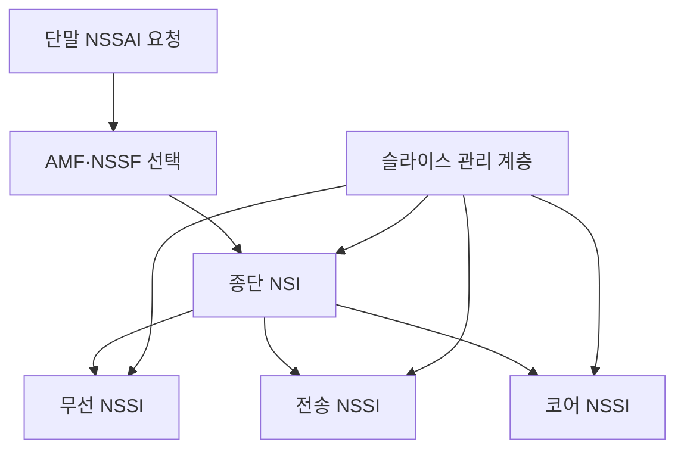
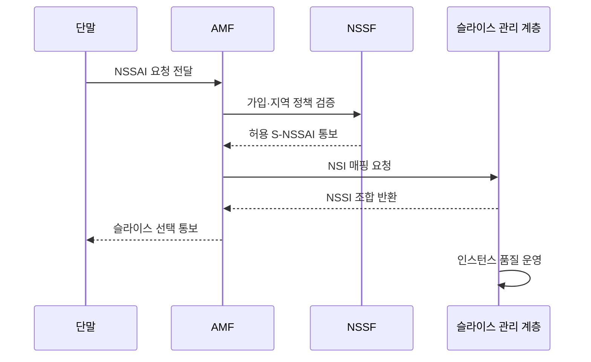

---
sidebar:
  order: 40
  label: "040. NSSAI·NSI·NSSI"
  badge: { text: "기출 · 50%", variant: note }
title: "네트워크 슬라이스 식별 체계"
date: "2026-07-27T23:59:59+09:00"
tags: ["notes-network"]
weight: 40
extra:
  question_no: "040"
  source_status: "기출"
  source_history: "137회"
  priority: 50
  priority_note: "137회 출제"
---

## 미리 알고가기

- **네트워크 슬라이스 선택 지원 정보(Network Slice Selection Assistance Information, NSSAI)**: ‘엔에스에스에이아이’로 읽고 다섯 영문 핵심어의 머리글자를 딴 표기이며 단말이 요청하거나 망이 허용하는 슬라이스 식별자 목록임
- **단일 NSSAI(Single-NSSAI, S-NSSAI)**: ‘에스 엔에스에스에이아이’로 읽고 단일을 뜻하는 S와 붙임표로 NSSAI를 이은 표기이며 하나의 슬라이스를 선택하는 식별자임
- **슬라이스·서비스 유형(Slice/Service Type, SST)**: ‘에스에스티’로 읽고 Slice와 Service를 빗금(/)으로 병기한 뒤 Type과 함께 머리글자를 딴 표기이며 S-NSSAI의 서비스 유형 값임
- **슬라이스 구분자(Slice Differentiator, SD)**: ‘에스디’로 읽고 두 영문 단어의 머리글자를 딴 표기이며 같은 SST의 슬라이스를 구분하는 선택 값임
- **네트워크 슬라이스 인스턴스(Network Slice Instance, NSI)**: ‘엔에스아이’로 읽고 세 영문 단어의 머리글자를 딴 표기이며 종단 논리망의 실제 운영 인스턴스임
- **네트워크 슬라이스 서브넷 인스턴스(Network Slice Subnet Instance, NSSI)**: ‘엔에스에스아이’로 읽고 네 영문 단어의 머리글자를 딴 표기이며 무선·전송·코어 영역별 하위 슬라이스 인스턴스임
- **접속 및 이동성 관리 기능(Access and Mobility Management Function, AMF)**: ‘에이엠에프’로 읽고 핵심 영문 단어의 머리글자를 딴 표기이며 단말 접속과 이동성을 제어함
- **네트워크 슬라이스 선택 기능(Network Slice Selection Function, NSSF)**: ‘엔에스에스에프’로 읽고 네 영문 단어의 머리글자를 딴 표기이며 요청에 맞는 슬라이스를 선택함

## Ⅰ. 개요

- **정의/개념**: 슬라이스 **식별 정보와 운영 인스턴스 매핑**
- **배경/필요성**: 식별자만으로는 **실제 종단망 선택 불가**

### 쉽게 이해하기 (학습용)

- 요청 이름표를 실제 논리망과 하위망에 연결한다.

## Ⅱ. 특징

- SST·SD 기반 **S-NSSAI 식별**
- 가입·지역·가용성 기반 **NSI 선택**
- 영역별 NSSI의 **종단 NSI 조립**

### 쉽게 이해하기 (학습용)

- 같은 이름표도 지역과 정책에 따라 다른 망을 쓴다.

## Ⅲ. 아키텍처 및 구성요소

| 설계 요소 | 설명 |
|:---|:---|
| 단말 NSSAI 요청 | 원하는 S-NSSAI 목록 전달 |
| AMF·NSSF 선택 | 가입·지역·가용 정책 검증 |
| 종단 NSI | 서비스용 논리망 전체 제공 |
| 무선 NSSI | 무선 접속 자원과 기능 제공 |
| 전송 NSSI | 영역 간 격리 경로 제공 |
| 코어 NSSI | 세션·정책·전달 기능 제공 |
| 슬라이스 관리 계층 | 인스턴스 수명주기와 매핑 관리 |

### 쉽게 이해하기 (학습용)

- 종단 논리망은 영역별 하위망을 조립해 만든다.

## Ⅳ. 원리 및 절차 흐름도

| 절차 | 설명 |
|:---|:---|
| NSSAI 요청 전달 | 단말이 희망 식별자 목록 제시 |
| 가입·지역 정책 검증 | 가입 권한과 지역 가용성 확인 |
| 허용 S-NSSAI 통보 | 사용할 단일 식별자 결정 |
| NSI 매핑 요청 | 식별자에 맞는 종단망 조회 |
| NSSI 조합 반환 | 무선·전송·코어 하위망 연결 |
| 슬라이스 선택 통보 | 단말에 최종 선택 결과 전달 |
| 인스턴스 품질 운영 | 수명주기와 SLA 상태 관리 |

> 요약: 식별 정보와 운영 인스턴스를 매핑

### 쉽게 이해하기 (학습용)

- 이름표가 있어도 가용한 실제 망이 필요하다.

## Ⅴ. 종류 및 비교

| 슬라이스 정보 단위 | NSSAI | NSI | NSSI |
|:---|:---|:---|:---|
| 적용 기준 | 접속 요청·선택 | 종단 서비스 운영 | 영역 조립·공유 |
| 핵심 특징 | 슬라이스 식별자 목록 | 종단 논리망 인스턴스 | 영역별 하위망 인스턴스 |
| 한계 | 식별자 정책 불일치 | 종단 품질·수명주기 오류 | 공유 자원 간섭 |

> 요약: NSSAI는 식별 정보, NSI·NSSI는 운영 단위

### 쉽게 이해하기 (학습용)

- 목록에서 고른 이름을 실제 논리망에 연결한다.

## Ⅵ. 실무 사례

1. 가입·지역별 **NSSAI-NSI 매핑 검증**
2. 공유 NSSI의 **용량·보안·장애 격리 검증**

### 쉽게 이해하기 (학습용)

- 같은 식별 정보가 지역별로 의도한 종단 논리망에 연결되는지 확인한다.
- 여러 종단망이 하위망을 공유할 때 용량 부족과 장애 전파 범위를 시험한다.

## Ⅶ. 결론

- **가입·지역별 NSSAI-NSI-NSSI 매핑** 검증

### 쉽게 이해하기 (학습용)

- 단말이 요청한 이름표가 가입과 지역에 맞는 실제 종단망과 하위망으로 이어지는지 검증한다.
