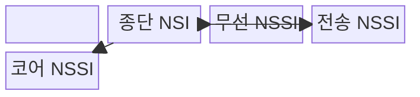
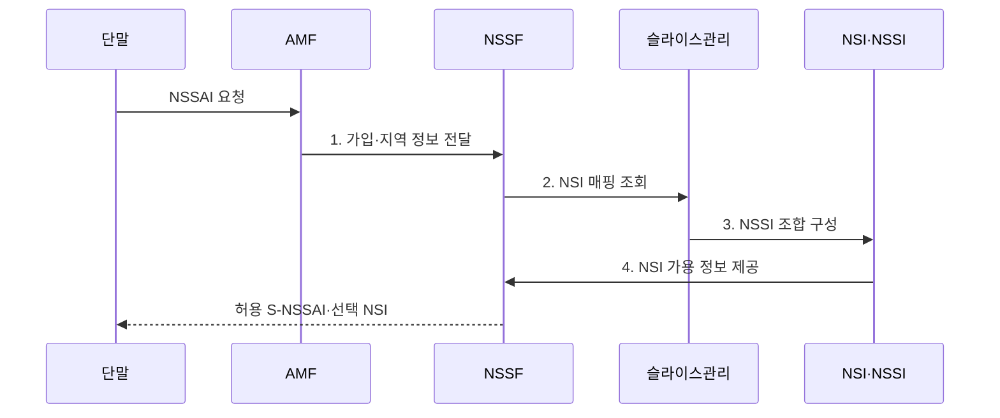

---
sidebar:
  order: 40
  label: "040. NSSAI·NSI·NSSI"
  badge: { text: "기출 · 50%", variant: note }
title: "네트워크 슬라이스 식별 체계"
date: "2026-07-31T16:46:00+09:00"
tags: ["notes-network"]
weight: 40
extra:
  question_no: "040"
  source_status: "기출"
  source_history: "137회"
  priority: 50
  priority_note: "137회 출제"
---

## Ⅰ. 개요

핵심 용어

- **네트워크 슬라이스 식별 체계**: 네트워크 슬라이스 선택 지원 정보(Network Slice Selection Assistance Information, NSSAI)를 실제 운영 단위인 네트워크 슬라이스 인스턴스(Network Slice Instance, NSI)와 네트워크 슬라이스 서브넷 인스턴스(Network Slice Subnet Instance, NSSI)에 연결하는 체계

- 정의/개념: 슬라이스의 **NSSAI-NSI·NSSI 연결 체계**
- 배경/필요성: 식별자만으로는 **실제 종단망 선택 불가**

#### 한줄 요약

- 요청 이름표를 실제 논리망과 하위망에 연결한다.

## Ⅱ. 특징

핵심 용어

- **단일 네트워크 슬라이스 선택 지원 정보(Single Network Slice Selection Assistance Information, S-NSSAI)**: 슬라이스·서비스 유형(Slice/Service Type, SST)과 선택적인 슬라이스 구분자(Slice Differentiator, SD)를 결합해 하나의 네트워크 슬라이스를 선택하는 식별자
- **네트워크 슬라이스 인스턴스(Network Slice Instance, NSI)·네트워크 슬라이스 서브넷 인스턴스(Network Slice Subnet Instance, NSSI)**: NSI는 종단 논리망 인스턴스이고 NSSI는 이를 구성하는 영역별 하위망 인스턴스

- SST·SD 기반 **S-NSSAI 식별**
- 가입·지역·가용성 기반 **NSI 선택**
- 영역별 NSSI의 **종단 NSI 조립**

#### 한줄 요약

- 같은 이름표도 지역과 정책에 따라 다른 망을 쓴다.

## Ⅲ. 구조 및 구성요소

핵심 용어

- **네트워크 슬라이스 선택 지원 정보(Network Slice Selection Assistance Information, NSSAI)**: 단말이 요청하거나 망이 허용하는 단일 네트워크 슬라이스 선택 지원 정보(Single Network Slice Selection Assistance Information, S-NSSAI)의 목록
- **네트워크 슬라이스 선택 기능(Network Slice Selection Function, NSSF)**: 가입·지역·가용성을 바탕으로 요청에 맞는 네트워크 슬라이스를 선택하는 망 기능
- **접속·이동성 관리 기능(Access and Mobility Management Function, AMF)**: 단말의 접속 정보를 받아 NSSF에 슬라이스 선택을 요청하는 망 기능
- **네트워크 슬라이스 인스턴스(Network Slice Instance, NSI)·네트워크 슬라이스 서브넷 인스턴스(Network Slice Subnet Instance, NSSI)**: NSI는 종단 논리망이고 NSSI는 영역별 하위망

| 구성요소 | 책임 |
|:---|:---|
| NSSAI | 요청·허용 **S-NSSAI 목록** 제공 |
| S-NSSAI(SST·SD) | 서비스 유형과 **슬라이스 구분자** 결합 |
| AMF·NSSF | 가입·지역·가용성 기반 **슬라이스 선택** |
| 종단 NSI | 서비스용 **종단 논리망** 제공 |
| 무선 NSSI | **무선 접속 자원·기능 제공** |
| 전송 NSSI | 영역 간 **격리 경로** 제공 |
| 코어 NSSI | 세션·정책·사용자면 **코어 기능** 제공 |

#### 한줄 요약

- 종단 논리망은 영역별 하위망을 조립해 만든다.

## Ⅳ. 흐름도

핵심 용어

- **네트워크 슬라이스 인스턴스(Network Slice Instance, NSI) 매핑**: 요청된 단일 네트워크 슬라이스 선택 지원 정보(Single Network Slice Selection Assistance Information, S-NSSAI)를 가입·지역·가용성 조건에 맞는 NSI에 연결하는 과정
- **네트워크 슬라이스 서브넷 인스턴스(Network Slice Subnet Instance, NSSI) 조합**: 무선·전송·코어 영역의 NSSI를 연결해 하나의 종단 NSI를 구성하는 과정
- **접속·이동성 관리 기능(Access and Mobility Management Function, AMF)·네트워크 슬라이스 선택 기능(Network Slice Selection Function, NSSF)**: AMF가 NSSF에 가입·지역 정보를 전달해 슬라이스를 선택하는 제어 기능
- **네트워크 슬라이스 선택 지원 정보(Network Slice Selection Assistance Information, NSSAI)**: 단말이 요청하거나 망이 허용하는 슬라이스 식별자 목록

**동작 원리**

1. **가입·지역 정보 전달**: AMF가 단말 요청과 접속 정보를 NSSF에 제공
2. **NSI 매핑 조회**: NSSF가 S-NSSAI에 맞는 종단망 검색
3. **NSSI 조합 구성**: 무선·전송·코어 하위망을 종단망으로 연결
4. **NSI 가용 정보 제공**: 구성된 종단망의 지역·상태 정보 반환

#### 한줄 요약

- 이름표가 있어도 가용한 실제 망이 필요하다.

## Ⅴ. 종류 및 비교

핵심 용어

- **네트워크 슬라이스 선택 지원 정보(Network Slice Selection Assistance Information, NSSAI)**: 접속 요청과 슬라이스 선택에 사용하는 식별 정보
- **네트워크 슬라이스 인스턴스(Network Slice Instance, NSI)**: 종단 서비스를 제공하는 실제 논리망 운영 인스턴스
- **네트워크 슬라이스 서브넷 인스턴스(Network Slice Subnet Instance, NSSI)**: NSI를 구성하거나 여러 NSI가 공유할 수 있는 영역별 하위망 인스턴스

| 슬라이스 단위 | 역할 | 상호 관계 |
|:---|:---|:---|
| **네트워크 슬라이스 선택 지원 정보(Network Slice Selection Assistance Information, NSSAI)** | **접속 요청의 슬라이스 식별·선택** | 단말 요청을 허용 NSI로 매핑 |
| **네트워크 슬라이스 인스턴스(Network Slice Instance, NSI)** | **종단 논리망 서비스 운영** | 하나 이상의 NSSI로 구성 |
| **네트워크 슬라이스 서브넷 인스턴스(Network Slice Subnet Instance, NSSI)** | **영역별 하위망 기능 제공** | 여러 NSI가 공유 가능 |

> 요약: NSSAI로 슬라이스를 선택하고 NSI를 NSSI 조합으로 운영

#### 한줄 요약

- 목록에서 고른 이름을 실제 논리망에 연결한다.

## Ⅵ. 실무 고려사항 및 대책

핵심 용어

- **고아 자원**: 상위 네트워크 슬라이스 인스턴스(Network Slice Instance, NSI)와의 연결이 끊겼지만 삭제되지 않아 불필요하게 남은 네트워크 슬라이스 서브넷 인스턴스(Network Slice Subnet Instance, NSSI) 또는 자원
- **매핑 불일치**: 가입·지역별 허용 단일 네트워크 슬라이스 선택 지원 정보(Single Network Slice Selection Assistance Information, S-NSSAI)가 의도한 NSI와 연결되지 않는 구성 오류
- **서비스 수준 협약(Service Level Agreement, SLA)**: 지역별 NSI가 보장해야 할 지연·용량·가용성 목표와 책임을 정한 협약

| 문제 | 대책 | 효과 |
|:---|:---|:---|
| 가입·지역 **매핑 불일치** | S-NSSAI 허용표 자동 대조 | **오접속** 방지 |
| **NSI·NSSI 수명주기** 단절 | 종단·도메인 인스턴스 연결 관리 | **고아 자원** 방지 |
| 동일 식별자의 **품질 편차** | 지역별 NSI·SLA 지표 검증 | **서비스 일관성** 확보 |

#### 한줄 요약

- 같은 식별 정보가 지역별로 의도한 종단 논리망에 연결되는지 확인한다.

## Ⅶ. 결론

핵심 용어

- **슬라이스 가용성**: 특정 가입자와 지역에서 요청한 단일 네트워크 슬라이스 선택 지원 정보(Single Network Slice Selection Assistance Information, S-NSSAI)에 대응하는 네트워크 슬라이스 인스턴스(Network Slice Instance, NSI)와 네트워크 슬라이스 서브넷 인스턴스(Network Slice Subnet Instance, NSSI)가 정상 제공되는 상태

- 가입·지역·가용성에 따른 **S-NSSAI와 NSI·NSSI 간 매핑**

#### 한줄 요약

- 단말의 이름표가 가입과 지역에 맞는 실제 종단망과 하위망으로 이어지는지 확인해야 한다.
