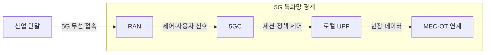
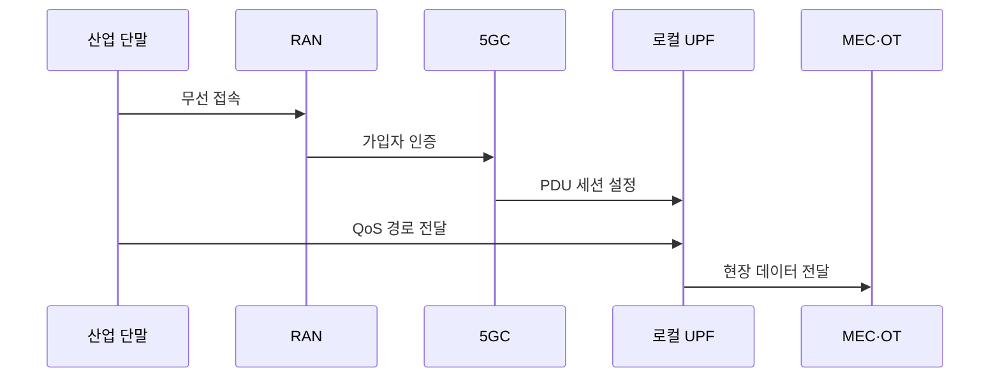

---
sidebar:
  order: 41
  label: "041. 5G 특화망·로컬 5G (Private 5G / 이음5G)"
  badge:
    text: "기출 · 50%"
    variant: note
title: "5G 특화망·로컬 5G (Private 5G / 이음5G)"
date: "2026-07-27T23:59:59+09:00"
tags:
  - "notes-network"
weight: 41
extra:
  question_no: "041"
  source_status: "기출"
  source_history: "126회"
  priority: 50
  priority_note: "비교·설계형: 126회 5G 특화망 장문 출제"
---

## 미리 알고가기

- **5G 특화망(Private 5G)**: ‘프라이빗 파이브지’로 읽고 세대 표기 5G를 붙인 관례 명칭이며 한정된 구역에서 전용 주파수·설비·정책으로 운영하는 비공중망임
- **이음5G**: ‘이음 파이브지’로 읽는 국내 제도 명칭이며 사업자가 직접 구축하거나 기간통신사업자의 서비스를 받아 쓰는 5G 특화망임
- **비공중망(Non-Public Network, NPN)**: ‘엔피엔’으로 읽고 세 영문 단어의 머리글자를 딴 표기이며 특정 조직이나 이용자만 접속하도록 제한한 이동통신망임
- **독립형 비공중망(Standalone NPN, SNPN)**: ‘에스엔피엔’으로 읽고 Standalone의 S를 NPN 앞에 붙인 표기이며 공중망에 의존하지 않고 전용 기지국과 5G 코어를 운영함
- **공중망 연동 비공중망(Public Network Integrated NPN, PNI-NPN)**: ‘피엔아이 엔피엔’으로 읽고 Public Network Integrated의 머리글자와 NPN을 붙임표로 이은 표기이며 공중망의 가입자·코어 기능을 공유함
- **무선접속망(Radio Access Network, RAN)**: ‘랜’으로 읽고 세 영문 단어의 머리글자를 딴 표기이며 단말을 무선으로 5G 코어망에 연결하는 기지국 체계임
- **5G 코어(5G Core, 5GC)**: ‘파이브지 코어’로 읽고 세대 표기 뒤에 Core의 C를 붙인 표기이며 가입자 인증·이동성·정책·세션을 제어함
- **사용자 평면 기능(User Plane Function, UPF)**: ‘유피에프’로 읽고 세 영문 단어의 머리글자를 딴 표기이며 단말 데이터를 목적지 망으로 전달함
- **다중접속 에지 컴퓨팅(Multi-access Edge Computing, MEC)**: ‘엠이시’로 읽고 세 영문 핵심어의 머리글자를 딴 표기이며 현장 가까이에서 데이터를 처리해 지연을 줄임
- **가입자 식별 모듈(Subscriber Identity Module, SIM)**: ‘심’으로 읽고 세 영문 단어의 머리글자를 딴 표기이며 가입자 식별자와 인증 정보를 저장함
- **서비스 품질(Quality of Service, QoS)**: ‘큐오에스’로 읽고 영문 핵심어의 머리글자를 딴 표기이며 트래픽별 지연·손실·대역폭을 제어함
- **서비스 수준 협약(Service Level Agreement, SLA)**: ‘에스엘에이’로 읽고 세 영문 단어의 머리글자를 딴 표기이며 가용성·지연 등 합의한 품질 목표임
- **운영기술(Operational Technology, OT)**: ‘오티’로 읽고 두 영문 단어의 머리글자를 딴 표기이며 생산 설비와 공정을 감시·제어함
- **프로토콜 데이터 단위 세션(Protocol Data Unit Session, PDU Session)**: ‘피디유 세션’으로 읽고 세 영문 핵심어의 머리글자를 딴 표기이며 단말과 데이터망 사이 사용자 데이터 전달 경로임

## Ⅰ. 개요

- 정의/개념: 한정 구역의 **전용 자원·정책 기반 5G망**
- **배경/필요성**: 공중망의 **장애·외부 전송 의존 한계** 해소

### 쉽게 이해하기 (학습용)

- 공장 안에 전용 5G 기지국과 데이터 길을 두어 외부 통신망이 끊겨도 현장 설비를 제어한다

## Ⅱ. 특징

- 전용 주파수·RAN의 **무선 자원 통제**
- 로컬 UPF의 **현장 데이터 경로 유지**
- SIM·QoS 기반 **단말·트래픽 통제**

### 쉽게 이해하기 (학습용)

- 독립형은 제어권과 장애 독립성이 크지만 코어망까지 직접 운영해야 한다

## Ⅲ. 아키텍처 및 구성요소

| 설계 요소 | 설명 |
|:---|:---|
| RAN | 전용 주파수로 산업 단말 무선 접속 |
| 5GC | 가입자 인증·세션·QoS 정책 제어 |
| 로컬 UPF | 사용자 데이터를 현장 목적지로 전달 |
| MEC·OT 연계 | 현장 응용 처리와 설비 제어 연결 |

> 요약: 5GC가 통제하고 로컬 UPF가 현장 전달

### 쉽게 이해하기 (학습용)

- 5G 코어가 출입과 데이터 길을 정하고 로컬 UPF가 공장 밖을 거치지 않고 설비로 보낸다

## Ⅳ. 원리 및 절차 흐름도

| 절차 | 설명 |
|:---|:---|
| 무선 접속 | 전용 주파수의 RAN에 단말 연결 |
| 가입자 인증 | SIM 정보로 접속 권한을 검증함 |
| PDU 세션 설정 | 5GC가 UPF·QoS 정책을 지정함 |
| QoS 경로 전달 | 트래픽 등급에 맞는 경로로 전송 |
| 현장 데이터 전달 | UPF가 MEC·OT로 데이터를 전달함 |

> 요약: 인증된 단말 데이터를 로컬 경로로 전달

### 쉽게 이해하기 (학습용)

- 단말 신원을 확인한 뒤 업무별 통신 품질을 적용해 데이터를 현장 설비로 보낸다

## Ⅴ. 종류 및 비교

| 현장 무선망 방식 | 5G 특화망 | 기업 Wi-Fi | 공중망 슬라이스 |
|:---|:---|:---|:---|
| 적용 기준 | 이동·QoS·현장 통제 | 저비용 근거리 접속 | 광역 이동·운영 위탁 |
| 핵심 특징 | 전용 주파수·정책 | 비면허 무선 LAN | 공중망 논리 분리 |
| 한계 | 코어망 운영 부담 | 간섭·로밍 제약 | 공중망 장애 의존 |

> 요약: 이동성·제어권·운영 역량으로 망 선택

### 쉽게 이해하기 (학습용)

- 현장이 주파수와 데이터 경로까지 통제해야 하면 특화망, 운영을 맡기려면 공중망 슬라이스를 선택한다

## Ⅵ. 실무 사례

1. 스마트 공장은 **로컬 UPF로 OT 데이터 전달**

### 쉽게 이해하기 (학습용)

- 공장 제어 데이터가 외부망을 돌지 않고 현장 설비에 바로 도착한다

## Ⅶ. 결론

- 산업 현장의 지연·보안·공중망 의존 문제를 줄이기 위해 커버리지·로컬 데이터·장애 독립성·주파수·운영 역량을 검토하여, 요구에 맞는 독립형 또는 공중망 연계형 사설 5G를 선택해야 한다.

### 쉽게 이해하기 (학습용)

- 외부망 없이 운영해야 하고 코어망을 관리할 수 있으면 독립형을 선택한다
