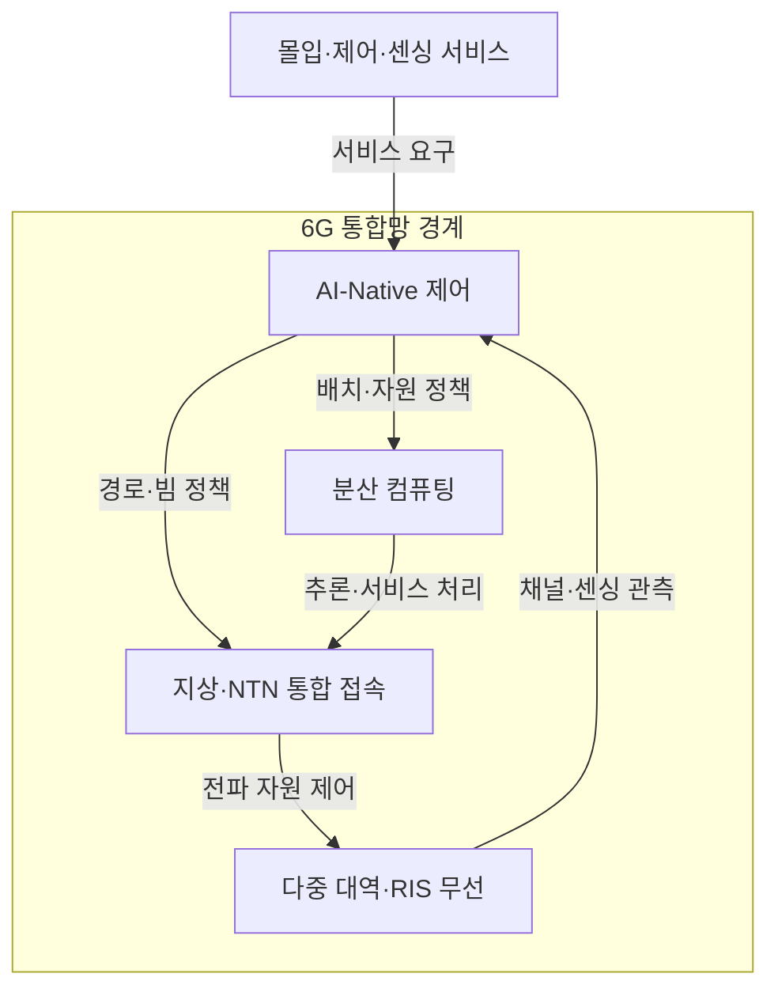

---
sidebar:
  order: 42
  label: "042. 6G 핵심 기술 (6G Vision & Technologies)"
  badge:
    text: "기출 · 70%"
    variant: note
title: "6G 핵심 기술 (6G Vision & Technologies)"
date: "2026-07-25T19:42:00+09:00"
tags:
  - "notes-network"
weight: 42
extra:
  question_no: "042"
  source_status: "기출"
  source_history: "128회, 135회"
  priority: 70
  priority_note: "설명·설계형: 128·135회 6G 반복"
---

## 미리 알고가기

- **국제전기통신연합(International Telecommunication Union, ITU)**: ‘아이티유’로 읽고 세 영문 단어의 머리글자를 딴 표기이며 국제 주파수와 이동통신 권고를 제정하는 유엔 전문기구임
- **국제이동통신 2030(International Mobile Telecommunications 2030, IMT-2030)**: ‘아이엠티 이천삼십’으로 읽고 세 영문 핵심어의 머리글자와 목표 연도를 붙임표로 이은 표기이며 ITU가 정한 6G 사용 시나리오·역량 틀임
- **테라헤르츠(Terahertz, THz)**: ‘테라헤르츠’로 읽고 주파수 접두사 T와 헤르츠 기호 Hz를 결합한 표기이며 0.1~10THz 초광대역 후보를 나타냄
- **범위 기호(~)**: ‘에서’로 읽고 두 수 사이의 연속 범위를 나타내는 표기이며 0.1~10THz가 후보 주파수 구간임을 뜻함
- **비지상망(Non-Terrestrial Network, NTN)**: ‘엔티엔’으로 읽고 세 영문 단어의 머리글자를 딴 표기이며 위성·고고도 플랫폼으로 지상망 밖까지 연결함
- **재구성 지능형 표면(Reconfigurable Intelligent Surface, RIS)**: ‘알아이에스’로 읽고 세 영문 단어의 머리글자를 딴 표기이며 반사 소자의 위상을 조절해 전파 방향을 바꿈
- **인공지능 내재화(Artificial Intelligence-Native, AI-Native)**: ‘에이아이 네이티브’로 읽고 인공지능 약어와 Native를 붙임표로 이은 표기이며 인공지능을 망 설계·운영의 기본 제어 기능으로 포함함
- **통신·센싱 통합(Integrated Sensing and Communication, ISAC)**: ‘아이색’으로 읽고 네 영문 핵심어의 머리글자를 딴 표기이며 같은 무선 자원으로 데이터 전송과 환경 감지를 수행함
- **다중입출력(Multiple-Input Multiple-Output, MIMO)**: ‘마이모’로 읽고 네 영문 핵심어의 머리글자를 딴 표기이며 여러 안테나로 공간 다중화나 빔 형성을 수행함
- **디지털 트윈(Digital Twin)**: 실제 망·설비의 상태를 가상 모델에 동기화해 변화 결과를 예측하는 모델임
- **폐루프 제어(Closed-loop Control)**: 관측·판단·실행 결과를 다시 관측해 설정을 반복 조정하는 제어 방식임

## Ⅰ. 개요

- **정의/개념**: 통신·센싱·AI를 통합하는 IMT-2030 체계
- **배경/필요성**: 지상망 밖 연결과 실시간 지능 제어

### 쉽게 이해하기 (학습용)

- 6G는 더 빠른 통신만이 아니라 주변을 감지하고 망이 스스로 경로와 자원을 조절하려는 이동통신 체계다

## Ⅱ. 특징

- IMT-2030은 6개 사용 시나리오를 제시한다.
- 지상망·NTN 통합으로 입체적 연결 범위를 넓힌다.
- ISAC은 같은 전파 자원으로 통신·감지를 수행한다.
- AI-Native 판단 오류는 망 전체로 확산될 수 있다.

### 쉽게 이해하기 (학습용)

- 6G는 목표가 정해지는 단계이므로 THz·RIS 같은 후보 기술을 확정 규격으로 보면 안 된다

## Ⅲ. 아키텍처 및 구성요소

| 설계 요소 | 설명 |
|:---|:---|
| AI-Native 제어 | 관측값으로 경로·빔·컴퓨팅 정책 결정 |
| 분산 컴퓨팅 | 추론·응용을 단말·에지·클라우드에 배치 |
| 지상·NTN 통합 접속 | 지상 셀과 위성 경로를 연계 |
| 다중 대역·RIS 무선 | 대역·빔·반사면으로 무선 경로 형성 |

> 요약: 관측 기반 정책이 접속·연산·전파를 통합 제어

### 쉽게 이해하기 (학습용)

- 망이 채널과 주변 환경을 보고 지상·위성 경로와 연산 위치를 함께 고르는 구조다

## Ⅳ. 원리 및 절차 흐름도

- 센싱·채널 관측이 디지털 트윈의 망 상태를 갱신
- AI 정책이 경로·빔·연산 배치를 함께 결정
- 실행 결과를 재관측해 정책 오차와 자원 재조정

> 요약: 관측과 실행 결과를 되먹임해 자원 조정

### 쉽게 이해하기 (학습용)

- 현재 망 상태를 가상 모델에 비춰 보고 경로를 바꾼 뒤 결과가 나쁘면 다시 조절한다

## Ⅴ. 종류 및 비교

| 판단 기준 | 6G | 5G |
|:---|:---|:---|
| 핵심 특징 | AI·센싱·NTN 통합 지향 | 통신 서비스 중심 |
| 적용 기준 | 연구·표준 후보 검증 | 상용 서비스 구축 |
| 주요 위험 | 후보 기술·목표의 불확실성 | 공중망 중심의 연결 한계 |

> 요약: 6G는 통합 목표와 후보 기술을 구분해 검증

### 쉽게 이해하기 (학습용)

- 5G는 지금 구축할 규격이고 6G는 앞으로 맞출 목표와 기술 후보를 검증하는 단계다

## Ⅵ. 실무 사례

1. 데이터센터 무선 백홀은 THz 차폐·빔 추적 시험
2. 재난 통신은 지상망·NTN 전환 지연 검증
3. 공장 디지털 트윈은 AI 정책 오차 시 수동 제어 전환

### 쉽게 이해하기 (학습용)

- 초고주파 링크는 장애물에 가려질 때 빔을 다시 찾는지 시험한다
- 지상 기지국이 끊기면 위성 경로로 바뀌는 시간을 확인한다
- AI가 잘못 판단하면 사람이 정한 안전 정책으로 되돌린다

## Ⅶ. 결론

- IMT-2030 목표별 후보 기술 성숙도 검증

### 쉽게 이해하기 (학습용)

- 6G 목표마다 실제로 구현 가능한 기술인지 확인한 뒤 표준 후보로 선택한다
