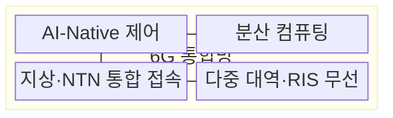
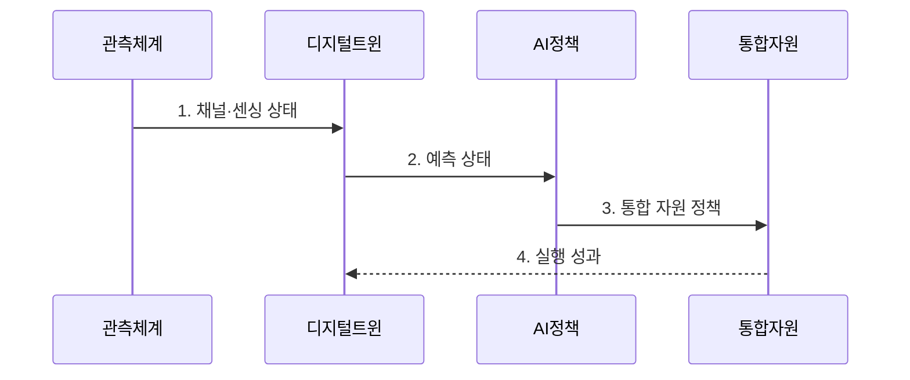

---
sidebar:
  order: 42
  label: "042. 6G 핵심 기술 (6G Vision & Technologies)"
  badge:
    text: "기출 · 70%"
    variant: note
title: "6G 핵심 기술 (6G Vision & Technologies)"
date: "2026-07-31T00:50:55+09:00"
tags:
  - "notes-network"
weight: 42
extra:
  question_no: "042"
  source_status: "기출"
  source_history: "128회, 135회"
  priority: 70
  priority_note: "설명·설계형: 128·135회 6G 반복"
---

## 미리 알고가기

- **국제전기통신연합(International Telecommunication Union, ITU)**: 국제 주파수와 이동통신 권고를 제정하는 유엔 전문기구
- **국제이동통신 2030(International Mobile Telecommunications 2030, IMT-2030)**: ITU가 정한 6G 사용 시나리오와 역량 체계
- **ITU-R M.2160**: IMT-2030의 사용 시나리오와 핵심 역량을 정의한 ITU 무선통신부문 권고
- **테라헤르츠(Terahertz, THz)**: 넓은 대역폭을 확보할 수 있지만 전파 손실이 큰 6G 후보 주파수 대역
- **비지상망(Non-Terrestrial Network, NTN)**: 위성·고고도 플랫폼으로 지상망 밖까지 연결하는 통신망
- **재구성 지능형 표면(Reconfigurable Intelligent Surface, RIS)**: 반사 소자의 위상을 조절해 전파 방향을 바꾸는 표면
- **인공지능 내재화(Artificial Intelligence-Native, AI-Native)**: 인공지능을 망 설계·운영의 기본 제어 기능으로 포함하는 구조
- **통신·센싱 통합(Integrated Sensing and Communication, ISAC)**: 같은 무선 자원으로 데이터 전송과 환경 감지를 수행하는 기술
- **디지털 트윈(Digital Twin)**: 실제 망·설비 상태를 가상 모델에 동기화해 변화 결과를 예측하는 모델
- **폐루프 제어(Closed-loop Control)**: 관측·판단·실행 결과를 다시 관측해 설정을 반복 조정하는 제어 방식
- **분산 컴퓨팅(Distributed Computing)**: 단말·에지·중앙의 여러 연산 자원에 작업을 나눠 처리하는 구조
- **채널 상태(Channel State)**: 송수신 사이 전파 감쇠·간섭·위상 특성을 나타내는 무선 링크 상태
- **빔포밍(Beamforming)**: 여러 안테나 신호의 위상을 조절해 전파 에너지를 원하는 방향으로 집중하는 기법
- **피드백(Feedback)**: 실행 결과를 다음 제어 입력으로 되돌려 정책을 조정하는 과정

> **키워드:** 6G 핵심 기술 (6G Vision & Technologies)

## Ⅰ. 개요

- 정의/개념: 통신·센싱·AI를 통합하는 **IMT-2030 이동통신 체계**
- 배경/필요성: 5G의 지상 셀·통신 중심 구조로 **입체 연결·환경 감지** 제약

### 쉽게 이해하기 (학습용)

- 6G는 더 빠른 통신만이 아니라 주변을 감지하고 망이 스스로 경로와 자원을 조절하려는 이동통신 체계다

## Ⅱ. 특징

- **ITU-R M.2160**의 6대 사용 시나리오로 6G 역량 체계화
- **NTN**으로 지상 셀 밖 입체 연결 확대
- **ISAC·AI-Native**로 통신·센싱·지능 제어 통합

### 쉽게 이해하기 (학습용)

- 6G는 목표가 정해지는 단계이므로 THz·RIS 같은 후보 기술을 확정 규격으로 보면 안 된다

## Ⅲ. 구조 및 구성요소

| 구성요소 | 책임 |
|:---|:---|
| AI-Native 제어 | 관측값으로 경로·빔·**자원 정책** 결정 |
| 분산 컴퓨팅 | 추론·응용을 단말·에지·중앙에 **분산 배치** |
| 지상·NTN 통합 접속 | 지상 셀과 위성 **접속 경로** 연계 |
| 다중 대역·RIS 무선 | 대역·빔·**반사 위상**으로 무선 경로 형성 |

### 쉽게 이해하기 (학습용)

- 망이 채널과 주변 환경을 보고 지상·위성 경로와 연산 위치를 함께 고르는 구조다

## Ⅳ. 흐름도

**동작 원리**

1. **채널·센싱 상태**: **디지털 트윈**의 망 상태 동기화
2. **예측 상태**: 자원 정책별 지연·연결 품질 예측
3. **통합 자원 정책**: 경로·빔·**연산 위치** 동시 지정
4. **실행 성과**: 정책 결과를 다음 제어 주기의 **피드백**으로 반영

> 요약: 관측·정책 실행·성과 피드백의 **폐루프 제어**

### 쉽게 이해하기 (학습용)

- 현재 망 상태를 가상 모델에 비춰 보고 경로를 바꾼 뒤 결과가 나쁘면 다시 조절한다

## Ⅴ. 종류 및 비교

| 이동통신 세대 | 6G | 5G |
|:---|:---|:---|
| 적용 기준 | 미래 사용 시나리오와 후보 기술 검증 | 상용 이동통신 서비스 구축 |
| 핵심 특징 | **AI·ISAC** 기반 지상·비지상 통합 | **초광대역·초저지연** 통신 상용화 |
| 한계 | 후보 기술의 **표준·성숙도** 불확실성 | 센싱 내재화·**입체 연결** 제약 |

> 요약: 6G는 통합 목표와 후보 기술을 구분해 검증

### 쉽게 이해하기 (학습용)

- 5G는 지금 구축할 규격이고 6G는 앞으로 맞출 목표와 기술 후보를 검증하는 단계다

## Ⅵ. 실무 고려사항 및 대책

| 고려사항 | 대책 | 효과 |
|:---|:---|:---|
| 후보 기술을 확정 규격으로 오인한 **선행 투자** | **IMT-2030 목표·성숙도** 분리 검증 | 미성숙 기술 투자 비용 감소 |
| **AI 정책 오판**으로 망 전체 품질 저하 | 정책 한계와 **수동 복구** 기준 설정 | 오판 영향 범위·복구 시간 감소 |
| 지상·**NTN 전환 지연**으로 연결 단절 | 궤도별 **전환·복구 시간** 시험 | 재난 통신의 연결 단절 감소 |

### 쉽게 이해하기 (학습용)

- 지상 기지국이 끊기면 위성 경로로 바뀌는 시간을 확인한다

## Ⅶ. 결론

- **IMT-2030** 시나리오별 성숙도를 검증해 충족 기술만 단계 도입

### 쉽게 이해하기 (학습용)

- 6G 목표마다 구현 가능성과 표준 성숙도를 확인한 기술만 단계적으로 선택해야 한다.
