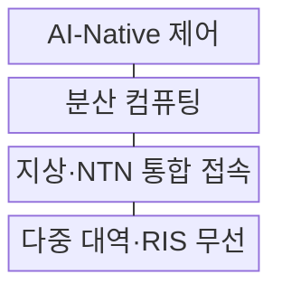
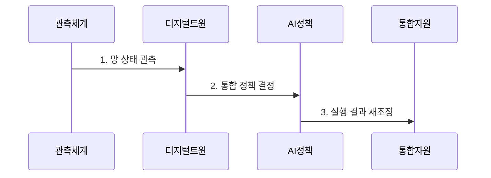

---
sidebar:
  order: 42
  label: "042. 6G 핵심 기술 (6G Vision & Technologies)"
  badge:
    text: "기출 · 70%"
    variant: note
title: "6G 핵심 기술 (6G Vision & Technologies)"
date: "2026-07-29T22:30:00+09:00"
tags:
  - "notes-network"
weight: 42
extra:
  question_no: "042"
  source_status: "기출"
  source_history: "128회, 135회"
  priority: 70
  priority_note: "설명·설계형: 128·135회 6G 반복"
---

## 미리 알고가기

- **국제전기통신연합(International Telecommunication Union, ITU)**: ‘아이티유’로 읽고 세 영문 단어의 머리글자를 딴 표기이며 국제 주파수와 이동통신 권고를 제정하는 유엔 전문기구임
- **국제이동통신 2030(International Mobile Telecommunications 2030, IMT-2030)**: ‘아이엠티 이천삼십’으로 읽고 세 영문 핵심어의 머리글자와 목표 연도를 붙임표로 이은 표기이며 ITU가 정한 6G 사용 시나리오·역량 틀임
- **테라헤르츠(Terahertz, THz)**: ‘테라헤르츠’로 읽고 주파수 접두사 T와 헤르츠 기호 Hz를 결합한 표기이며 0.1~10THz 초광대역 후보를 나타냄
- **범위 기호(~)**: ‘에서’로 읽고 두 수 사이의 연속 범위를 나타내는 표기이며 0.1~10THz가 후보 주파수 구간임을 뜻함
- **비지상망(Non-Terrestrial Network, NTN)**: ‘엔티엔’으로 읽고 세 영문 단어의 머리글자를 딴 표기이며 위성·고고도 플랫폼으로 지상망 밖까지 연결함
- **재구성 지능형 표면(Reconfigurable Intelligent Surface, RIS)**: ‘알아이에스’로 읽고 세 영문 단어의 머리글자를 딴 표기이며 반사 소자의 위상을 조절해 전파 방향을 바꿈
- **인공지능 내재화(Artificial Intelligence-Native, AI-Native)**: ‘에이아이 네이티브’로 읽고 인공지능 약어와 Native를 붙임표로 이은 표기이며 인공지능을 망 설계·운영의 기본 제어 기능으로 포함함
- **통신·센싱 통합(Integrated Sensing and Communication, ISAC)**: ‘아이색’으로 읽고 네 영문 핵심어의 머리글자를 딴 표기이며 같은 무선 자원으로 데이터 전송과 환경 감지를 수행함
- **다중입출력(Multiple-Input Multiple-Output, MIMO)**: ‘마이모’로 읽고 네 영문 핵심어의 머리글자를 딴 표기이며 여러 안테나로 공간 다중화나 빔 형성을 수행함
- **디지털 트윈(Digital Twin)**: 실제 망·설비의 상태를 가상 모델에 동기화해 변화 결과를 예측하는 모델임
- **폐루프 제어(Closed-loop Control)**: 관측·판단·실행 결과를 다시 관측해 설정을 반복 조정하는 제어 방식임

## Ⅰ. 개요

- 정의/개념: 통신·센싱·AI를 통합하는 **IMT-2030 이동통신 체계**
- 배경/필요성: 5G의 **입체 연결·통신 센싱 통합 한계** 해소

### 쉽게 이해하기 (학습용)

- 6G는 더 빠른 통신만이 아니라 주변을 감지하고 망이 스스로 경로와 자원을 조절하려는 이동통신 체계다

## Ⅱ. 특징

- IMT-2030의 **6개 사용 시나리오**
- 지상망·NTN의 **입체 연결**
- ISAC·AI-Native의 **통신·센싱·지능 제어 통합**

### 쉽게 이해하기 (학습용)

- 6G는 목표가 정해지는 단계이므로 THz·RIS 같은 후보 기술을 확정 규격으로 보면 안 된다

## Ⅲ. 구조 및 구성요소

| 구성요소 | 책임 |
|:---|:---|
| AI-Native 제어 | 관측값으로 경로·빔·컴퓨팅 정책 결정 |
| 분산 컴퓨팅 | 추론·응용을 단말·에지·클라우드에 배치 |
| 지상·NTN 통합 접속 | 지상 셀과 위성 경로를 연계 |
| 다중 대역·RIS 무선 | 대역·빔·반사면으로 무선 경로 형성 |

### 쉽게 이해하기 (학습용)

- 망이 채널과 주변 환경을 보고 지상·위성 경로와 연산 위치를 함께 고르는 구조다

## Ⅳ. 흐름도

**동작 원리**

1. **망 상태 관측**: 채널·센싱·자원 상태 갱신
2. **통합 정책 결정**: 경로·빔·연산 위치 산출
3. **실행 결과 재조정**: 성과를 되먹임해 정책 수정

### 쉽게 이해하기 (학습용)

- 현재 망 상태를 가상 모델에 비춰 보고 경로를 바꾼 뒤 결과가 나쁘면 다시 조절한다

## Ⅴ. 종류 및 비교

| 이동통신 세대 | 6G | 5G |
|:---|:---|:---|
| 적용 기준 | 연구·표준 후보 검증 | 상용 서비스 구축 |
| 핵심 특징 | AI·센싱·NTN 통합 지향 | 통신 서비스 중심 |
| 한계 | 후보 기술·목표 불확실성 | 공중망 중심 연결 한계 |

> 요약: 6G는 통합 목표와 후보 기술을 구분해 검증

### 쉽게 이해하기 (학습용)

- 5G는 지금 구축할 규격이고 6G는 앞으로 맞출 목표와 기술 후보를 검증하는 단계다

## Ⅵ. 실무 고려사항 및 대책

| 고려사항 | 대책 | 효과 |
|:---|:---|:---|
| 후보 기술을 확정 규격으로 오인 | IMT-2030 목표·성숙도 분리 | 과잉 투자 방지 |
| AI 제어의 설명·안전 부족 | 정책 한계·수동 복구 기준 | 망 통제 가능성 |
| 지상·NTN 전환 지연 | 궤도별 전환·복구 시간 시험 | 재난 연결성 확보 |

### 쉽게 이해하기 (학습용)

- 지상 기지국이 끊기면 위성 경로로 바뀌는 시간을 확인한다

## Ⅶ. 결론

- **IMT-2030 목표와 후보 기술 성숙도에 따른 6G 단계 검증**

### 쉽게 이해하기 (학습용)

- 6G 목표마다 구현 가능성과 표준 성숙도를 확인한 기술만 단계적으로 선택해야 한다.
