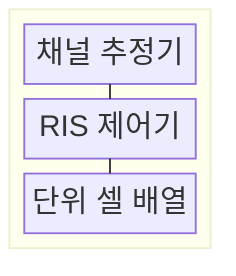
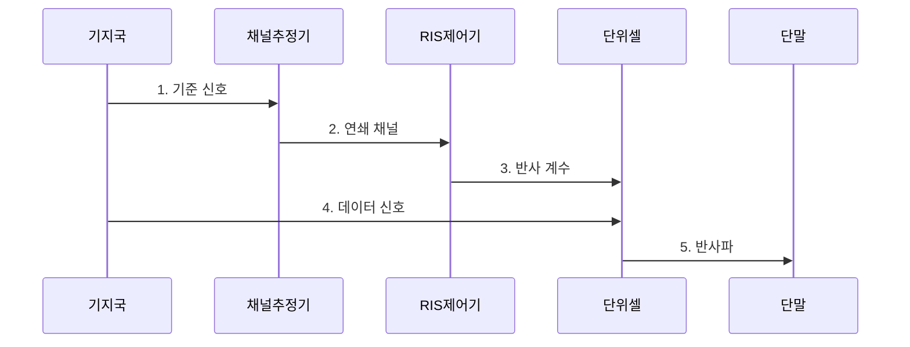

---
sidebar:
  order: 43
  label: "043. 지능형 반사 표면 (RIS, Reconfigurable Intelligent Surface)"
  badge:
    text: "기출 · 50%"
    variant: note
title: "지능형 반사 표면 (RIS, Reconfigurable Intelligent Surface)"
date: "2026-07-31T10:59:30+09:00"
tags:
  - "notes-network"
weight: 43
extra:
  question_no: "043"
  source_status: "기출"
  source_history: "135회"
  priority: 50
  priority_note: "설명형: 135회 6G RIS 핵심 구성요소"
---

## 미리 알고가기

- **재구성 지능형 표면(Reconfigurable Intelligent Surface, RIS)**: 다수 소자의 전자기 응답을 바꿔 전파 반사 방향을 제어하는 표면
- **단위 셀(Unit Cell)**: 위상·진폭·편파 응답을 개별 설정할 수 있는 RIS의 최소 반사 소자
- **무선주파수 체인(Radio Frequency Chain, RF Chain)**: 신호 변환·증폭·변복조를 담당하는 능동 회로 계통
- **신호대잡음비(Signal-to-Noise Ratio, SNR)**: 수신 신호 전력과 잡음 전력의 비율
- **반사 계수(Reflection Coefficient)**: 입사파 대비 반사파의 진폭과 위상 변화를 나타내는 복소수
- **연쇄 채널(Cascaded Channel)**: 기지국-RIS 경로와 RIS-단말 경로가 결합된 전파 채널
- **위상 양자화(Phase Quantization)**: 연속 위상값을 소자가 지원하는 유한 단계로 변환하는 과정
- **빔 이탈(Beam Misalignment)**: 설정한 반사 빔 방향과 이동한 단말 위치가 어긋나 수신 전력이 감소하는 현상
- **중계기(Repeater)**: 수신한 무선 신호를 증폭·재송신해 약한 전파 구간을 보완하는 장치

> **키워드:** 지능형 반사 표면 (RIS, Reconfigurable Intelligent Surface)

## Ⅰ. 개요

- 정의/개념: 다수 단위 셀의 **반사 계수**를 조절해 전파 경로를 재구성하는 **무선 표면 기술**
- 배경/필요성: **고주파 차폐** 시 직접 경로만으로 비가시 영역 수신 전력 확보 곤란

### 쉽게 이해하기 (학습용)

- 작은 전자 거울들의 각도를 맞춰 막힌 전파를 단말 방향으로 모은다

## Ⅱ. 특징

- 단위 셀별 **위상·진폭** 조절로 반사파를 목표 방향에 결합
- **연쇄 채널** 추정 오차가 반사 빔의 방향 오차로 전파
- 채널 갱신 지연 시 **빔 이탈**로 단말 수신 전력 저하

### 쉽게 이해하기 (학습용)

- 단말이 움직인 뒤 예전 위상값을 적용하면 반사파가 엉뚱한 곳에 모인다

## Ⅲ. 구조 및 구성요소

| 구성요소 | 책임 |
|:---|:---|
| 채널 추정기 | 기준 신호로 **연쇄 채널** 상태 추정 |
| RIS 제어기 | 목표 방향에 맞는 소자별 **반사 계수** 계산 |
| 단위 셀 배열 | 설정된 **위상·진폭**으로 전파 반사 |

### 쉽게 이해하기 (학습용)

- 추정기가 전파 길을 재면 제어기가 거울 각도를 계산하고 단위 셀이 그 방향으로 전파를 반사한다

## Ⅳ. 흐름도

**동작 원리**

1. **기준 신호**: 기지국-RIS-단말의 **연쇄 채널** 관측
2. **연쇄 채널**: 추정한 복소 채널값으로 반사 방향 계산
3. **반사 계수**: 목표 방향에서 위상이 합쳐지도록 소자 설정
4. **데이터 신호**: 기지국 신호가 **단위 셀 배열**에 입사
5. **반사파**: 조절된 반사파가 단말 위치에서 결합

### 쉽게 이해하기 (학습용)

- 여러 거울에서 온 전파의 물결이 단말에서 같은 때 겹치도록 각도를 맞추고 결과를 다시 측정한다

## Ⅴ. 종류 및 비교

| 전파 음영 보완 방식 | RIS | 전통적 중계기 |
|:---|:---|:---|
| 적용 기준 | 반사 표면에 충분한 입사파가 있을 때 | 경로 손실 보상에 증폭이 필요할 때 |
| 핵심 특징 | **반사 계수**로 수동 경로 제어 | **RF Chain**으로 수신·증폭·재송신 |
| 한계 | **채널 추정·제어 지연**에 민감 | **증폭 잡음·전력 소비** 증가 |

> 요약: 입사파가 충분하면 RIS, 증폭은 중계기

### 쉽게 이해하기 (학습용)

- 전파가 닿지만 방향만 나쁘면 RIS를 쓰고 신호 자체가 약하면 중계기로 증폭한다

## Ⅵ. 실무 고려사항 및 대책

| 고려사항 | 대책 | 효과 |
|:---|:---|:---|
| 입사 **SNR** 부족으로 반사 경로 이득 미달 | 후보 위치별 **입사 전력** 사전 측정 | 효과 없는 RIS 설치 방지 |
| 이동 중 채널 갱신 지연으로 **빔 이탈** | 이동 속도별 **갱신 주기** 설정 | 단말 수신 전력 저하 감소 |
| **위상 양자화·셀 편차**로 반사 위상 오차 | 소자별 **보정표**와 고장 셀 우회 적용 | 목표 방향의 반사 빔 오차 감소 |

### 쉽게 이해하기 (학습용)

- 선반에 막힌 구역까지 전파가 꺾여 도달하도록 RIS 위치를 정한다

## Ⅶ. 결론

- 입사 전력이 충분하고 채널 추적이 가능하면 **RIS**, 증폭이 필요하면 **중계기** 선택

### 쉽게 이해하기 (학습용)

- 전파가 충분히 닿고 움직임을 따라 반사 각도를 바꿀 수 있는 구역에 RIS를 적용해야 한다.
