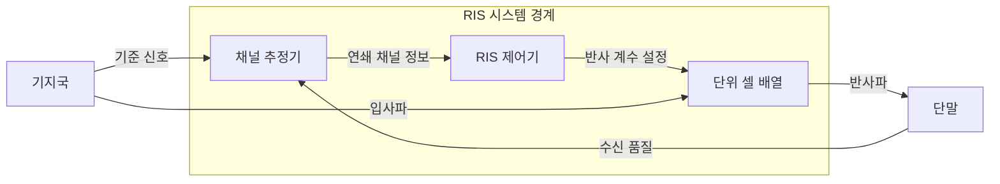
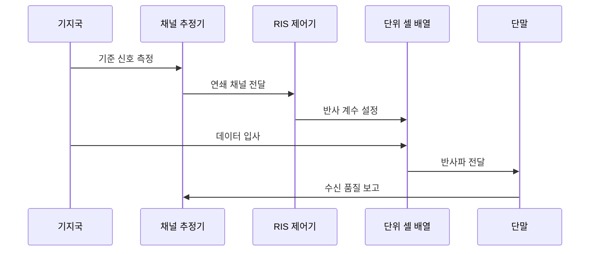

---
sidebar:
  order: 43
  label: "043. 지능형 반사 표면 (RIS, Reconfigurable Intelligent Surface)"
  badge:
    text: "기출 · 50%"
    variant: note
title: "지능형 반사 표면 (RIS, Reconfigurable Intelligent Surface)"
date: "2026-07-27T23:59:59+09:00"
tags:
  - "notes-network"
weight: 43
extra:
  question_no: "043"
  source_status: "기출"
  source_history: "135회"
  priority: 50
  priority_note: "설명형: 135회 6G RIS 핵심 구성요소"
---

## 미리 알고가기

- **재구성 지능형 표면(Reconfigurable Intelligent Surface, RIS)**: ‘알아이에스’로 읽고 세 영문 단어의 머리글자를 딴 표기이며 다수 소자의 전자기 응답을 바꿔 전파 반사 방향을 제어함
- **단위 셀(Unit Cell)**: 위상·진폭·편파 응답을 개별 설정할 수 있는 RIS의 최소 반사 소자임
- **무선주파수 체인(Radio Frequency Chain, RF Chain)**: ‘알에프 체인’으로 읽고 Radio Frequency의 머리글자를 딴 표기이며 신호 변환·증폭·변복조를 담당하는 능동 회로 계통임
- **신호대잡음비(Signal-to-Noise Ratio, SNR)**: ‘에스엔알’로 읽고 세 영문 핵심어의 머리글자를 딴 표기이며 수신 신호 전력과 잡음 전력의 비율임
- **반사 계수(Reflection Coefficient)**: 입사파 대비 반사파의 진폭과 위상 변화를 나타내는 복소수임
- **연쇄 채널(Cascaded Channel)**: 기지국-RIS 경로와 RIS-단말 경로가 결합된 전파 채널임
- **위상 양자화(Phase Quantization)**: 연속 위상값을 소자가 지원하는 유한한 단계로 변환하는 과정임
- **근접장(Near Field)**: 송신원과 가까워 전파를 평면파가 아닌 구면파로 다뤄야 하는 영역임
- **수동형·능동형 RIS**: 수동형은 자체 증폭 없이 반사 계수만 바꾸고 능동형은 반사 소자의 증폭 기능으로 경로 손실을 보상함
- **기지국·사용자 장비(Base Station·User Equipment, BS·UE)**: 각각 ‘비에스·유이’로 읽고 영문 머리글자를 딴 도식 표기이며 기지국이 신호를 보내고 사용자 장비가 RIS 반사파를 수신함

## Ⅰ. 개요

- 정의/개념: 단위 셀의 **반사 계수로 전파 경로 제어**
- **배경/필요성**: 고주파의 **차폐·비가시 경로 손실 한계** 보완

### 쉽게 이해하기 (학습용)

- 작은 전자 거울들의 각도를 맞춰 막힌 전파를 단말 방향으로 모은다

## Ⅱ. 특징

- 다수 단위 셀의 **위상·진폭 제어**
- 연쇄 채널 기반 **반사 빔 형성**
- 채널 추정·제어 지연의 **빔 이탈 영향**

### 쉽게 이해하기 (학습용)

- 단말이 움직인 뒤 예전 위상값을 적용하면 반사파가 엉뚱한 곳에 모인다

## Ⅲ. 아키텍처 및 구성요소

| 설계 요소 | 설명 |
|:---|:---|
| 채널 추정기 | 기준 신호로 연쇄 채널 상태 추정 |
| RIS 제어기 | 목표에 맞는 소자별 반사 계수 계산 |
| 단위 셀 배열 | 설정된 위상·진폭으로 전파 반사 |

> 요약: 채널 추정값으로 반사 계수를 맞춰 빔 형성

### 쉽게 이해하기 (학습용)

- 추정기가 전파 길을 재면 제어기가 거울 각도를 계산하고 단위 셀이 그 방향으로 전파를 반사한다

## Ⅳ. 원리 및 절차 흐름도

| 절차 | 설명 |
|:---|:---|
| 기준 신호 측정 | 기지국-RIS-단말 경로를 관측 |
| 연쇄 채널 전달 | 추정한 복소 채널값을 제어기에 전달 |
| 반사 계수 설정 | 목표 방향에 위상이 합쳐지도록 설정 |
| 데이터 입사 | 기지국 신호가 단위 셀에 도달 |
| 반사파 전달 | 조절된 반사파가 단말에서 결합 |
| 수신 품질 보고 | SNR 저하 시 반사 계수를 재계산 |

> 요약: 반사파 위상을 맞추고 수신 품질로 재조정

### 쉽게 이해하기 (학습용)

- 여러 거울에서 온 전파의 물결이 단말에서 같은 때 겹치도록 각도를 맞추고 결과를 다시 측정한다

## Ⅴ. 종류 및 비교

| 전파 음영 보완 방식 | RIS | 전통적 중계기 |
|:---|:---|:---|
| 적용 기준 | 우회 경로에 입사파 확보 | 경로 손실 보상에 증폭 필요 |
| 핵심 특징 | 반사 계수로 경로 제어 | RF Chain으로 수신·재송신 |
| 한계 | 채널 추정·제어 지연 | 증폭 잡음·전력 소비 |

> 요약: 입사파가 충분하면 RIS, 증폭은 중계기

### 쉽게 이해하기 (학습용)

- 전파가 닿지만 방향만 나쁘면 RIS를 쓰고 신호 자체가 약하면 중계기로 증폭한다

## Ⅵ. 실무 사례

1. 창고 음영 구역의 **반사 경로 측정 후 RIS 배치**

### 쉽게 이해하기 (학습용)

- 선반에 막힌 구역까지 전파가 꺾여 도달하도록 RIS 위치를 정한다

## Ⅶ. 결론

- 전파 음영을 능동 송신기 증설 없이 보완하기 위해 입사 전력·채널 추정·갱신 지연·배치 비용을 검토하여, 반사 경로 이득이 유효한 구역에 RIS를 적용해야 한다.

### 쉽게 이해하기 (학습용)

- 전파가 충분히 닿고 움직임을 따라 각도를 바꿀 수 있을 때 RIS를 선택한다
