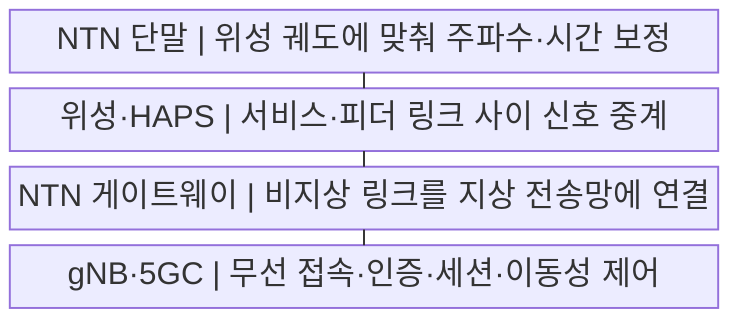
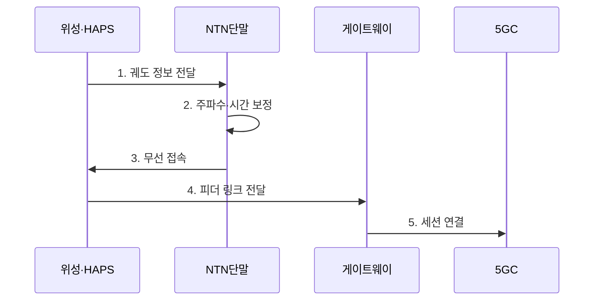

---
sidebar:
  order: 44
  label: "044. 비지상 네트워크 (NTN, Non-Terrestrial Network)"
  badge:
    text: "기출 · 50%"
    variant: note
title: "비지상 네트워크 (NTN, Non-Terrestrial Network)"
date: "2026-07-29T22:30:00+09:00"
tags:
  - "notes-network"
weight: 44
extra:
  question_no: "044"
  source_status: "기출"
  source_history: "137회"
  priority: 50
  priority_note: "설명·설계형: 137회 NTN 단답과 LEO 확장"
---

## 미리 알고가기

- **비지상망(Non-Terrestrial Network, NTN)**: ‘엔티엔’으로 읽고 세 영문 단어의 머리글자를 딴 표기이며 위성·고고도 플랫폼을 5G 접속망에 포함함
- **저궤도(Low Earth Orbit, LEO)**: ‘엘이오’로 읽고 세 영문 단어의 머리글자를 딴 표기이며 지상 약 2,000km 이하를 빠르게 공전하는 궤도임
- **정지궤도(Geostationary Earth Orbit, GEO)**: ‘지이오’로 읽고 세 영문 단어의 머리글자를 딴 표기이며 적도 상공 약 35,786km에서 지상 기준 같은 위치에 머무는 궤도임
- **위성 간 링크(Inter-Satellite Link, ISL)**: ‘아이에스엘’로 읽고 세 영문 단어의 머리글자를 딴 표기이며 지상 게이트웨이를 거치지 않고 위성끼리 데이터를 전달함
- **고고도 플랫폼국(High Altitude Platform Station, HAPS)**: ‘햅스’로 읽고 네 영문 단어의 머리글자를 딴 표기이며 성층권에 체공해 일정 지역에 무선 접속을 제공함
- **5G 기지국(next Generation NodeB, gNB)**: ‘지엔비’로 읽고 차세대를 뜻하는 소문자 g와 NodeB의 머리글자를 결합한 표기이며 5G 무선 접속과 자원 제어를 담당함
- **5G 코어(5G Core, 5GC)**: ‘파이브지 코어’로 읽고 세대 표기 뒤에 Core의 C를 붙인 표기이며 가입자 인증·세션·이동성을 제어함
- **왕복 시간(Round-Trip Time, RTT)**: ‘알티티’로 읽고 세 영문 단어의 머리글자를 딴 표기이며 송신부터 응답 수신까지 소요되는 지연임
- **서비스 링크·피더 링크(Service Link·Feeder Link)**: 서비스 링크는 단말과 위성·플랫폼을, 피더 링크는 플랫폼과 지상 게이트웨이를 잇는 무선 구간임
- **도플러 보상(Doppler Compensation)**: 위성의 상대 이동으로 생긴 반송파 주파수 편이를 보정하는 과정임
- **투명형·재생형 페이로드(Transparent·Regenerative Payload)**: 투명형은 신호를 변환·증폭해 중계하고 재생형은 위성에서 복조·처리한 뒤 다시 생성함
- **링크 예산(Link Budget)**: 송신 전력부터 경로 손실·안테나 이득을 합산해 수신 전력을 산정하는 계산임

## Ⅰ. 개요

- 정의/개념: 위성·HAPS를 **이동통신 접속망에 통합**
- 배경/필요성: 지상망의 **음영·재난 단절·광역 한계** 해소

### 쉽게 이해하기 (학습용)

- 기지국을 세우기 어려운 바다·산간·재난 지역을 위성이나 성층권 기지국으로 연결한다

## Ⅱ. 특징

- 긴 전파 거리의 **RTT·경로 손실 증가**
- LEO 이동의 **도플러 보상·빔 전환**
- 투명형·재생형의 **gNB 기능 위치 차이**

### 쉽게 이해하기 (학습용)

- 빠르게 움직이는 위성을 따라 주파수와 접속 빔을 미리 바꿔야 통화가 끊기지 않는다

## Ⅲ. 구조 및 구성요소

| 구성요소 | 책임 |
|:---|:---|
| NTN 단말 | 위성 궤도에 맞춰 주파수·시간 보정 |
| 위성·HAPS | 서비스·피더 링크 사이 신호 중계 |
| NTN 게이트웨이 | 비지상 링크를 지상 전송망에 연결 |
| gNB·5GC | 무선 접속·인증·세션·이동성 제어 |

### 쉽게 이해하기 (학습용)

- 단말 신호는 위성까지 서비스 링크로 올라가고 피더 링크로 지상 게이트웨이에 내려온다

## Ⅳ. 흐름도

**동작 원리**

1. **궤도 정보 전달**: 위성 위치·속도·시간 기준 제공
2. **주파수·시간 보정**: 도플러 편이와 전파 지연을 선보정
3. **무선 접속**: 보정된 신호로 서비스 링크 접속
4. **피더 링크 전달**: 위성이 단말 신호를 게이트웨이에 중계
5. **세션 연결**: 5GC가 가입자 인증·세션 설정

### 쉽게 이해하기 (학습용)

- 위성 위치를 보고 신호 시계와 주파수를 맞춘 뒤 사라지기 전에 다음 위성 빔으로 갈아탄다

## Ⅴ. 종류 및 비교

| 비지상 플랫폼 | LEO | GEO | HAPS |
|:---|:---|:---|:---|
| 적용 기준 | 저지연 광역 접속 | 고정 지역 방송·백홀 | 재난·지역 임시망 |
| 핵심 특징 | 저고도 고속 공전 | 정지 위치 광역 빔 | 성층권 지역 체공 |
| 한계 | 위성·빔 전환 빈발 | 긴 RTT·큰 경로 손실 | 체공 시간·기상 제약 |

> 요약: 지연·이동성·체공 범위로 플랫폼 선택

### 쉽게 이해하기 (학습용)

- 낮은 위성은 빠르지만 자주 갈아타고 정지위성은 오래 보이지만 응답이 늦다

## Ⅵ. 실무 고려사항 및 대책

| 고려사항 | 대책 | 효과 |
|:---|:---|:---|
| 도플러·긴 전파 지연 | 궤도 정보 기반 선보정 | 접속 성공률 향상 |
| 빔·위성 전환 단절 | 가시 시간 예측·선행 전환 | 세션 연속성 |
| 게이트웨이 단일 장애 | 다중 위성·게이트웨이 경로 | 재난 가용성 |

### 쉽게 이해하기 (학습용)

- 지상 회선이 끊기면 다른 위성과 게이트웨이를 거쳐 재난 현장을 연결한다

## Ⅶ. 결론

- **궤도·RTT·가시 시간에 맞춘 NTN 플랫폼과 이중 경로**

### 쉽게 이해하기 (학습용)

- 응답 시간과 위성·빔 교체 빈도를 감당할 수 있는 궤도와 플랫폼을 선택해야 한다.
