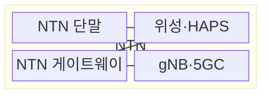
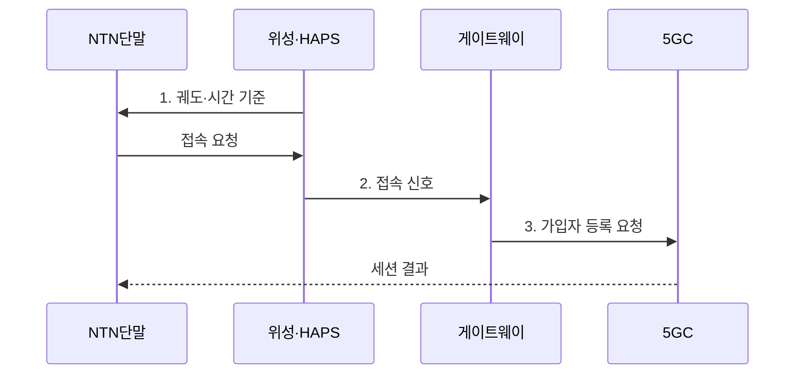

---
sidebar:
  order: 44
  label: "044. 비지상 네트워크 (NTN, Non-Terrestrial Network)"
  badge:
    text: "기출 · 50%"
    variant: note
title: "비지상 네트워크 (NTN, Non-Terrestrial Network)"
date: "2026-07-31T00:53:09+09:00"
tags:
  - "notes-network"
weight: 44
extra:
  question_no: "044"
  source_status: "기출"
  source_history: "137회"
  priority: 50
  priority_note: "설명·설계형: 137회 NTN 단답과 LEO 확장"
---

## 미리 알고가기

- **비지상망(Non-Terrestrial Network, NTN)**: 위성·고고도 플랫폼을 이동통신 접속망에 포함하는 네트워크
- **저궤도(Low Earth Orbit, LEO)**: 지상 약 2,000km 이하에서 빠르게 공전하는 위성 궤도
- **정지궤도(Geostationary Earth Orbit, GEO)**: 적도 상공 약 35,786km에서 지상 기준 같은 위치에 머무는 위성 궤도
- **고고도 플랫폼국(High Altitude Platform Station, HAPS)**: 성층권에 체공해 일정 지역에 무선 접속을 제공하는 플랫폼
- **5G 기지국(next Generation NodeB, gNB)**: 5G 무선 접속과 무선 자원 제어를 담당하는 기지국
- **5G 코어(5G Core, 5GC)**: 가입자 인증·세션·이동성을 제어하는 핵심망
- **왕복 시간(Round-Trip Time, RTT)**: 송신부터 응답 수신까지 걸리는 지연 시간
- **서비스 링크·피더 링크(Service Link·Feeder Link)**: 서비스 링크는 단말과 플랫폼을, 피더 링크는 플랫폼과 지상 게이트웨이를 잇는 무선 구간
- **도플러 보상(Doppler Compensation)**: 위성의 상대 이동으로 생긴 반송파 주파수 편이를 보정하는 과정
- **투명형·재생형 페이로드(Transparent·Regenerative Payload)**: 투명형은 신호를 변환·증폭해 중계하고 재생형은 위성에서 복조·처리한 뒤 다시 생성하는 탑재체
- **링크 예산(Link Budget)**: 송신 전력·경로 손실·안테나 이득을 합산해 수신 전력을 산정하는 계산
- **백홀(Backhaul)**: 기지국·게이트웨이의 접속 트래픽을 코어망으로 운반하는 전송 구간
- **빔 전환(Beam Handover)**: 이동 단말이나 위성의 가시 범위 변화에 맞춰 접속 빔을 바꾸는 절차
- **가시 시간(Visibility Time)**: 단말에서 특정 위성이나 빔에 접속할 수 있는 연속 시간

> **키워드:** 비지상 네트워크 (NTN, Non-Terrestrial Network)

## Ⅰ. 개요

- 정의/개념: 위성·HAPS를 무선 접속 구간으로 활용해 지상망 밖 단말을 연결하는 **이동통신망**
- 배경/필요성: 지상 기지국만으로 해양·산간·재난 지역 **연속 접속 범위** 확보 곤란

### 쉽게 이해하기 (학습용)

- 기지국을 세우기 어려운 바다·산간·재난 지역을 위성이나 성층권 기지국으로 연결한다

## Ⅱ. 특징

> **궤도 고도**가 높을수록 전파 왕복 거리와 최소 **RTT** 증가

- 궤도 고도가 높을수록 **RTT·경로 손실** 증가
- LEO 고속 이동으로 **도플러 편이·빔 전환** 빈도 증가
- **투명형·재생형 페이로드**에 따라 gNB 기능 위치 분리

### 쉽게 이해하기 (학습용)

- 빠르게 움직이는 위성을 따라 주파수와 접속 빔을 미리 바꿔야 통화가 끊기지 않는다

## Ⅲ. 구조 및 구성요소

| 구성요소 | 책임 |
|:---|:---|
| NTN 단말 | 위성 궤도에 맞춰 **주파수·시간** 보정 |
| 위성·HAPS | **서비스·피더 링크** 사이 신호 중계 |
| NTN 게이트웨이 | **비지상 링크**를 지상 전송망에 연결 |
| gNB·5GC | 무선 접속·인증·**세션·이동성** 제어 |

### 쉽게 이해하기 (학습용)

- 단말 신호는 위성까지 서비스 링크로 올라가고 피더 링크로 지상 게이트웨이에 내려온다

## Ⅳ. 흐름도

**동작 원리**

1. **궤도·시간 기준**: 단말의 **도플러 편이·전파 지연** 선보정
2. **접속 신호**: 위성이 **피더 링크**로 단말 신호 중계
3. **가입자 등록 요청**: **5GC**의 가입자 인증·세션 설정

### 쉽게 이해하기 (학습용)

- 위성 위치를 보고 신호 시계와 주파수를 맞춘 뒤 사라지기 전에 다음 위성 빔으로 갈아탄다

## Ⅴ. 종류 및 비교

| 비지상 플랫폼 | LEO | GEO | HAPS |
|:---|:---|:---|:---|
| 적용 기준 | 저지연 광역 위성 접속이 필요할 때 | 고정 지역 방송·백홀이 필요할 때 | 재난·지역 임시망이 필요할 때 |
| 핵심 특징 | 저고도 **고속 공전** | 정지 위치의 **광역 빔** | 성층권 **지역 체공** |
| 한계 | 위성·**빔 전환** 빈발 | 긴 **RTT·경로 손실** | **체공 시간·기상** 제약 |

> 요약: 지연·이동성·체공 범위로 플랫폼 선택

### 쉽게 이해하기 (학습용)

- 낮은 위성은 빠르지만 자주 갈아타고 정지위성은 오래 보이지만 응답이 늦다

## Ⅵ. 실무 고려사항 및 대책

| 고려사항 | 대책 | 효과 |
|:---|:---|:---|
| 궤도 고도로 **링크 예산**이 수신 한도 미달 | 궤도별 **경로 손실·안테나 이득** 산정 | 수신 전력 부족 구간 사전 배제 |
| 이동 위성의 도플러·**전파 지연** 증가 | 궤도 정보 기반 **주파수·시간 선보정** | 초기 접속 실패율 감소 |
| 짧은 가시 시간으로 **빔 전환 단절** | 가시 시간 예측과 **선행 전환** | 이동 중 세션 단절 감소 |
| 재난 시 **게이트웨이 단일 장애** | 다중 위성·**게이트웨이 경로** 구성 | 지상 회선 장애 시 우회 경로 유지 |

### 쉽게 이해하기 (학습용)

- 지상 회선이 끊기면 다른 위성과 게이트웨이를 거쳐 재난 현장을 연결한다

## Ⅶ. 결론

- RTT 한도가 엄격하면 **LEO·HAPS**, 고정 광역 접속에 지연을 허용하면 **GEO** 선택

### 쉽게 이해하기 (학습용)

- 응답 시간과 위성·빔 교체 빈도를 감당할 수 있는 궤도와 플랫폼을 선택해야 한다.
