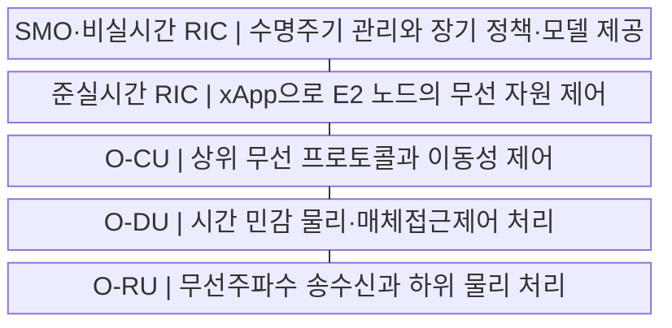
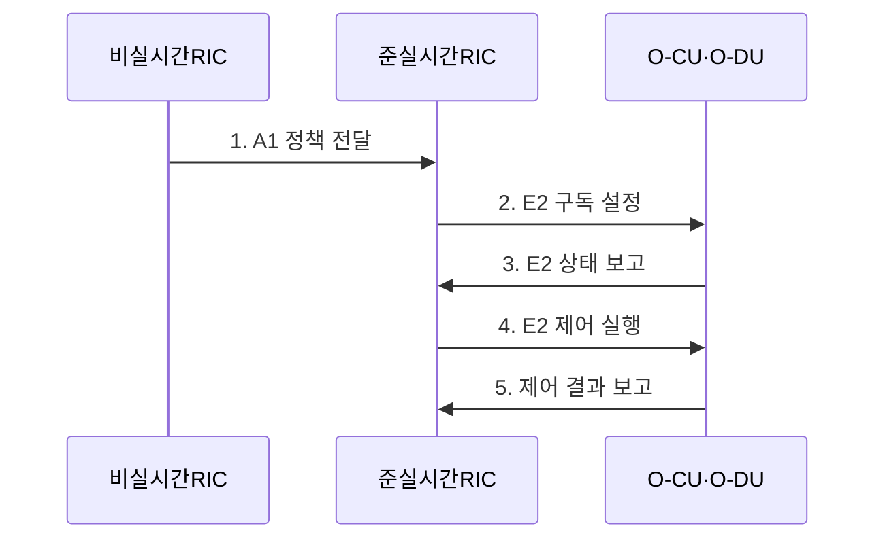

---
sidebar:
  order: 45
  label: "045. 오픈랜 (O-RAN, Open Radio Access Network)"
  badge:
    text: "기출 · 50%"
    variant: note
title: "오픈랜 (O-RAN, Open Radio Access Network)"
date: "2026-07-29T22:30:00+09:00"
tags:
  - "notes-network"
weight: 45
extra:
  question_no: "045"
  source_status: "기출"
  source_history: "132회"
  priority: 50
  priority_note: "설계·비교형: 132회 Open RAN 장문 출제"
---

## 미리 알고가기

- **개방형 무선접속망(Open Radio Access Network, O-RAN)**: ‘오랜’으로 읽고 Open의 O와 RAN을 붙임표로 이은 표기이며 기지국 기능을 분리하고 개방 인터페이스로 다중 공급자 장비를 연동함
- **O-RAN 무선 장치(O-RAN Radio Unit, O-RU)**: ‘오알유’로 읽고 O-RAN의 O와 Radio Unit의 머리글자를 붙임표로 이은 표기이며 무선주파수 송수신과 하위 물리계층을 처리함
- **O-RAN 분산 장치(O-RAN Distributed Unit, O-DU)**: ‘오디유’로 읽고 O와 Distributed Unit의 머리글자를 이은 표기이며 상위 물리계층과 실시간 매체접근제어를 처리함
- **O-RAN 중앙 장치(O-RAN Central Unit, O-CU)**: ‘오시유’로 읽고 O와 Central Unit의 머리글자를 이은 표기이며 상위 무선 프로토콜과 이동성을 제어함
- **무선접속망 지능형 제어기(RAN Intelligent Controller, RIC)**: ‘릭’으로 읽고 세 영문 단어의 머리글자를 딴 표기이며 관측값과 정책으로 무선 자원을 최적화함
- **준실시간·비실시간 RIC(Near-Real-Time·Non-Real-Time RIC)**: 준실시간은 약 10ms~1초 주기로 xApp 제어를, 비실시간은 1초보다 긴 주기로 정책·모델 학습을 수행함
- **밀리초(millisecond, ms)**: ‘밀리초’로 읽고 1초의 천분의 일을 뜻하는 접두사 m과 초 기호 s를 결합한 표기이며 준실시간 제어 주기의 하한을 나타냄
- **서비스 관리·오케스트레이션(Service Management and Orchestration, SMO)**: ‘에스엠오’로 읽고 세 영문 핵심어의 머리글자를 딴 표기이며 O-RAN 기능의 구성·장애·성능·배치를 관리함
- **O-클라우드(O-Cloud)**: ‘오클라우드’로 읽고 O-RAN의 O와 Cloud를 붙임표로 이은 표기이며 가상화 기능의 컴퓨팅·가속기 기반임
- **엑스앱·알앱(xApp·rApp)**: ‘엑스앱·알앱’으로 읽고 실행 계층을 구분하는 소문자 접두사와 App을 붙인 공식 이름이며 각각 준실시간 제어와 비실시간 정책·분석을 수행함
- **A1·E2·O1 인터페이스**: 각각 ‘에이원·이투·오원’으로 읽는 O-RAN 공식 참조점 이름이며 A1은 정책·모델, E2는 관측·제어, O1은 구성·장애·성능 정보를 전달함
- **F1 인터페이스**: ‘에프원’으로 읽는 3GPP 공식 참조점 이름이며 O-CU와 O-DU 사이의 제어·사용자면 정보를 전달함
- **개방형 프론트홀(Open Fronthaul)**: O-DU와 O-RU 사이 제어·사용자·동기 정보를 전달하는 개방 인터페이스임

## Ⅰ. 개요

- 정의/개념: 분리된 RAN 기능의 **개방 인터페이스 연동**
- 배경/필요성: 폐쇄형 RAN의 **공급자 종속·확장 한계** 해소

### 쉽게 이해하기 (학습용)

- 한 회사의 통짜 기지국 대신 여러 회사의 무선·처리 장치를 표준 연결로 조립한다

## Ⅱ. 특징

- O-RU·O-DU·O-CU의 **기능 분리**
- 프론트홀·E2·A1의 **개방 인터페이스**
- xApp·rApp 기반 **무선 자원 지능 제어**

### 쉽게 이해하기 (학습용)

- 부품 선택은 자유로워지지만 장애가 나면 어느 장비나 연결 규격이 원인인지 함께 찾아야 한다

## Ⅲ. 구조 및 구성요소

| 구성요소 | 책임 |
|:---|:---|
| SMO·비실시간 RIC | 수명주기 관리와 장기 정책·모델 제공 |
| 준실시간 RIC | xApp으로 E2 노드의 무선 자원 제어 |
| O-CU | 상위 무선 프로토콜과 이동성 제어 |
| O-DU | 시간 민감 물리·매체접근제어 처리 |
| O-RU | 무선주파수 송수신과 하위 물리 처리 |

### 쉽게 이해하기 (학습용)

- 무선 신호는 RU-DU-CU를 지나고 RIC는 옆에서 상태를 보고 각 장치의 동작을 조절한다

## Ⅳ. 흐름도

**동작 원리**

1. **A1 정책 전달**: rApp이 목표·제약·모델을 제공
2. **E2 구독 설정**: xApp이 필요한 측정 항목을 요청
3. **E2 상태 보고**: O-CU·O-DU가 무선 상태를 전달
4. **E2 제어 실행**: xApp이 정책 안에서 자원값 변경
5. **제어 결과 보고**: E2 노드가 변경 결과를 다시 전달

### 쉽게 이해하기 (학습용)

- 장기 목표를 받은 xApp이 기지국 상태를 보고 설정을 바꾼 뒤 결과를 다시 확인한다

## Ⅴ. 종류 및 비교

| RAN 구현 방식 | O-RAN | 폐쇄형 RAN |
|:---|:---|:---|
| 적용 기준 | 공급자 조합·RIC 확장 필요 | 통합 성능·단일 책임 우선 |
| 핵심 특징 | 기능 분리·개방 인터페이스 | 단일 공급자 통합 구현 |
| 한계 | 상호운용·성능·책임 분산 | 공급자 종속·기능 확장 제약 |

> 요약: 개방 조합 이득이 통합 비용보다 클 때 선택

### 쉽게 이해하기 (학습용)

- 여러 회사 장비를 섞을 이득이 연결 시험과 장애 조정 비용보다 클 때 O-RAN을 선택한다

## Ⅵ. 실무 고려사항 및 대책

| 고려사항 | 대책 | 효과 |
|:---|:---|:---|
| 다중 공급자 조합 불일치 | O-RU·O-DU 조합·회귀 시험 | 상호운용성 확보 |
| 프론트홀 지연 초과 | 분할별 지연·동기 예산 측정 | 무선 성능 보호 |
| xApp 정책 충돌 | 우선순위·허용 범위·복구 설정 | 제어 안정성 |

### 쉽게 이해하기 (학습용)

- 서로 다른 회사의 무선 장치와 처리 장치가 정해진 지연 안에 함께 동작하는지 시험한다

## Ⅶ. 결론

- **조합 시험·프론트홀 성능·RIC 통제를 갖춘 O-RAN 전환**

### 쉽게 이해하기 (학습용)

- 개방화 이득이 조합 시험과 장애 조정 비용보다 큰 구간부터 O-RAN을 적용해야 한다.
