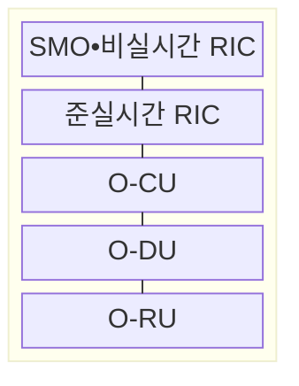

---
sidebar:
  order: 45
  label: "045. 오픈랜 (O-RAN, Open Radio Access Network)"
  badge:
    text: "기출 • 50%"
    variant: note
title: "오픈랜 (O-RAN, Open Radio Access Network)"
date: "2026-08-04T16:50:00+09:00"
tags:
  - "notes-network"
weight: 45
extra:
  question_no: "045"
  source_status: "기출"
  source_history: "132회"
  priority: 50
  priority_note: "설계•비교형: 132회 Open RAN 장문 출제"
---

## Ⅰ. 개요

핵심 용어

- **개방형 무선 접속망(Open Radio Access Network, O-RAN)**: RAN 기능을 분리해 다중 공급자 장비를 조합하는 구조
- **무선 접속망(Radio Access Network, RAN)**: 단말과 코어망 사이의 무선 접속을 제공하는 망

- 정의/개념: RAN 기능을 분리해 다중 공급자 장비를 조합하는 **개방 인터페이스 기반 무선접속망 구조**
- 배경/필요성: 폐쇄형 전용 인터페이스로 장비 교체•**공급자 조합** 제약

#### 한줄 요약

- 한 회사의 통짜 기지국 대신 여러 회사의 무선•처리 장치를 표준 연결로 조립한다

## Ⅱ. 특징

핵심 용어

- **개방형 분산 장치(Open Distributed Unit, O-DU)**: 시간 민감 물리•매체접근제어를 처리하는 장치
- **개방형 무선 장치(Open Radio Unit, O-RU)**: 무선 송수신과 하위 물리 처리를 담당하는 장치
- **개방형 프론트홀**: O-DU와 O-RU 사이의 제어•사용자•동기 인터페이스
- **확장 응용(xApp)**: 준실시간 무선 제어를 수행하는 RIC 응용
- **비실시간 응용(rApp)**: 비실시간 정책•분석을 수행하는 RIC 응용
- **무선 접속망 지능형 제어기(RAN Intelligent Controller, RIC)**: 정책과 응용으로 무선 자원을 제어하는 기능
- **개방형 중앙 장치(Open Central Unit, O-CU)**: 상위 무선 프로토콜과 이동성을 제어하는 논리 장치
- **A1 인터페이스**: 비실시간 정책•모델을 준실시간 RIC에 전달하는 참조점
- **E2 인터페이스**: 준실시간 RIC와 무선 노드 사이의 상태•제어 참조점

- **O-RU•O-DU•O-CU** 기능 분리로 장치별 독립 교체
- **프론트홀•A1•E2** 개방으로 다중 공급자 연동 표준화
- **xApp•rApp 기반 제어 주기별 무선 자원 정책 실행**

#### 한줄 요약

- 부품 선택은 자유로워지지만 장애가 나면 어느 장비나 연결 규격이 원인인지 함께 찾아야 한다

## Ⅲ. 구조 및 구성요소

핵심 용어

- **서비스 관리 및 오케스트레이션(Service Management and Orchestration, SMO)**: O-RAN 수명주기와 비실시간 정책•모델을 관리하는 기능

| 구성요소 | 책임 |
|:---|:---|
| SMO•비실시간 RIC | 수명주기 관리와 장기 **정책•모델** 제공 |
| 준실시간 RIC | xApp으로 E2 노드의 **무선 자원** 제어 |
| O-CU | 상위 무선 프로토콜과 **이동성** 제어 |
| O-DU | 시간 민감 물리•**매체접근제어** 처리 |
| O-RU | **무선주파수 송수신•하위 물리 처리** |

#### 한줄 요약

- 무선 신호는 RU-DU-CU를 지나고 RIC는 옆에서 상태를 보고 각 장치의 동작을 조절한다

## Ⅳ. 흐름도

**동작 원리**

1. **A1 정책**: rApp이 목표•제약•모델을 준실시간 RIC에 제공
2. **E2 구독 요청**: xApp이 필요한 **무선 측정 항목** 지정
3. **E2 무선 상태**: O-CU•O-DU의 측정값으로 자원 상태 갱신
4. **E2 제어 명령**: A1 정책 범위에서 **무선 자원값** 변경
5. **제어 결과**: 변경 후 측정값으로 정책 효과 판정

#### 한줄 요약

- 장기 목표를 받은 xApp이 기지국 상태를 보고 설정을 바꾼 뒤 결과를 다시 확인한다

## Ⅴ. 종류 및 비교

핵심 용어

- **폐쇄형 무선 접속망(Closed Radio Access Network, Closed RAN)**: 단일 공급자가 기지국 기능과 인터페이스를 통합 제공하는 구현 방식

| RAN 구현 방식 | O-RAN | 폐쇄형 RAN |
|:---|:---|:---|
| 적용 기준 | 공급자 조합과 RIC 기능 확장이 필요할 때 | 통합 성능과 단일 장애 책임이 우선일 때 |
| 핵심 특징 | **기능 분리•개방 인터페이스** | 단일 공급자의 **통합 구현** |
| 한계 | **상호운용 시험•책임 조정** 비용 | **공급자 종속•기능 확장** 제약 |

> 요약: 개방 조합 이득이 통합 비용보다 클 때 선택

#### 한줄 요약

- 여러 회사 장비를 섞을 이득이 연결 시험과 장애 조정 비용보다 클 때 O-RAN을 선택한다

## Ⅵ. 실무 고려사항 및 대책

핵심 용어

- **회귀 시험**: 장비나 소프트웨어 조합을 변경한 뒤 기존 연동 기능이 유지되는지 확인하는 시험
- **동기 예산**: 분리된 무선 장치가 허용할 수 있는 시간•주파수 동기 오차의 한도

| 문제 | 대책 | 효과 |
|:---|:---|:---|
| 다중 공급자 조합 변경으로 **연동 불일치** | O-RU•O-DU 조합별 **회귀 시험** | 장비 교체 후 연동 장애 감소 |
| **프론트홀 지연•동기 오차의 분할 한도 초과** | 분할별 **지연•동기 예산** 측정 | 무선 신호 처리 오류 감소 |
| 여러 xApp의 **자원 정책 충돌** | 우선순위•**허용 범위•복구값** 설정 | 충돌 시 자원 설정 변동 억제 |

#### 한줄 요약

- 서로 다른 회사의 무선 장치와 처리 장치가 정해진 지연 안에 함께 동작하는지 시험한다

## Ⅶ. 결론

핵심 용어

- **상호운용 비용**: 다중 공급자 장비 조합을 시험하고 장애 책임을 조정하는 데 필요한 운영 비용

- 다중 공급자 조합 이득이 연동 시험 비용보다 크면 **O-RAN**, 아니면 **폐쇄형 RAN** 선택

#### 한줄 요약

- 개방화 이득이 조합 시험과 장애 조정 비용보다 큰 구간부터 O-RAN을 적용해야 한다.
