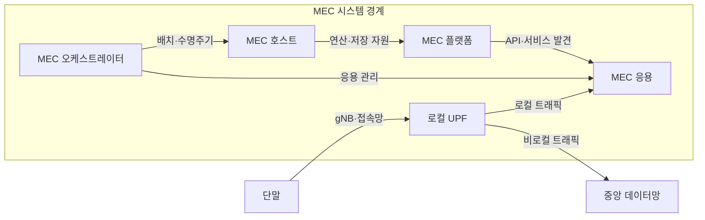
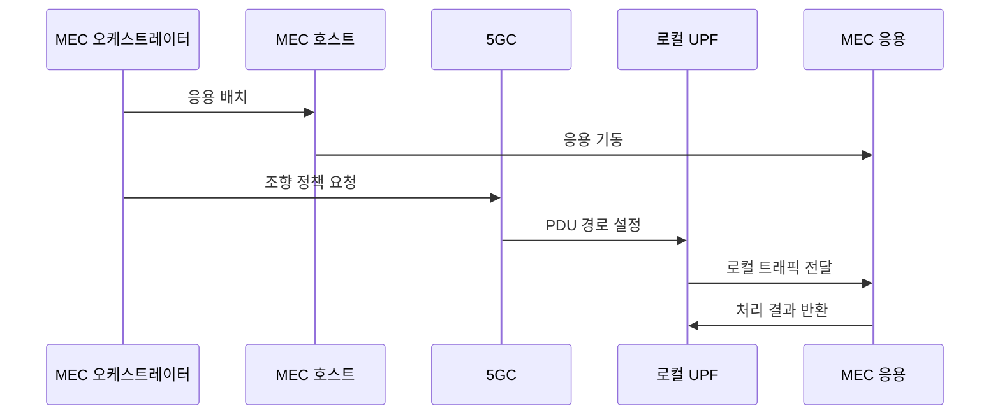

---
sidebar:
  order: 46
  label: "046. 모바일 엣지 컴퓨팅 (MEC, Mobile Edge Computing / Multi-access Edge Computing)"
  badge:
    text: "기출 · 50%"
    variant: note
title: "모바일 엣지 컴퓨팅 (MEC, Mobile Edge Computing / Multi-access Edge Computing)"
date: "2026-07-27T23:59:59+09:00"
tags:
  - "notes-network"
weight: 46
extra:
  question_no: "046"
  source_status: "기출"
  source_history: "132회"
  priority: 50
  priority_note: "설계형: 132회 MEC 구조·배치 직접 출제"
---

## 미리 알고가기

- **다중접속 에지 컴퓨팅(Multi-access Edge Computing, MEC)**: ‘엠이시’로 읽고 세 영문 핵심어의 머리글자를 딴 표기이며 접속망 가까이에 연산·저장·망 정보를 배치함
- **5G 기지국(next Generation NodeB, gNB)**: ‘지엔비’로 읽고 차세대를 뜻하는 소문자 g와 NodeB의 머리글자를 결합한 표기이며 5G 무선 접속을 담당함
- **5G 코어(5G Core, 5GC)**: ‘파이브지 코어’로 읽고 세대 표기 뒤에 Core의 C를 붙인 표기이며 가입자·세션·이동성 정책을 제어함
- **사용자 평면 기능(User Plane Function, UPF)**: ‘유피에프’로 읽고 세 영문 단어의 머리글자를 딴 표기이며 사용자 데이터를 선택된 데이터망으로 전달함
- **응용 프로그래밍 인터페이스(Application Programming Interface, API)**: ‘에이피아이’로 읽고 세 영문 단어의 머리글자를 딴 표기이며 응용이 플랫폼 기능을 호출하는 계약임
- **로컬 브레이크아웃(Local Breakout)**: 사용자 트래픽을 중앙망까지 보내지 않고 인접 에지 데이터망으로 분기하는 방식임
- **트래픽 조향(Traffic Steering)**: 응용·사용자·경로 정책에 따라 트래픽이 통과할 UPF와 목적지를 선택하는 제어임
- **MEC 플랫폼·오케스트레이터(MEC Platform·Orchestrator)**: 플랫폼은 서비스 발견·망 정보 API를 제공하고 오케스트레이터는 지연·자원·위치에 따라 응용의 배치와 수명주기를 관리함
- **프로토콜 데이터 단위 세션(Protocol Data Unit Session, PDU Session)**: ‘피디유 세션’으로 읽고 세 영문 핵심어의 머리글자를 딴 표기이며 단말과 데이터망 사이 사용자 데이터 전달 경로임

## Ⅰ. 개요

- 정의/개념: 접속망 인접 위치에 **연산·플랫폼·망 정보 배치**
- 기존 한계: 중앙 처리의 **왕복 지연·백홀 트래픽 집중**

### 쉽게 이해하기 (학습용)

- 단말 요청을 먼 중앙 데이터센터까지 보내지 않고 가까운 기지국 주변 서버에서 처리한다

## Ⅱ. 특징

- 로컬 UPF의 **에지 트래픽 분기**
- 플랫폼 API의 **위치·무선 상태 제공**
- 오케스트레이터의 **지연·위치 기반 응용 배치**

### 쉽게 이해하기 (학습용)

- 서버가 가까워도 데이터 길이 중앙망을 돌면 늦으므로 로컬 UPF가 에지로 바로 보내야 한다

## Ⅲ. 아키텍처 및 구성요소

| 설계 요소 | 설명 |
|:---|:---|
| 로컬 UPF | 정책에 따라 사용자 흐름을 MEC로 분기 |
| MEC 호스트 | 에지의 연산·저장·가상화 자원 제공 |
| MEC 플랫폼 | 서비스 발견·망 정보·트래픽 API 제공 |
| MEC 응용 | 현장 데이터의 추론·제어·캐시 수행 |
| MEC 오케스트레이터 | 위치·자원에 맞춰 응용 배치·회수 |

> 요약: 로컬 UPF가 사용자 흐름을 엣지로 분기

### 쉽게 이해하기 (학습용)

- 오케스트레이터가 가까운 호스트에 응용을 띄우면 UPF가 단말 데이터를 그 응용으로 바로 보낸다

## Ⅳ. 원리 및 절차 흐름도

| 절차 | 설명 |
|:---|:---|
| 응용 배치 | 지연·자원을 만족하는 호스트 선택 |
| 응용 기동 | 호스트가 응용 실행 환경을 생성 |
| 조향 정책 요청 | 응용 주소와 대상 흐름을 5GC에 전달 |
| PDU 경로 설정 | 5GC가 로컬 UPF 경로를 지정 |
| 로컬 트래픽 전달 | UPF가 사용자 데이터를 응용에 전달 |
| 처리 결과 반환 | 중앙망을 거치지 않고 단말로 응답 |

> 요약: 응용 배치와 PDU 경로를 맞춰 로컬 처리

### 쉽게 이해하기 (학습용)

- 가까운 서버에 응용을 먼저 띄우고 단말 데이터 길을 그 서버로 바꿔야 지연이 줄어든다

## Ⅴ. 종류 및 비교

| 컴퓨팅 배치 | MEC | 중앙 클라우드 |
|:---|:---|:---|
| 적용 기준 | 저지연·**지역 망 정보 필요** | 대규모 학습·**장기 저장** |
| 핵심 특징 | 접속망 인접 **로컬 처리·분기** | 중앙 집중 **대규모 자원 공유** |
| 한계 | 분산 노드·**상태 이전 복잡** | 왕복 지연·**백홀 집중** |

> 요약: 실시간 처리는 MEC, 집약 처리는 중앙

### 쉽게 이해하기 (학습용)

- 즉시 제어할 데이터는 가까이서 처리하고 많은 데이터를 모아 학습할 때는 중앙으로 보낸다

## Ⅵ. 실무 사례

1. 공장 영상 검사는 로컬 UPF로 MEC 추론기에 전달

### 쉽게 이해하기 (학습용)

- 카메라 영상을 공장 밖에 보내지 않고 현장 서버가 불량을 판정한다

## Ⅶ. 결론

- 클라우드 왕복 지연과 대량 데이터 전송을 줄이기 위해 응답 기한·데이터 위치·사용자 이동·상태 이전 비용을 검토하여, 처리 위치와 이동 정책을 MEC로 설계해야 한다.

### 쉽게 이해하기 (학습용)

- 응답 제한 시간과 사용자 이동 범위를 보고 서버 위치와 상태를 옮길 시점을 정한다
