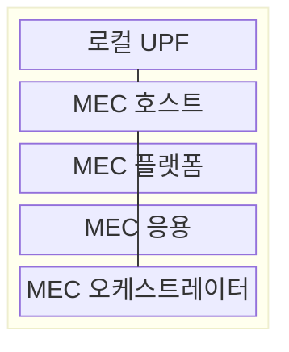
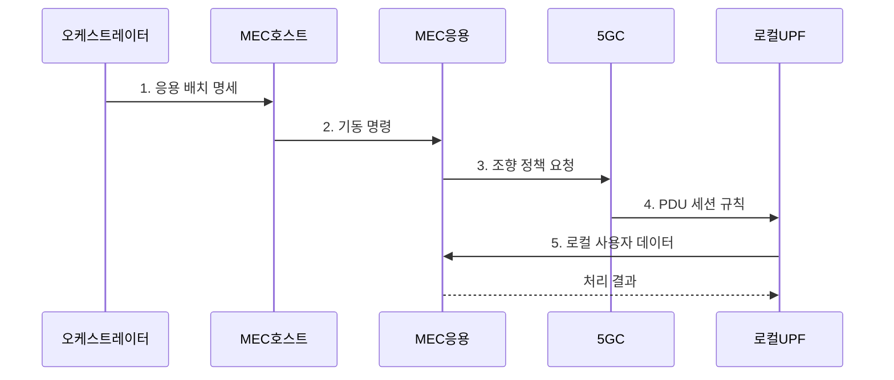

---
sidebar:
  order: 46
  label: "046. 모바일 엣지 컴퓨팅 (MEC, Mobile Edge Computing / Multi-access Edge Computing)"
  badge:
    text: "기출 · 50%"
    variant: note
title: "모바일 엣지 컴퓨팅 (MEC, Mobile Edge Computing / Multi-access Edge Computing)"
date: "2026-07-31T10:59:30+09:00"
tags:
  - "notes-network"
weight: 46
extra:
  question_no: "046"
  source_status: "기출"
  source_history: "132회"
  priority: 50
  priority_note: "설계형: 132회 MEC 구조·배치 직접 출제"
---

## Ⅰ. 개요

핵심 용어

- **MEC**: 접속망과 가까운 에지에 연산·저장·망 정보 기능을 배치하는 분산 컴퓨팅 구조이다.

- 정의/개념: 접속망 인접 에지에 **연산·저장·망 정보** 기능을 제공하는 **분산 컴퓨팅 구조**
- 배경/필요성: 중앙 클라우드 왕복과 **백홀 집중**으로 실시간 제어 응답 기한 초과

### 쉽게 이해하기 (학습용)

- 단말 요청을 먼 중앙 데이터센터까지 보내지 않고 가까운 기지국 주변 서버에서 처리한다

## Ⅱ. 특징

핵심 용어

- **로컬 브레이크아웃**: 사용자 트래픽을 중앙망까지 보내지 않고 인접 에지 데이터망으로 분기하는 방식이다.
- **MEC 오케스트레이터**: 지연·자원·위치 조건에 따라 MEC 응용의 배치와 수명주기를 관리하는 기능이다.

- 로컬 **UPF** 분기로 중앙망을 거치지 않고 에지에 직접 전달
- 플랫폼 **API**로 위치·무선 상태를 MEC 응용에 제공
- **오케스트레이터**가 지연·자원·위치에 따라 응용 배치

### 쉽게 이해하기 (학습용)

- 서버가 가까워도 데이터 길이 중앙망을 돌면 늦으므로 로컬 UPF가 에지로 바로 보내야 한다

## Ⅲ. 구조 및 구성요소

핵심 용어

- **로컬 UPF**: 정책에 따라 사용자 흐름을 인접 MEC 응용으로 분기하는 사용자면 기능이다.
- **MEC 플랫폼**: 응용에 서비스 발견·망 정보·트래픽 제어 API를 제공하는 플랫폼이다.

| 구성요소 | 책임 |
|:---|:---|
| 로컬 UPF | 정책에 따라 사용자 흐름을 **MEC로 분기** |
| MEC 호스트 | 에지의 연산·저장·**가상화 자원** 제공 |
| MEC 플랫폼 | 서비스 발견·망 정보·**트래픽 API** 제공 |
| MEC 응용 | 현장 데이터의 **추론·제어·캐시** 수행 |
| MEC 오케스트레이터 | 위치·자원에 맞춰 **응용 배치·회수** |

### 쉽게 이해하기 (학습용)

- 오케스트레이터가 가까운 호스트에 응용을 띄우면 UPF가 단말 데이터를 그 응용으로 바로 보낸다

## Ⅳ. 흐름도

핵심 용어

- **트래픽 조향**: 응용·사용자·경로 정책에 따라 트래픽이 통과할 UPF와 목적지를 선택하는 제어이다.
- **PDU 세션**: 단말과 데이터망 사이에서 사용자 데이터를 전달하도록 설정한 논리 경로이다.

**동작 원리**

1. **응용 배치 명세**: 지연·자원 조건을 만족하는 **MEC 호스트** 지정
2. **기동 명령**: 호스트가 MEC 응용의 실행 환경 생성
3. **조향 정책 요청**: 응용 주소와 대상 **사용자 흐름** 전달
4. **PDU 세션 규칙**: **5GC**가 로컬 UPF를 데이터 경로로 지정
5. **로컬 사용자 데이터**: UPF에서 MEC 응용으로 **로컬 브레이크아웃**

### 쉽게 이해하기 (학습용)

- 가까운 서버에 응용을 먼저 띄우고 단말 데이터 길을 그 서버로 바꿔야 지연이 줄어든다

## Ⅴ. 종류 및 비교

핵심 용어

- **MEC**: 실시간 처리를 위해 접속망 인접 위치에서 데이터와 응용을 분산 처리하는 환경이다.
- **중앙 클라우드**: 대규모 연산·저장 자원을 중앙 데이터센터에 모아 공유하는 컴퓨팅 환경이다.

| 컴퓨팅 배치 | MEC | 중앙 클라우드 |
|:---|:---|:---|
| 적용 기준 | 저지연·**지역 망 정보 필요** | 대규모 학습·**장기 저장** |
| 핵심 특징 | 접속망 인접 **로컬 처리·분기** | 중앙 집중 **대규모 자원 공유** |
| 한계 | 분산 노드·**상태 이전 복잡** | 왕복 지연·**백홀 집중** |

> 요약: 실시간 처리는 MEC, 집약 처리는 중앙

### 쉽게 이해하기 (학습용)

- 즉시 제어할 데이터는 가까이서 처리하고 많은 데이터를 모아 학습할 때는 중앙으로 보낸다

## Ⅵ. 실무 고려사항 및 대책

핵심 용어

- **세션 앵커**: 사용자 이동 중에도 데이터 경로의 기준점으로 유지되는 UPF이다.
- **원격 증명**: 에지 호스트의 소프트웨어와 실행 상태가 승인된 값인지 원격에서 검증하는 기술이다.

| 문제 | 대책 | 효과 |
|:---|:---|:---|
| 에지 응용 배치 후에도 **중앙 UPF 경유** | 로컬 UPF·**트래픽 조향** 경로 검증 | 종단 왕복 지연 감소 |
| 사용자 이동으로 응용 상태·**세션 앵커** 분리 | 상태 이전과 **앵커 변경** 기준 설정 | 이동 중 세션·응용 상태 단절 감소 |
| 분산 MEC 호스트의 **변조·패치 누락** | 서명 배포·격리·**원격 증명** 적용 | 미승인 실행 환경의 서비스 차단 |

### 쉽게 이해하기 (학습용)

- 카메라 영상을 공장 밖에 보내지 않고 현장 서버가 불량을 판정한다

## Ⅶ. 결론

핵심 용어

- **데이터 잔류**: 민감 데이터가 지정한 현장이나 지역 밖으로 전송되지 않고 해당 위치에서 처리·보관되는 요구이다.

- 종단 지연·데이터 잔류가 우선이면 **MEC**, 대규모 집약 처리는 **중앙 클라우드** 선택

### 쉽게 이해하기 (학습용)

- 서버 거리뿐 아니라 사용자 경로와 상태를 옮기는 비용까지 보고 MEC 위치를 정해야 한다.
