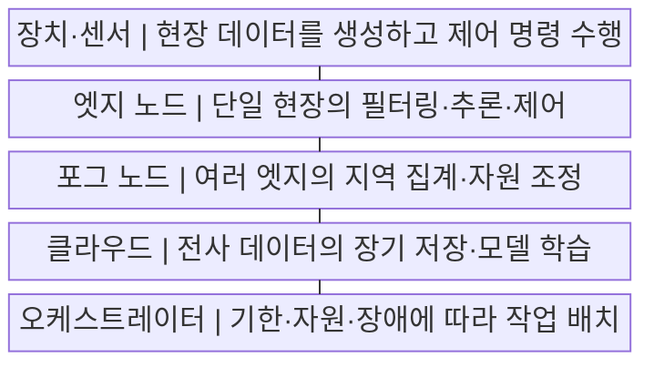
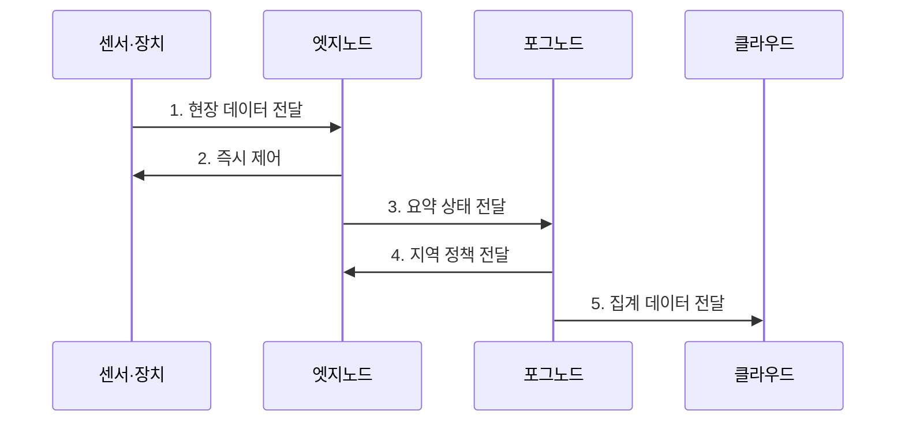

---
sidebar:
  order: 47
  label: "047. 엣지 컴퓨팅 vs 포그 컴퓨팅 (Edge vs Fog Computing)"
  badge:
    text: "기출 · 50%"
    variant: note
title: "엣지 컴퓨팅 vs 포그 컴퓨팅 (Edge vs Fog Computing)"
date: "2026-07-29T22:30:00+09:00"
tags:
  - "notes-network"
weight: 47
extra:
  question_no: "047"
  source_status: "기출"
  source_history: "125회, 126회"
  priority: 50
  priority_note: "비교형: 125·126회 Edge·Fog 반복"
---

## 미리 알고가기

- **엣지 컴퓨팅(Edge Computing)**: 센서·단말·게이트웨이처럼 데이터 발생 지점 가까이에서 저장·연산하는 구조임
- **포그 컴퓨팅(Fog Computing)**: 엣지와 클라우드 사이의 여러 계층 노드가 지역 데이터와 자원을 분산 처리하는 구조임
- **클라우드 컴퓨팅(Cloud Computing)**: 중앙 데이터센터의 공유 자원으로 대규모 저장·연산 서비스를 제공하는 구조임
- **엣지 노드(Edge Node)**: 데이터 발생 지점에서 필터링·추론·제어를 수행하는 장치나 서버임
- **포그 노드(Fog Node)**: 여러 엣지 노드의 데이터를 지역 단위로 집계하고 자원·정책을 조정하는 중간 노드임
- **오케스트레이션(Orchestration)**: 작업의 요구 자원·지연·위치에 따라 실행 노드를 배치하고 수명주기를 관리하는 기능임
- **장애 독립성(Failure Independence)**: 상위 계층과의 연결이 끊겨도 하위 계층이 필수 기능을 계속 수행하는 성질임

## Ⅰ. 개요

- 정의/개념: 엣지는 **발생점 처리**, 포그는 **계층형 지역 조정**
- 배경/필요성: 중앙 단독 처리의 **제어 지연·백홀 과부하**

### 쉽게 이해하기 (학습용)

- 기계 바로 옆의 엣지가 급한 판단을 하고 지역 포그가 여러 기계의 정보를 모아 조정한다

## Ⅱ. 특징

- 엣지의 **발생점 실시간 판단·제어**
- 포그의 **다수 엣지 집계·지역 조정**
- 역할 범위에 따른 **처리 위치·지연 절충**

### 쉽게 이해하기 (학습용)

- 같은 서버도 한 장비만 즉시 제어하면 엣지, 여러 현장을 모아 조정하면 포그 역할을 한다

## Ⅲ. 구조 및 구성요소

| 구성요소 | 책임 |
|:---|:---|
| 장치·센서 | 현장 데이터를 생성하고 제어 명령 수행 |
| 엣지 노드 | 단일 현장의 필터링·추론·제어 |
| 포그 노드 | 여러 엣지의 지역 집계·자원 조정 |
| 클라우드 | 전사 데이터의 장기 저장·모델 학습 |
| 오케스트레이터 | 기한·자원·장애에 따라 작업 배치 |

### 쉽게 이해하기 (학습용)

- 현장 데이터는 위로 갈수록 요약되고 중앙 정책은 아래로 내려오며 급한 제어는 엣지에 남는다

## Ⅳ. 흐름도

**동작 원리**

1. **현장 데이터 전달**: 센서가 원시 데이터를 인접 엣지에 전송
2. **즉시 제어**: 엣지가 기한 안에 장치를 제어
3. **요약 상태 전달**: 엣지가 필요한 상태만 포그에 전송
4. **지역 정책 전달**: 포그가 여러 현장의 정책을 조정
5. **집계 데이터 전달**: 포그가 장기 분석 데이터를 중앙에 전송

### 쉽게 이해하기 (학습용)

- 센서와 가까운 곳에서 즉시 멈추고 여러 현장의 공통 판단만 위 계층으로 올린다

## Ⅴ. 종류 및 비교

| 분산 처리 방식 | 엣지 컴퓨팅 | 포그 컴퓨팅 |
|:---|:---|:---|
| 적용 기준 | 짧은 제어 기한·**원시 데이터 처리** | 다수 엣지·**공동 정책 조정** |
| 핵심 특징 | 발생점 인접 **단일 현장 처리** | 다계층 **지역 집계·분산 처리** |
| 한계 | 제한 자원·**개별 노드 관리** | 계층 동기화·**장애 전파** |

> 요약: 제어 기한과 조정 범위로 엣지·포그 선택

### 쉽게 이해하기 (학습용)

- 한 장비의 급한 판단은 엣지에, 여러 현장을 함께 보는 판단은 포그에 둔다

## Ⅵ. 실무 고려사항 및 대책

| 고려사항 | 대책 | 효과 |
|:---|:---|:---|
| 즉시 제어를 상위 계층 배치 | 제어 기한별 최하위 처리 | 반응시간 보장 |
| 포그 장애의 다수 현장 영향 | 지역 이중화·독립 운전 모드 | 장애 범위 축소 |
| 원시 데이터 과다 전송 | 엣지 필터·요약 기준 설정 | 대역폭 절감 |

### 쉽게 이해하기 (학습용)

- 즉시 대응할 제어는 설비 인접 엣지가 맡고 여러 공장의 데이터를 모을 업무는 지역 포그가 맡는다

## Ⅶ. 결론

- **제어 기한과 집계 범위에 따른 엣지·포그 역할 배치**

### 쉽게 이해하기 (학습용)

- 빨리 끝내야 할수록 아래 계층에, 넓게 모아 볼수록 위 계층에 작업을 둬야 한다.
