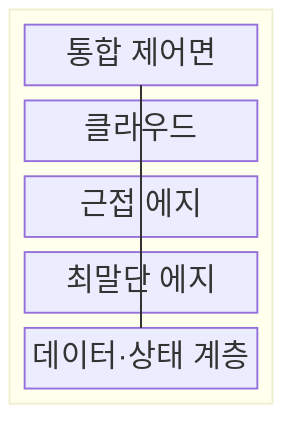
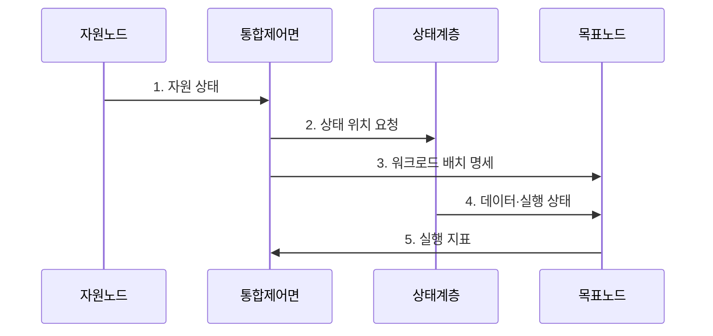

---
sidebar:
  order: 48
  label: "048. 컴퓨팅 연속체 (Computing Continuum / Cloud-Edge Continuum)"
  badge:
    text: "기출 · 30%"
    variant: note
title: "컴퓨팅 연속체 (Computing Continuum / Cloud-Edge Continuum)"
date: "2026-07-31T00:57:08+09:00"
tags:
  - "notes-network"
weight: 48
extra:
  question_no: "048"
  source_status: "기출"
  source_history: "126회"
  priority: 30
  priority_note: "설명형: 126회 Cloud-Edge-IoT 단답"
---

## Ⅰ. 개요

핵심 용어

- **컴퓨팅 연속체**: 단말·에지·클라우드 자원을 통합 관측하고 SLO에 따라 워크로드를 배치하는 분산 실행 환경이다.

- 정의/개념: 단말·에지·클라우드 자원을 통합 관측해 **SLO별 워크로드**를 배치하는 **분산 실행 환경**
- 배경/필요성: 위치별 고립 제어면으로 **유휴 자원 재배치·장애 복구** 자동화 제한

#### 한줄 요약

- 곳곳에 흩어진 컴퓨터를 한 지도에서 보고 각 작업을 가장 알맞은 위치에 놓는다

## Ⅱ. 특징

핵심 용어

- **워크로드 이식성**: 응용이 실행 환경 차이를 흡수해 다른 위치에서도 같은 기능을 수행하는 성질이다.
- **데이터 중력**: 데이터 규모와 의존성이 커질수록 연산을 데이터 가까이에 묶어 두는 현상이다.

- 위치별 **연산·망·에너지** 통합 관측으로 배치 후보 확대
- 표준 실행 환경의 **워크로드 이식성**으로 위치 간 재배치
- **데이터 중력**이 상태 이동 비용을 높여 배치 범위 제한

#### 한줄 요약

- 프로그램이 가벼워도 필요한 데이터가 크고 멀리 있으면 작업 위치를 옮기는 비용이 더 커진다

## Ⅲ. 구조 및 구성요소

핵심 용어

- **통합 제어면**: 자원 상태와 정책을 바탕으로 워크로드의 실행 위치와 복구 동작을 결정하는 계층이다.
- **최말단·근접 에지**: 최말단 에지는 장치 인접 제어를, 근접 에지는 지역 집계·추론을 수행하는 자원 계층이다.

| 구성요소 | 책임 |
|:---|:---|
| 통합 제어면 | 자원 발견과 정책 기반 **배치·복구** |
| 클라우드 | 대규모 학습·전사 분석·**장기 저장** |
| 근접 에지 | 지역 데이터 **집계·추론·캐시** |
| 최말단 에지 | 장치 인접 제어와 단절 시 **자율 실행** |
| 데이터·상태 계층 | 데이터·모델·실행 상태의 **위치 간 동기화** |

#### 한줄 요약

- 제어면이 작업 위치를 바꾸고 데이터 계층이 필요한 자료와 작업 상태를 새 위치에 맞춘다

## Ⅳ. 흐름도

핵심 용어

- **SLO**: 지연·가용성처럼 서비스가 달성해야 하는 측정 가능한 목표이다.
- **워크로드 배치 명세**: 요구 자원·정책·상태 위치를 반영해 목표 노드의 실행 조건을 지정한 정보이다.

**동작 원리**

1. **자원 상태**: 노드별 **연산·망·에너지** 가용량 갱신
2. **상태 위치 요청**: 데이터·모델·실행 상태의 현재 위치 조회
3. **워크로드 배치 명세**: **SLO·정책**을 만족하는 목표 노드 지정
4. **데이터·실행 상태**: 실행에 필요한 상태를 목표 노드로 복제
5. **실행 지표**: 목표 노드의 **SLO 충족 여부** 판정

#### 한줄 요약

- 새 위치에 프로그램과 작업 상태를 옮겨 정상 동작을 확인한 뒤 기존 프로그램을 끈다

## Ⅴ. 종류 및 비교

핵심 용어

- **연속 배치**: 공통 정책으로 클라우드와 여러 에지 위치 사이에 워크로드를 배치·재배치하는 방식이다.
- **위치별 고립 운영**: 각 위치가 독립된 자원과 관리 도구로 워크로드를 고정 운영하는 방식이다.

| 실행 환경 | 컴퓨팅 연속체 | 위치별 고립 운영 |
|:---|:---|:---|
| 적용 기준 | SLO에 따라 **위치 간 재배치**가 필요할 때 | 위치 고정과 **독립 운영**이 우선일 때 |
| 핵심 특징 | 공통 정책의 **연속 배치·조정** | 위치별 **자원·도구 독립 관리** |
| 한계 | 상태 동기화·**제어면 복잡성** | 자원 고립·**수동 이관** |

> 요약: 재배치 이득이 동기화 비용보다 클 때 선택

#### 한줄 요약

- 위치를 바꿀 이득이 데이터와 상태를 옮기는 비용보다 큰 작업만 연속체에서 재배치한다

## Ⅵ. 실무 고려사항 및 대책

핵심 용어

- **워크로드 신원**: 실행 위치가 바뀌어도 같은 승인된 응용임을 검증하는 고유 신원이다.
- **인스턴스 중복 실행**: 전환 과정에서 이전 위치와 새 위치의 워크로드가 동시에 상태를 변경하는 문제이다.

| 문제 | 대책 | 효과 |
|:---|:---|:---|
| 데이터 규모·의존성 누락으로 **이동 비용**이 배치 이득 초과 | **데이터 중력·상태 크기** 계측 | 이득 없는 워크로드 재배치 방지 |
| 위치별 신원 해석 차이로 **무단 워크로드** 실행 | 공통 **워크로드 신원·배치 정책** 적용 | 미승인 위치의 실행 차단 |
| 전환 중 구·신 인스턴스의 **중복 실행** | 상태 동기화 후 **트래픽 전환·기존 회수** | 상태 변경의 중복 처리 방지 |

#### 한줄 요약

- 영상의 급한 판정은 현장에서 하고 많은 영상으로 모델을 학습하는 일은 클라우드에 둔다

## Ⅶ. 결론

핵심 용어

- **재배치 이득**: 워크로드 위치를 옮겨 얻는 SLO 개선량에서 데이터·상태 이동 비용을 제외한 효과이다.

- SLO 개선 이득이 데이터·상태 이동 비용보다 크면 **재배치**, 아니면 **위치 고정**

#### 한줄 요약

- 더 좋은 위치의 이득이 데이터와 실행 상태를 옮기는 비용보다 클 때만 재배치해야 한다.
