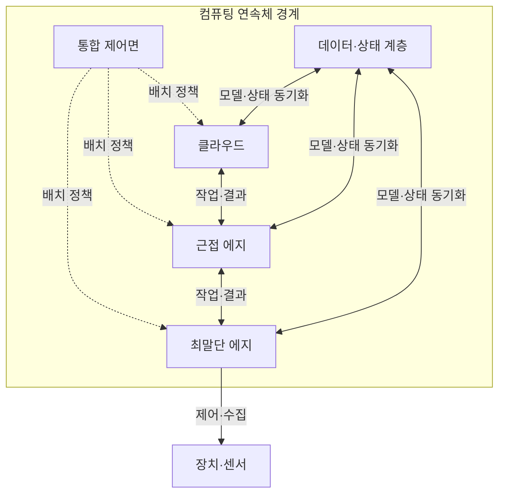
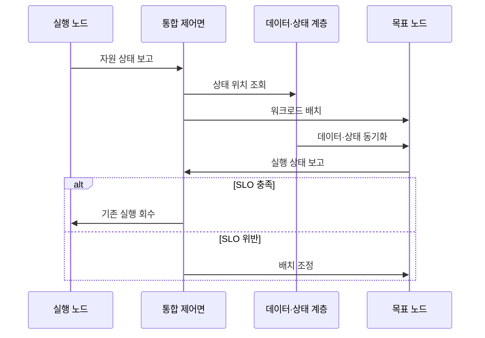

---
sidebar:
  order: 48
  label: "048. 컴퓨팅 연속체 (Computing Continuum / Cloud-Edge Continuum)"
  badge:
    text: "기출 · 30%"
    variant: note
title: "컴퓨팅 연속체 (Computing Continuum / Cloud-Edge Continuum)"
date: "2026-07-25T19:48:00+09:00"
tags:
  - "notes-network"
weight: 48
extra:
  question_no: "048"
  source_status: "기출"
  source_history: "126회"
  priority: 30
  priority_note: "설명형: 126회 Cloud-Edge-IoT 단답"
---

## 미리 알고가기

- **컴퓨팅 연속체(Computing Continuum)**: 단말·에지·클라우드의 이질적 자원을 하나의 정책·운영 체계로 연결하는 실행 환경임
- **최말단 에지(Far Edge)**: 센서·장치와 가장 가까운 곳에서 짧은 지연의 제어·전처리를 수행하는 자원임
- **근접 에지(Near Edge)**: 최말단 에지와 클라우드 사이에서 지역 집계·추론을 수행하는 자원임
- **클라우드 컴퓨팅(Cloud Computing)**: 중앙 데이터센터의 공유 자원으로 대규모 저장·연산 서비스를 제공하는 구조임
- **워크로드(Workload)**: 배치·실행·이동의 대상이 되는 응용과 그 연산 작업임
- **오케스트레이션(Orchestration)**: 요구 조건과 자원 상태에 따라 워크로드의 배치·확장·복구를 조정하는 기능임
- **서비스 수준 목표(Service Level Objective, SLO)**: ‘에스엘오’로 읽고 세 영문 단어의 머리글자를 딴 표기이며 지연·가용성처럼 서비스가 달성해야 하는 측정 가능한 목표임
- **워크로드 이식성(Workload Portability)**: 응용이 실행 환경 차이를 흡수하고 다른 위치에서도 같은 기능을 수행하는 성질임
- **데이터 중력(Data Gravity)**: 데이터 규모와 의존성이 커질수록 연산을 데이터 가까이에 묶어 두는 현상임
- **선언형 배포(Declarative Deployment)**: 원하는 최종 상태를 기술하면 제어기가 현재 상태와 차이를 줄이는 배포 방식임
- **사물인터넷(Internet of Things, IoT)**: ‘아이오티’로 읽고 영문 핵심어의 머리글자를 딴 표기이며 연속체의 최말단에서 센서 데이터와 제어 대상을 제공하는 연결 장치 체계임

## Ⅰ. 개요

- **정의/개념**: 단말·에지·클라우드를 잇는 통합 실행 환경
- **배경/필요성**: 지연·데이터·자원에 맞는 작업 재배치

### 쉽게 이해하기 (학습용)

- 곳곳에 흩어진 컴퓨터를 한 지도에서 보고 각 작업을 가장 알맞은 위치에 놓는다

## Ⅱ. 특징

- 위치별 연산·망·에너지 상태를 통합 관측한다.
- 정책 제약 안에서 워크로드를 분할·복제·이동한다.
- 선언형 배포가 이질 환경의 실행 상태를 수렴시킨다.
- 데이터 중력이 작업 이동 비용을 높인다.

### 쉽게 이해하기 (학습용)

- 프로그램이 가벼워도 필요한 데이터가 크고 멀리 있으면 작업 위치를 옮기는 비용이 더 커진다

## Ⅲ. 아키텍처 및 구성요소

| 설계 요소 | 설명 |
|:---|:---|
| 통합 제어면 | 자원 발견과 정책 기반 배치·복구 |
| 클라우드 | 대규모 학습·전사 분석·장기 저장 |
| 근접 에지 | 지역 데이터 집계·추론·캐시 |
| 최말단 에지 | 장치 인접 제어와 단절 시 자율 실행 |
| 데이터·상태 계층 | 데이터·모델·실행 상태의 위치 간 동기화 |

> 요약: 공통 제어면이 위치별 자원·상태 조정

### 쉽게 이해하기 (학습용)

- 제어면이 작업 위치를 바꾸고 데이터 계층이 필요한 자료와 작업 상태를 새 위치에 맞춘다

## Ⅳ. 원리 및 절차 흐름도

| 절차 | 설명 |
|:---|:---|
| 자원 상태 보고 | 노드가 연산·망·에너지 상태를 전달 |
| 상태 위치 조회 | 데이터·모델·실행 상태의 위치 확인 |
| 워크로드 배치 | SLO·정책을 만족하는 목표 노드 선택 |
| 데이터·상태 동기화 | 실행에 필요한 상태를 목표 노드로 복제 |
| 실행 상태 보고 | 목표 노드의 SLO 충족 여부 관측 |
| 기존 실행 회수 | 정상 전환 후 이전 인스턴스 종료 |
| 배치 조정 | SLO 위반 원인에 따라 위치·자원 변경 |

> 요약: 상태 동기화 후 SLO 결과로 배치 확정

### 쉽게 이해하기 (학습용)

- 새 위치에 프로그램과 작업 상태를 옮겨 정상 동작을 확인한 뒤 기존 프로그램을 끈다

## Ⅴ. 종류 및 비교

| 판단 기준 | 컴퓨팅 연속체 | 위치별 고립 운영 |
|:---|:---|:---|
| 핵심 특징 | 공통 정책으로 위치 간 배치 | 위치마다 자원·도구 독립 |
| 적용 기준 | SLO에 따른 재배치 필요 | 위치 고정·독립 운영 우선 |
| 주요 위험 | 상태 동기화·제어면 복잡성 | 자원 고립·수동 이관 |

> 요약: 재배치 이득이 동기화 비용보다 클 때 선택

### 쉽게 이해하기 (학습용)

- 위치를 바꿀 이득이 데이터와 상태를 옮기는 비용보다 큰 작업만 연속체에서 재배치한다

## Ⅵ. 실무 사례

1. 영상 추론은 카메라 인접 에지와 클라우드에 분할
2. 에지 장애 시 상태 복제본이 있는 근접 노드로 전환

### 쉽게 이해하기 (학습용)

- 영상의 급한 판정은 현장에서 하고 많은 영상으로 모델을 학습하는 일은 클라우드에 둔다
- 현장 서버가 고장 나면 작업 상태를 저장한 가까운 서버에서 이어서 실행한다

## Ⅶ. 결론

- SLO 이득·상태 이동 비용으로 재배치 결정

### 쉽게 이해하기 (학습용)

- 더 좋은 위치에서 얻는 이득이 데이터와 작업 상태를 옮기는 비용보다 클 때만 재배치한다
