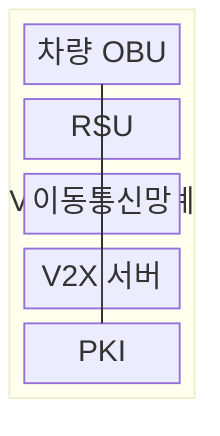
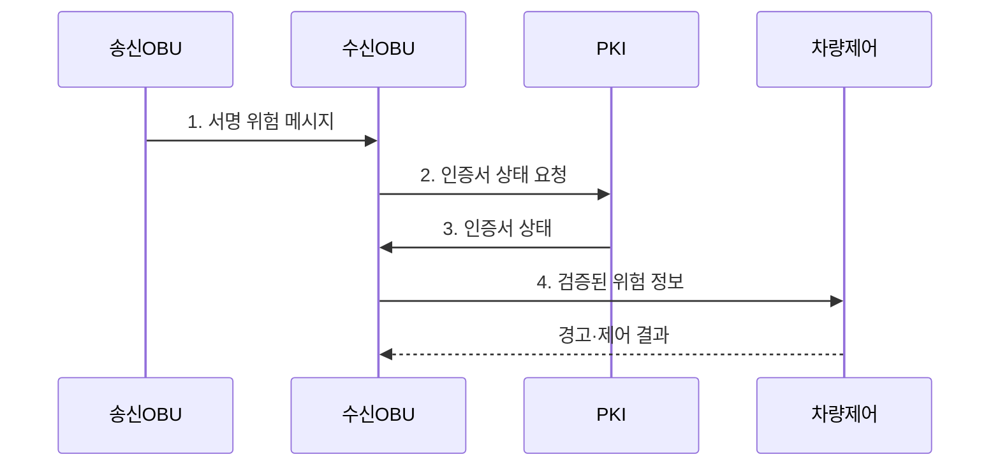

---
sidebar:
  order: 49
  label: "049. V2X 차량사물통신 (V2X Vehicle-to-Everything)"
  badge:
    text: "기출 · 50%"
    variant: note
title: "V2X 차량사물통신 (V2X Vehicle-to-Everything)"
date: "2026-07-31T00:58:15+09:00"
tags:
  - "notes-network"
weight: 49
extra:
  question_no: "049"
  source_status: "기출"
  source_history: "138회"
  priority: 50
  priority_note: "보안·설계형: 138회 V2X 위협 대응 장문"
---

## 미리 알고가기

- **차량사물통신(Vehicle-to-Everything, V2X)**: 차량이 주변 차량·인프라·보행자·통신망과 주행 정보를 교환하는 통신 체계
- **차량 탑재 장치(On-Board Unit, OBU)**: 차량 센서 정보를 안전 메시지로 생성·송수신하는 장치
- **노변 장치(Roadside Unit, RSU)**: 도로 주변에서 차량·교통 정보를 송수신하는 장치
- **공개키 기반구조(Public Key Infrastructure, PKI)**: 인증서와 공개키로 송신자 신원과 메시지 서명을 검증하는 체계
- **PC5·Uu 인터페이스**: PC5는 차량끼리 직접 통신하고 Uu는 기지국을 거쳐 코어망과 통신하는 3GPP 참조점
- **가명 인증서(Pseudonym Certificate)**: 차량의 장기 신원을 감추면서 메시지 서명을 검증하도록 주기적으로 바꾸는 인증서
- **최신성(Freshness)**: 생성 시각과 순서 정보를 검사해 오래된 메시지의 재전송을 식별하는 성질
- **전자서명(Digital Signature)**: 송신자의 개인키로 만든 값을 공개키로 검증해 출처와 무결성을 확인하는 기술
- **위치·센서 개연성(Plausibility)**: 수신한 위치·속도·위험 정보가 시각과 차량 센서 관측에 비춰 가능한지 판단하는 기준
- **혼잡 제어(Congestion Control)**: 채널 부하에 따라 메시지 우선순위·전송률을 조절하는 기능

> **키워드:** V2X 차량사물통신 (V2X Vehicle-to-Everything)

## Ⅰ. 개요

- 정의/개념: 차량이 **PC5·Uu**로 주변 대상과 주행·위험 정보를 교환하는 **V2X 협력 통신 체계**
- 배경/필요성: 차량 센서의 가시거리·차폐로 교차로 밖 **위험 사전 탐지** 불가

### 쉽게 이해하기 (학습용)

- 앞 차량 너머의 급정거나 보행자 접근 정보를 통신으로 먼저 받아 대응 시간을 번다

## Ⅱ. 특징

- **PC5** 직접 통신으로 근거리 위험의 전파 지연 최소화
- **Uu** 망 경유로 광역 교통 정보·콘텐츠 배포
- **PKI 서명**과 **메시지 개연성** 결합으로 위조·재전송·허위 위치 검증

### 쉽게 이해하기 (학습용)

- 서명이 맞아도 내용이 거짓일 수 있으므로 메시지의 시간·위치와 차량 센서를 함께 확인한다

## Ⅲ. 구조 및 구성요소

| 구성요소 | 책임 |
|:---|:---|
| 차량 OBU | 센서 상태를 **서명 메시지**로 생성·수신 |
| RSU | 차량과 도로 설비·서버 사이 **정보 교환** |
| 이동통신망 | **Uu**를 통한 광역 서버 경로 제공 |
| V2X 서버 | 광역 **교통 정보** 집계·배포 |
| PKI | **가명 인증서** 발급·검증·폐기 |

### 쉽게 이해하기 (학습용)

- 가까운 위험은 차량끼리 직접 알리고 넓은 지역 정보는 기지국과 서버를 거쳐 받는다

## Ⅳ. 흐름도

**동작 원리**

1. **서명 위험 메시지**: 위치·속도·시각과 **전자서명**을 PC5로 전송
2. **인증서 상태 요청**: 가명 인증서의 유효·폐기 여부 조회
3. **인증서 상태**: **PKI**가 공개키와 인증서 상태 제공
4. **검증된 위험 정보**: 서명·최신성·**위치·센서 개연성** 통과 정보만 전달

### 쉽게 이해하기 (학습용)

- 받은 경고가 믿을 만한 차량이 방금 보낸 것인지 확인하고 내 센서와 맞을 때 제동한다

## Ⅴ. 종류 및 비교

| V2X 통신 경로 | PC5 직접 통신 | Uu 망 경유 통신 |
|:---|:---|:---|
| 적용 기준 | 근거리 **즉시 위험 전파**가 필요할 때 | 광역 교통·**콘텐츠 배포**가 필요할 때 |
| 핵심 특징 | 주변 단말·RSU와 **직접 교환** | 기지국·서버를 **경유 교환** |
| 한계 | 채널 혼잡·**도달 범위 제한** | 망 왕복 지연·**음영 의존** |

> 요약: 위험 범위·허용 지연으로 PC5·Uu 선택

### 쉽게 이해하기 (학습용)

- 눈앞의 충돌 위험은 차량끼리 직접 보내고 먼 지역의 교통 정보는 서버를 거쳐 보낸다

## Ⅵ. 실무 고려사항 및 대책

| 고려사항 | 대책 | 효과 |
|:---|:---|:---|
| 유효 서명에 허위 위치를 넣은 **위치 위조** | 시각·위치·**센서 개연성** 대조 | 허위 위험 정보의 제어 반영 감소 |
| 인증서 연결로 장기 **차량 추적** 가능 | **가명 인증서 회전·최소 로그** 적용 | 동일 차량의 추적 가능 시간 단축 |
| **PC5 채널 혼잡**으로 안전 메시지 지연 | 우선순위·전송률 기반 **혼잡 제어** | 안전 메시지의 기한 초과율 감소 |

### 쉽게 이해하기 (학습용)

- 앞 차량의 급제동 메시지가 지금 위치와 맞는지 확인한 뒤 운전자에게 경고한다

## Ⅶ. 결론

- **전자서명·최신성**과 **위치·센서 개연성**이 모두 맞을 때만 제어, 불일치하면 폐기

### 쉽게 이해하기 (학습용)

- 서명이 맞아도 시간과 위치가 틀릴 수 있으므로 차량 센서 관측과 함께 판단해야 한다.
