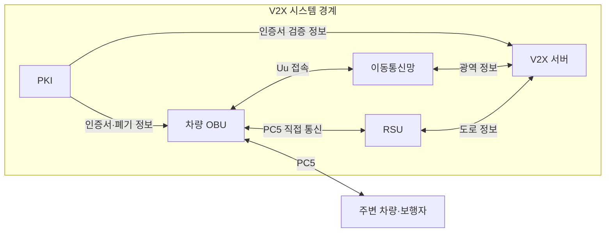
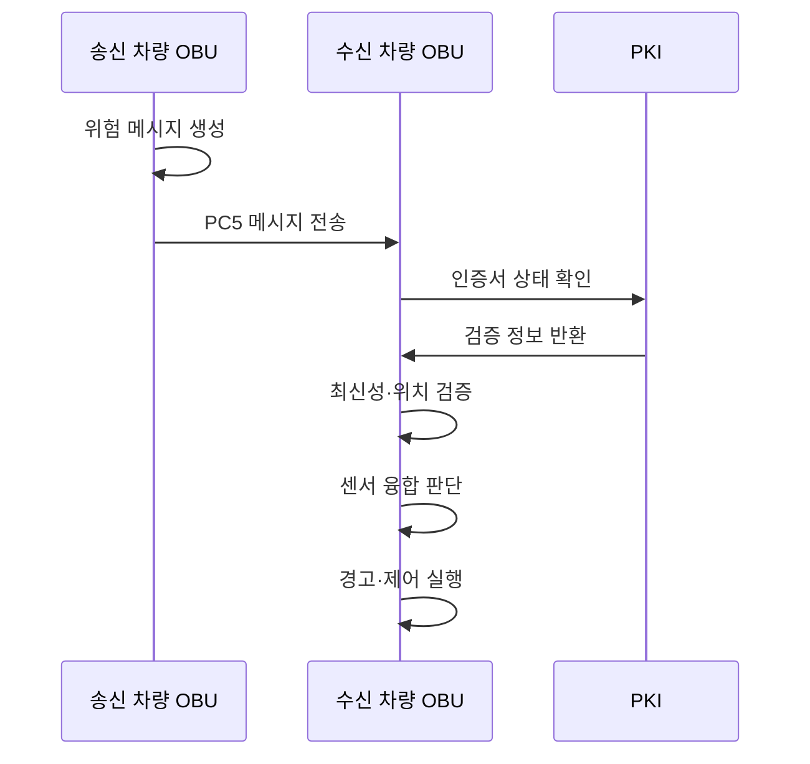

---
sidebar:
  order: 49
  label: "049. V2X 차량사물통신 (V2X Vehicle-to-Everything)"
  badge:
    text: "기출 · 50%"
    variant: note
title: "V2X 차량사물통신 (V2X Vehicle-to-Everything)"
date: "2026-07-27T23:59:59+09:00"
tags:
  - "notes-network"
weight: 49
extra:
  question_no: "049"
  source_status: "기출"
  source_history: "138회"
  priority: 50
  priority_note: "보안·설계형: 138회 V2X 위협 대응 장문"
---

## 미리 알고가기

- **차량사물통신(Vehicle-to-Everything, V2X)**: ‘브이투엑스’로 읽고 Vehicle과 대상 X 사이를 숫자 2로 연결한 표기이며 차량이 주변 대상·통신망과 주행 정보를 교환함
- **차량 간 통신(Vehicle-to-Vehicle, V2V)**: ‘브이투브이’로 읽고 차량 양쪽을 숫자 2로 이은 표기이며 차량끼리 위치·속도·위험 정보를 직접 교환함
- **차량-인프라 통신(Vehicle-to-Infrastructure, V2I)**: ‘브이투아이’로 읽고 차량과 인프라를 숫자 2로 이은 표기이며 차량과 신호기·노변 장치가 도로 정보를 교환함
- **차량-보행자 통신(Vehicle-to-Pedestrian, V2P)**: ‘브이투피’로 읽고 차량과 보행자를 숫자 2로 이은 표기이며 접근·충돌 위험을 교환함
- **차량-네트워크 통신(Vehicle-to-Network, V2N)**: ‘브이투엔’으로 읽고 차량과 네트워크를 숫자 2로 이은 표기이며 이동통신망을 거쳐 광역 정보를 교환함
- **차량 탑재 장치(On-Board Unit, OBU)**: ‘오비유’로 읽고 세 영문 단어의 머리글자를 딴 표기이며 차량 센서 정보를 메시지로 생성·송수신함
- **노변 장치(Roadside Unit, RSU)**: ‘알에스유’로 읽고 두 영문 핵심어의 머리글자를 딴 표기이며 도로 주변에서 차량·교통 정보를 송수신함
- **공개키 기반구조(Public Key Infrastructure, PKI)**: ‘피케이아이’로 읽고 세 영문 단어의 머리글자를 딴 표기이며 인증서와 공개키로 송신자와 메시지 서명을 검증함
- **PC5·Uu 인터페이스**: 각각 ‘피시파이브·유유’로 읽는 3GPP 공식 참조점 이름이며 PC5는 차량끼리 직접, Uu는 기지국을 거쳐 코어망과 통신함
- **가명 인증서(Pseudonym Certificate)**: 차량의 장기 신원을 감추면서 메시지 서명을 검증하도록 주기적으로 바꾸는 인증서임
- **최신성(Freshness)**: 생성 시각과 순서 정보를 검사해 오래된 메시지의 재전송을 식별하는 성질임

## Ⅰ. 개요

- 정의/개념: 차량이 주변 대상·망과 **주행·위험 정보를 교환**
- 기존 한계: 차량 센서의 **가시거리·차폐 범위 밖 위험 미탐지**

### 쉽게 이해하기 (학습용)

- 앞 차량 너머의 급정거나 보행자 접근 정보를 통신으로 먼저 받아 대응 시간을 번다

## Ⅱ. 특징

- PC5의 **근거리 직접 위험 전파**
- Uu의 **망 경유 광역 정보 전달**
- 서명·최신성·위치의 **메시지 신뢰 검증**

### 쉽게 이해하기 (학습용)

- 서명이 맞아도 내용이 거짓일 수 있으므로 메시지의 시간·위치와 차량 센서를 함께 확인한다

## Ⅲ. 아키텍처 및 구성요소

| 설계 요소 | 설명 |
|:---|:---|
| 차량 OBU | 센서 상태를 서명 메시지로 생성·수신 |
| RSU | 차량과 도로 설비·서버 사이 정보 교환 |
| 이동통신망 | Uu를 통한 광역 서버 경로 제공 |
| V2X 서버 | 광역 교통 정보를 집계·배포 |
| PKI | 가명 인증서 발급·검증·폐기 |

> 요약: PC5는 주변 위험, Uu는 광역 정보 연결

### 쉽게 이해하기 (학습용)

- 가까운 위험은 차량끼리 직접 알리고 넓은 지역 정보는 기지국과 서버를 거쳐 받는다

## Ⅳ. 원리 및 절차 흐름도

| 절차 | 설명 |
|:---|:---|
| 위험 메시지 생성 | 위치·속도·시각을 넣고 전자서명 |
| PC5 메시지 전송 | 주변 차량에 안전 정보를 직접 방송 |
| 인증서 상태 확인 | 가명 인증서의 유효·폐기 상태 조회 |
| 검증 정보 반환 | 공개키와 인증서 검증 결과 제공 |
| 최신성·위치 검증 | 재전송과 공간상 불가능한 값을 식별 |
| 센서 융합 판단 | 통신 정보와 자체 센서 관측을 대조 |
| 경고·제어 실행 | 위험도에 따라 운전자 경고·제동 |

> 요약: 서명·최신성·센서를 함께 검증해 경고

### 쉽게 이해하기 (학습용)

- 받은 경고가 믿을 만한 차량이 방금 보낸 것인지 확인하고 내 센서와 맞을 때 제동한다

## Ⅴ. 종류 및 비교

| V2X 통신 경로 | PC5 직접 통신 | Uu 망 경유 통신 |
|:---|:---|:---|
| 적용 기준 | 근거리 **즉시 위험 전파** | 광역 교통·**콘텐츠 배포** |
| 핵심 특징 | 주변 단말·RSU와 **직접 교환** | 기지국·서버를 **경유 교환** |
| 한계 | 채널 혼잡·**도달 범위 제한** | 망 왕복 지연·**음영 의존** |

> 요약: 위험 범위·허용 지연으로 PC5·Uu 선택

### 쉽게 이해하기 (학습용)

- 눈앞의 충돌 위험은 차량끼리 직접 보내고 먼 지역의 교통 정보는 서버를 거쳐 보낸다

## Ⅵ. 실무 사례

1. 급제동 경고는 PC5 방송 후 최신성·센서 대조

### 쉽게 이해하기 (학습용)

- 앞 차량의 급제동 메시지가 지금 위치와 맞는지 확인한 뒤 운전자에게 경고한다

## Ⅶ. 결론

- 위험 범위·지연·신뢰도로 경로·검증 수준 결정

### 쉽게 이해하기 (학습용)

- 위험이 얼마나 가깝고 급한지와 메시지 신뢰도를 보고 전송 경로와 확인 절차를 정한다
