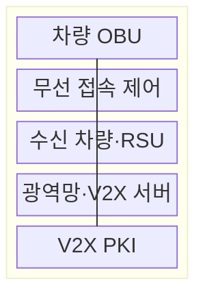
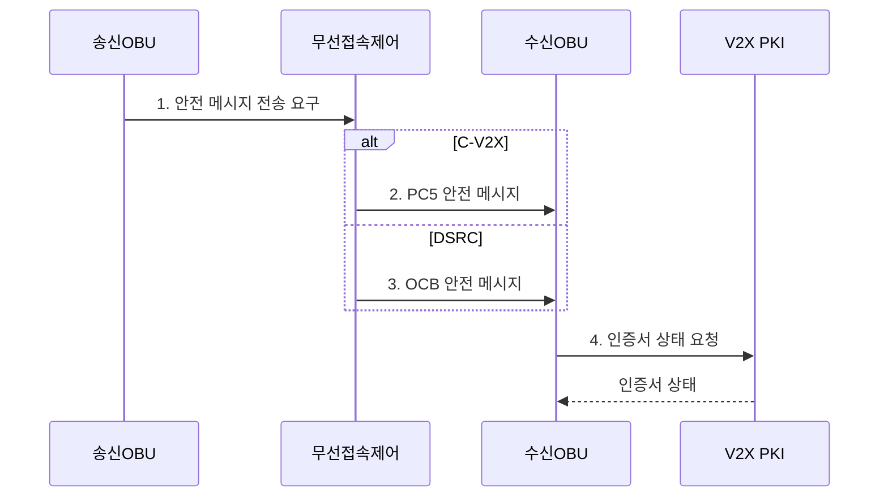

---
sidebar:
  order: 50
  label: "050. C-V2X와 DSRC 비교 (C-V2X DSRC)"
  badge:
    text: "기출 · 30%"
    variant: note
title: "C-V2X와 DSRC 비교 (C-V2X DSRC)"
date: "2026-07-31T10:59:30+09:00"
tags:
  - "notes-network"
weight: 50
extra:
  question_no: "050"
  source_status: "기출"
  source_history: "138회"
  priority: 30
  priority_note: "비교형: 138회 C-V2X·DSRC 구성축"
---

## Ⅰ. 개요

핵심 용어

- **셀룰러 차량·사물 통신·전용 단거리 통신(C-V2X·DSRC)**: 차량 안전 메시지를 각각 셀룰러 접속과 차량 환경 무선 접속으로 전달하는 차량·사물 무선 기술군이다.

- 정의/개념: 차량 안전 메시지를 **셀룰러 차량·사물 통신(Cellular Vehicle-to-Everything, C-V2X)·전용 단거리 통신(Dedicated Short-Range Communications, DSRC)** 으로 전달하는 **차량·사물 통신(Vehicle-to-Everything, V2X) 기술군**
- 배경/필요성: 단일 규격으로는 기존 **차량 환경 무선 접속(Wireless Access in Vehicular Environments, WAVE) 호환** 과 이동통신 진화 경로 동시 수용 곤란

#### 한줄 요약

- 두 기술 모두 차량 위험을 알리지만 이동통신 자원을 쓰는지 무선랜처럼 채널 경쟁을 하는지가 다르다.

## Ⅱ. 특징

핵심 용어

- **셀룰러 차량·사물 통신(C-V2X)**: 3세대 파트너십 프로젝트 규격의 PC5 직접 통신과 Uu 망 경유 통신을 제공하는 기술이다.
- **전용 단거리 통신(DSRC)**: 전기전자공학자협회 802.11p 계열의 기본 서비스 집합 외부 통신·반송파 감지 다중 접속/충돌 회피를 이용하는 차량 단거리 통신 기술이다.

- **셀룰러 차량·사물 통신(Cellular Vehicle-to-Everything, C-V2X)** 의 **PC5 직접·Uu 망 경유** 이중 경로
- **전용 단거리 통신(Dedicated Short-Range Communications, DSRC)** 의 **기본 서비스 집합 외부 통신(Outside the Context of a Basic Service Set, OCB)·반송파 감지 다중 접속/충돌 회피(Carrier Sense Multiple Access with Collision Avoidance, CSMA/CA)** 기반 직접 접속
- 차량 밀도 증가 시 **채널 경쟁·충돌** 로 DSRC 지연·손실 증가

#### 한줄 요약

- 규격 이름만 보고 고르지 말고 같은 주파수·차량 밀도·속도에서 위험 메시지가 제때 도착하는지 비교해야 한다

## Ⅲ. 구조 및 구성요소

핵심 용어

- **차량 탑재 장치·노변 장치(OBU·RSU)**: 차량 탑재 장치는 안전 메시지를 송수신하고 노변 장치는 도로 주변에서 차량과 서버 정보를 중계한다.
- **차량·사물 공개키 기반구조(V2X PKI)**: 두 무선 방식에서 사용하는 인증서의 발급·검증·폐기를 담당하는 신뢰 체계이다.

**차량 탑재 장치(On-Board Unit, OBU)** 와 **노변 장치(Roadside Unit, RSU)** 가 메시지를 교환하고 **차량·사물 통신 공개키 기반구조(Vehicle-to-Everything Public Key Infrastructure, V2X PKI)** 가 인증서를 관리한다.

| 구성요소 | 책임 |
|:---|:---|
| 차량 OBU | C-V2X 또는 DSRC **안전 메시지** 생성·수신 |
| 무선 접속 제어 | **PC5 자원 선택·OCB 채널 경쟁** 수행 |
| 수신 차량·RSU | 직접 무선 구간의 **위험 정보** 수신 |
| 광역망·V2X 서버 | Uu·RSU 백홀의 **광역 정보** 집계·배포 |
| V2X PKI | 두 방식의 **인증서** 발급·검증·폐기 |

#### 한줄 요약

- C-V2X 차량은 직접 링크와 이동통신망을 함께 쓰고 DSRC 차량은 OCB로 주변 차량·RSU와 직접 통신한다

## Ⅳ. 흐름도

핵심 용어

- **사이드링크**: 이동통신 단말끼리 기지국을 거치지 않고 직접 데이터를 교환하는 링크이다.
- **반송파 감지 다중 접속/충돌 회피(CSMA/CA)**: 채널 감지와 임의 대기로 여러 장치의 동시 전송 충돌을 줄이는 접속 방식이다.

**동작 원리**

1. **안전 메시지 전송 요구**: 송신 **차량 탑재 장치(On-Board Unit, OBU)** 가 위험 정보의 전송 기한 지정
2. **PC5 안전 메시지**: **사이드링크 자원** 선택·예약 후 전송
3. **기본 서비스 집합 외부 통신 안전 메시지**: **반송파 감지 다중 접속/충돌 회피(Carrier Sense Multiple Access with Collision Avoidance, CSMA/CA)** 채널 감지·임의 대기 후 전송
4. **인증서 상태 요청**: 서명·**최신성** 검증 후 메시지 수용

#### 한줄 요약

- C-V2X는 보낼 시간·주파수 자원을 고르고 DSRC는 채널이 비었는지 듣고 경쟁해서 보낸다

## Ⅴ. 종류 및 비교

핵심 용어

- **차량 환경 무선 접속(WAVE)**: 전기전자공학자협회 802.11p와 1609 계열로 구성된 차량 통신 체계이다.
- **기본 서비스 집합 외부 통신(OCB)**: 기본 서비스 집합 가입 절차 없이 차량이 데이터 프레임을 직접 교환하는 방식이다.

| 차량·사물 통신(Vehicle-to-Everything, V2X) 무선 방식 | 셀룰러 차량·사물 통신(Cellular Vehicle-to-Everything, C-V2X) | 전용 단거리 통신(Dedicated Short-Range Communications, DSRC) |
|:---|:---|:---|
| 적용 기준 | 이동통신 진화·**광역망 연계** 가 필요할 때 | 기존 WAVE·**RSU 호환** 이 필요할 때 |
| 핵심 특징 | **3세대 파트너십 프로젝트(3rd Generation Partnership Project, 3GPP)** 의 **PC5·Uu 통신** | **전기전자공학자협회(Institute of Electrical and Electronics Engineers, IEEE) 차량 환경 무선 접속(Wireless Access in Vehicular Environments, WAVE)** 의 **기본 서비스 집합 외부 통신(Outside the Context of a Basic Service Set, OCB) 직접 접속** |
| 한계 | 세대·모드 간 **호환 제약** | 고밀도 **채널 경쟁·충돌** |

> 요약: 기존 인프라와 진화 경로로 방식 선택

#### 한줄 요약

- 이동통신망과 함께 진화하려면 C-V2X, 이미 깔린 WAVE 장비를 유지하려면 DSRC를 우선 검토한다.

## Ⅵ. 실무 고려사항 및 대책

핵심 용어

- **백분위수**: 측정값을 작은 순서로 나열했을 때 지정한 비율의 값이 그 이하가 되는 경계이다.
- **전달 성능**: 같은 차량 밀도·속도·대역 조건에서 안전 메시지가 기한 안에 도착하는 수신률과 지연이다.

| 문제 | 대책 | 효과 |
|:---|:---|:---|
| 규격명만으로 선택해 현장 **전달 성능** 미검증 | 동일 밀도·속도·대역의 **비교 시험** | 같은 조건의 수신률·지연 확보 |
| 기존 **차량 탑재 장치(On-Board Unit, OBU)·노변 장치(Roadside Unit, RSU)** 와 **세대 호환** 누락 | 장비·단말·**인증서 생태계** 조사 | 교체 대상·전환 비용 사전 산정 |
| 혼잡 시 **안전 메시지 손실·지연** 증가 | 수신률·지연 **백분위수** 측정 | 안전 메시지의 기한 초과율 판정 |

#### 한줄 요약

- 같은 수의 차량이 동시에 경고를 보낼 때 두 방식 중 더 많이 제때 도착하는 쪽을 확인한다.

## Ⅶ. 결론

핵심 용어

- **진화 경로**: 기존 차량·도로 인프라와의 호환성을 유지하면서 다음 무선 세대로 전환하는 기술·운영 계획이다.

- 기존 **차량 환경 무선 접속(Wireless Access in Vehicular Environments, WAVE)·노변 장치(Roadside Unit, RSU)** 호환이 우선이면 **전용 단거리 통신(Dedicated Short-Range Communications, DSRC)**, 이동통신 진화·광역 연계면 **셀룰러 차량·사물 통신(Cellular Vehicle-to-Everything, C-V2X)** 선택

#### 한줄 요약

- 기존 장비 활용성과 붐비는 도로의 기한 내 전달 성능을 함께 비교해야 한다.
