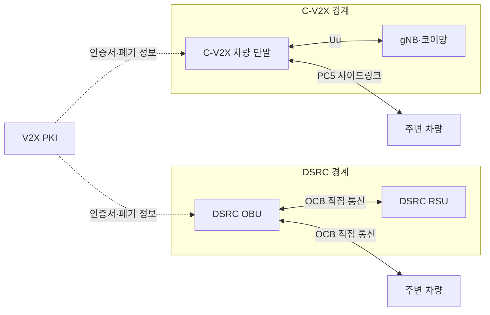

---
sidebar:
  order: 50
  label: "050. C-V2X와 DSRC 비교 (C-V2X DSRC)"
  badge:
    text: "기출 · 30%"
    variant: note
title: "C-V2X와 DSRC 비교 (C-V2X DSRC)"
date: "2026-07-27T23:59:59+09:00"
tags:
  - "notes-network"
weight: 50
extra:
  question_no: "050"
  source_status: "기출"
  source_history: "138회"
  priority: 30
  priority_note: "비교형: 138회 C-V2X·DSRC 구성축"
---

## 미리 알고가기

- **셀룰러 차량사물통신(Cellular Vehicle-to-Everything, C-V2X)**: ‘시 브이투엑스’로 읽고 Cellular의 C와 V2X를 붙임표로 이은 표기이며 3GPP 규격으로 차량 직접·망 경유 통신을 제공함
- **전용 단거리 통신(Dedicated Short-Range Communications, DSRC)**: ‘디에스알시’로 읽고 네 영문 핵심어의 머리글자를 딴 표기이며 IEEE 802.11p 계열의 차량 단거리 통신임
- **차량사물통신(Vehicle-to-Everything, V2X)**: ‘브이투엑스’로 읽고 Vehicle과 대상 X 사이를 숫자 2로 연결한 표기이며 차량이 주변 대상·통신망과 주행 정보를 교환함
- **3세대 파트너십 프로젝트(3rd Generation Partnership Project, 3GPP)**: ‘쓰리지피피’로 읽고 세대 숫자 3과 세 영문 핵심어의 머리글자를 결합한 표기이며 LTE·5G 이동통신 규격을 제정함
- **전기전자공학자협회(Institute of Electrical and Electronics Engineers, IEEE)**: ‘아이 트리플 이’로 읽고 영문 핵심어의 머리글자를 딴 표기이며 802 계열 통신 표준을 제정함
- **차량 환경 무선 접속(Wireless Access in Vehicular Environments, WAVE)**: ‘웨이브’로 읽고 다섯 영문 핵심어의 머리글자를 딴 표기이며 IEEE 802.11p와 1609 계열로 구성된 차량 통신 체계임
- **기본 서비스 집합 외부(Outside the Context of a Basic Service Set, OCB)**: ‘오시비’로 읽고 영문 핵심어의 머리글자를 딴 표기이며 기본 서비스 집합 가입 절차 없이 차량이 데이터 프레임을 교환함
- **충돌 회피 반송파 감지 다중접속(Carrier Sense Multiple Access with Collision Avoidance, CSMA/CA)**: ‘시에스엠에이 씨에이’로 읽고 접속 방식과 충돌 회피 약어를 빗금(/)으로 이은 표기이며 채널 감지와 임의 대기로 충돌을 줄임
- **PC5·Uu 인터페이스**: 각각 ‘피시파이브·유유’로 읽는 3GPP 공식 참조점 이름이며 PC5는 직접, Uu는 기지국 경유 통신에 쓰임
- **사이드링크(Sidelink)**: 이동통신 단말끼리 기지국을 통과하지 않고 직접 데이터를 교환하는 링크임
- **차량 탑재 장치(On-Board Unit, OBU)·노변 장치(Roadside Unit, RSU)**: 각각 ‘오비유·알에스유’로 읽고 영문 머리글자를 딴 표기이며 차량과 도로 주변에서 메시지를 송수신함
- **공개키 기반구조(Public Key Infrastructure, PKI)**: ‘피케이아이’로 읽고 세 영문 단어의 머리글자를 딴 표기이며 인증서와 공개키로 송신자와 메시지 서명을 검증함

## Ⅰ. 개요

- 정의/개념: 3GPP 셀룰러와 IEEE 무선랜 기반의 **V2X 접속 기술**
- 기존 한계: 단일 차량 통신 규격의 **기존 장비·진화 경로 동시 수용 한계**

### 쉽게 이해하기 (학습용)

- 두 기술 모두 차량 위험을 알리지만 이동통신 자원을 쓰는지 무선랜처럼 채널 경쟁을 하는지가 다르다

## Ⅱ. 특징

- C-V2X의 **PC5 직접·Uu 망 경유 통신**
- DSRC의 **OCB·CSMA/CA 직접 접속**
- 차량 밀도·주파수 정책의 **성능·호환 결정**

### 쉽게 이해하기 (학습용)

- 규격 이름만 보고 고르지 말고 같은 주파수·차량 밀도·속도에서 위험 메시지가 제때 도착하는지 비교해야 한다

## Ⅲ. 아키텍처 및 구성요소

| 설계 요소 | 설명 |
|:---|:---|
| C-V2X 차량 단말 | PC5 직접 통신과 Uu 망 접속 |
| gNB·코어망 | C-V2X 무선 자원·광역 경로 제공 |
| DSRC OBU | OCB 방식으로 차량 메시지 송수신 |
| DSRC RSU | OCB 차량과 도로 인프라 정보 교환 |
| V2X PKI | 두 방식의 인증서 발급·검증·폐기 |

> 요약: C-V2X는 PC5·Uu, DSRC는 OCB 사용

### 쉽게 이해하기 (학습용)

- C-V2X 차량은 직접 링크와 이동통신망을 함께 쓰고 DSRC 차량은 OCB로 주변 차량·RSU와 직접 통신한다

## Ⅳ. 원리 및 절차 흐름도

- C-V2X는 선택·예약한 사이드링크 자원에 전송
- DSRC는 채널 감지 후 임의 대기하고 전송
- 두 방식 모두 서명 메시지를 수신 측에서 검증

> 요약: 자원 선택·채널 경쟁 방식이 충돌 특성 결정

### 쉽게 이해하기 (학습용)

- C-V2X는 보낼 시간·주파수 자원을 고르고 DSRC는 채널이 비었는지 듣고 경쟁해서 보낸다

## Ⅴ. 종류 및 비교

| V2X 무선 방식 | C-V2X | DSRC |
|:---|:---|:---|
| 적용 기준 | 이동통신 진화·**광역망 연계** | 기존 WAVE·**RSU 호환** |
| 핵심 특징 | 3GPP의 **PC5·Uu 통신** | IEEE WAVE의 **OCB 직접 접속** |
| 한계 | 세대·모드 간 **호환 제약** | 고밀도 **채널 경쟁·충돌** |

> 요약: 기존 인프라와 진화 경로로 방식 선택

### 쉽게 이해하기 (학습용)

- 이동통신망과 함께 진화하려면 C-V2X, 이미 깔린 WAVE 장비를 유지하려면 DSRC를 우선 검토한다

## Ⅵ. 실무 사례

1. 혼잡 교차로에서 C-V2X와 DSRC의 수신률·지연 비교

### 쉽게 이해하기 (학습용)

- 같은 수의 차량이 동시에 경고를 보낼 때 두 방식 중 더 많이 제때 도착하는 쪽을 확인한다

## Ⅶ. 결론

- 차량 안전 통신 방식의 성급한 선택을 피하기 위해 기존 인프라·단말 생태계·혼잡 수신률·지연·통신 범위를 검토하여, 지역 환경에 맞게 C-V2X 또는 DSRC를 선택해야 한다.

### 쉽게 이해하기 (학습용)

- 기존 장비를 살릴 수 있는지와 붐비는 도로에서 제때 전달되는지를 함께 보고 방식을 선택한다
