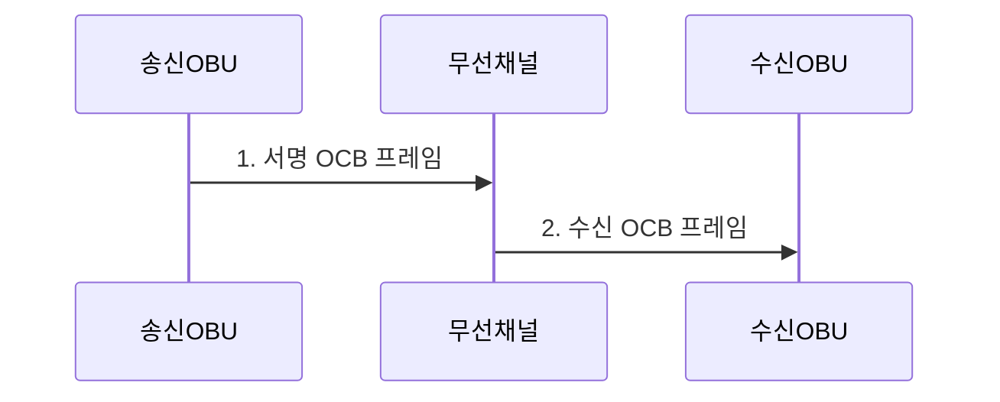

---
sidebar:
  order: 51
  label: "051. IEEE 802.11p WAVE"
  badge:
    text: "기출 • 30%"
    variant: note
title: "IEEE 802.11p WAVE"
date: "2026-08-05T08:00:00+09:00"
tags:
  - "notes-network"
weight: 51
extra:
  question_no: "051"
  source_status: "기출"
  source_history: "138회"
  priority: 30
  priority_note: "설명형: 138회 V2X의 802.11p 하위 기술"
---

## Ⅰ. 개요

<details>
<summary>핵심 용어</summary>

- **차량 환경 무선 접속(Wireless Access in Vehicular Environments, WAVE)**: IEEE 802.11p와 1609 서비스를 결합한 차량 직접 통신 체계
- **전기전자공학자협회(Institute of Electrical and Electronics Engineers, IEEE)**: 전기•전자•통신 표준을 개발하는 전문기관
- **기본 서비스 집합 외부 통신(Outside the Context of a Basic Service Set, OCB)**: 가입 절차 없이 무선 프레임을 직접 교환하는 방식

</details>

- 정의/개념: **IEEE 802.11p OCB**와 **IEEE 1609 서비스**를 결합한 **WAVE 체계**
- 배경/필요성: 일반 Wi-Fi의 가입•로밍 절차로 고속 이동 **안전 메시지 기한** 초과

#### 한줄 요약

- 차량이 무선망 가입 절차를 생략하고 주변 차량•도로 장치와 안전 메시지를 교환한다.

## Ⅱ. 특징

<details>
<summary>핵심 용어</summary>

- **직교 주파수 분할 다중화(Orthogonal Frequency-Division Multiplexing, OFDM)**: 직교 부반송파에 데이터를 나눠 전송하는 변조 방식
- **메가헤르츠(Megahertz, MHz)**: 초당 백만 주기의 주파수 단위

</details>

- **OCB**의 가입 절차 없는 차량 간 직접 프레임 교환
- **IEEE 802.11p**의 10MHz **OFDM** 차량 무선 전송
- **IEEE 1609** 의 메시지 보안•네트워킹•채널 운영

#### 한줄 요약

- 802.11p가 무선 전송을 맡고 1609 계층이 메시지 보안•네트워킹•채널을 맡는다.

## Ⅲ. 구조 및 구성요소

<details>
<summary>핵심 용어</summary>

- **WAVE 단문 메시지 프로토콜(WAVE Short Message Protocol, WSMP)**: 짧은 차량 안전 메시지를 전달하는 네트워크 프로토콜
- **인터넷 프로토콜(Internet Protocol, IP)**: 패킷 주소 지정과 전달을 담당하는 네트워크 프로토콜
- **제어 채널(Control Channel, CCH)**: 안전 제어 트래픽을 전달하는 차량 통신 채널
- **서비스 채널(Service Channel, SCH)**: 일반 서비스 트래픽을 전달하는 차량 통신 채널
- **매체 접근 제어(Media Access Control, MAC)**: 공유 매체 접근과 프레임 전달을 제어하는 계층
- **물리 계층(Physical Layer, PHY)**: 신호 변환과 무선 전송을 담당하는 계층

</details>

**WSMP•IP**를 **CCH•SCH**로 전달하며, **MAC•PHY** 계층은 IEEE 802.11p가 담당한다.

```text
          [IEEE 1609.2]
                |
          [IEEE 1609.3]
                |
          [IEEE 1609.4]
                |
       [IEEE 802.11p OCB]
```

선의 의미: WAVE의 보안•네트워킹•채널 운용 계층이 IEEE 802.11p OCB의 MAC•PHY 전송 계층 위에 놓이는 정적 프로토콜 스택이다.

| 구성요소 | 책임 |
|:---|:---|
| IEEE 1609.2 | 메시지 **서명•인증서 검증** |
| IEEE 1609.3 | **WSMP•IP 네트워킹** |
| IEEE 1609.4 | **CCH•SCH 채널** 운용 |
| IEEE 802.11p OCB | 가입 절차 없는 **MAC•PHY 전송** |

#### 한줄 요약

- 응용 메시지는 서명과 네트워킹 처리를 거쳐 OCB 무선 프레임으로 전송된다.

## Ⅳ. 흐름도

<details>
<summary>핵심 용어</summary>

- **최신성**: 생성 시각과 순서 정보로 오래된 메시지의 재전송을 식별하는 성질이다.
- **서명 OCB 프레임**: IEEE 1609.2 전자서명을 포함해 OCB 방식으로 직접 전송하는 차량 메시지이다.

</details>



**동작 원리**

1. **서명 OCB 프레임**: **IEEE 1609.2** 서명 후 **CCH•SCH**를 선택해 전송
2. **수신 OCB 프레임**: 인증서•**최신성** 검증을 통과한 메시지만 수용

#### 한줄 요약

- 안전•일반 서비스를 채널로 나눠도 차량이 몰리면 전송 경쟁으로 메시지가 충돌할 수 있다.

## Ⅴ. 종류 및 비교

<details>
<summary>핵심 용어</summary>

- **WAVE OCB**: 가입 절차 없이 주변 차량•노변 장치와 안전 메시지를 직접 교환하는 무선 접속 방식이다.
- **인프라 와이파이(Wi-Fi)**: 단말이 액세스 포인트에 연결한 뒤 인프라를 경유해 일반 데이터를 교환하는 방식이다.
- **액세스 포인트(Access Point, AP)**: 무선 단말을 유선망에 연결하는 접속 장치

</details>

| 무선 접속 방식 | WAVE OCB | 인프라 Wi-Fi |
|:---|:---|:---|
| 적용 기준 | 고속 이동 중 **안전 메시지 직접 전파** 가 필요할 때 | 지속 연결의 **일반 데이터 통신** 이 필요할 때 |
| 핵심 특징 | 가입 없는 **직접 프레임 교환** | **AP** 연결 후 **인프라 경유 교환** |
| 한계 | 고밀도 **채널 경쟁•충돌** | 연결 설정•**로밍 지연** |

> 요약: Wi-Fi는 지속 연결, WAVE는 고속 직접통신

#### 한줄 요약

- WAVE는 연결 준비 없이 직접 보내지만 여러 차량이 동시에 보내면 채널 경쟁이 발생한다.

## Ⅵ. 실무 고려사항 및 대책

<details>
<summary>핵심 용어</summary>

- **채널 경쟁**: 여러 차량이 같은 무선 채널의 전송 기회를 얻기 위해 동시에 접근하는 현상이다.
- **인증서 폐기 정보**: 더는 신뢰할 수 없는 인증서를 수신자가 거부하도록 배포하는 상태 정보이다.

</details>

| 문제 | 대책 | 효과 |
|:---|:---|:---|
| 고밀도 차량의 **채널 경쟁•충돌** 증가 | 밀도별 **채널 부하•지연** 시험 | 안전 메시지의 기한 내 수신률 판정 |
| 인증서 조회로 **서명 검증 지연** 증가 | 검증 캐시•**폐기 정보** 사전 갱신 | 메시지 검증 시간 감소 |
| 장치별 **CCH•SCH 정책 불일치** | **IEEE 1609.4 채널 정책** 대조 | 서비스 채널 접속 실패 감소 |

#### 한줄 요약

- 차량이 몰리면 동시에 보낸 프레임이 충돌해 안전 메시지가 늦거나 사라질 수 있다.

## Ⅶ. 결론

<details>
<summary>핵심 용어</summary>

- **안전 메시지 기한**: 차량 위험 정보가 실제 제어에 유효하도록 수신•검증을 마쳐야 하는 최대 시간이다.

</details>

- 고속 이동 안전 메시지는 **WAVE OCB**, 지속 연결 일반 데이터는 **인프라 Wi-Fi** 선택

#### 한줄 요약

- 가입 절차가 없어도 혼잡한 도로에서 안전 메시지가 기한 안에 도착하는지 검증해야 한다.
