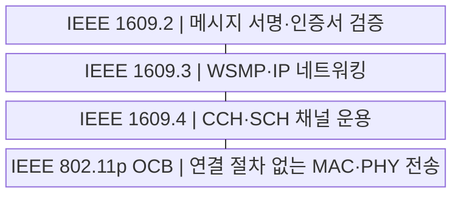
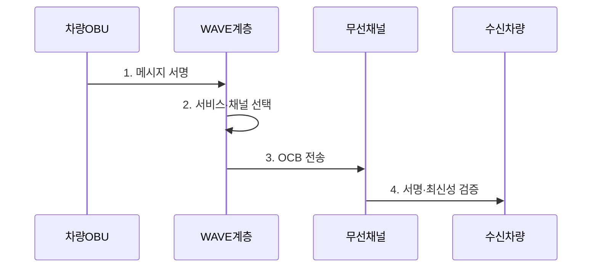

---
sidebar:
  order: 51
  label: "051. IEEE 802.11p WAVE"
  badge:
    text: "기출 · 30%"
    variant: note
title: "IEEE 802.11p WAVE"
date: "2026-07-29T22:30:00+09:00"
tags:
  - "notes-network"
weight: 51
extra:
  question_no: "051"
  source_status: "기출"
  source_history: "138회"
  priority: 30
  priority_note: "설명형: 138회 V2X의 802.11p 하위 기술"
---

## 미리 알고가기

- **전기전자공학자협회(Institute of Electrical and Electronics Engineers, IEEE)**: ‘아이 트리플 이’로 읽고 영문 핵심어의 머리글자를 딴 표기이며 차량 통신 규격을 표준화함
- **차량 환경 무선 접속(Wireless Access in Vehicular Environments, WAVE)**: ‘웨이브’로 읽고 다섯 영문 핵심어의 머리글자를 딴 표기이며 차량 무선 통신 체계를 뜻함
- **기본 서비스 집합 외부 모드(Outside the Context of a Basic Service Set, OCB)**: ‘오시비’로 읽고 영문 핵심어의 머리글자를 딴 표기이며 연결 절차 없이 프레임을 교환함
- **WAVE 단문 메시지 프로토콜(WAVE Short Message Protocol, WSMP)**: ‘더블유에스엠피’로 읽고 네 영문 핵심어의 머리글자를 딴 표기이며 안전 메시지를 전달함
- **제어 채널(Control Channel, CCH)·서비스 채널(Service Channel, SCH)**: 각각 ‘시시에이치·에스시에이치’로 읽고 영문 머리글자를 딴 표기이며 안전 제어와 일반 서비스를 분리함
- **노변 장치(Roadside Unit, RSU)·차량 탑재 장치(On-Board Unit, OBU)**: 각각 ‘알에스유·오비유’로 읽고 영문 머리글자를 딴 표기이며 도로와 차량에서 메시지를 송수신함
- **인터넷 프로토콜(Internet Protocol, IP)·매체 접근 제어(Medium Access Control, MAC)·물리 계층(Physical Layer, PHY)**: 각각 ‘아이피·맥·파이’로 읽는 계층 약어이며 1609.3 네트워킹과 802.11p 무선 전송의 역할을 구분함
- **접근점(Access Point, AP)**: ‘에이피’로 읽고 두 영문 단어의 머리글자를 딴 표기이며 인프라 와이파이 단말의 연결을 중계함
- **최신성(Freshness)**: 생성 시각과 순서 정보로 오래된 메시지의 재전송을 식별하는 성질

## Ⅰ. 개요

- 정의/개념: 802.11p OCB 무선과 **IEEE 1609 서비스를 결합**
- 배경/필요성: 일반 Wi-Fi 가입·로밍의 **고속 이동 안전 통신 지연**

### 쉽게 이해하기 (학습용)

- 차량이 무선망 가입 절차를 생략하고 주변 차량·도로 장치와 안전 메시지를 교환한다.

## Ⅱ. 특징

- OCB의 **가입 없는 직접 프레임 교환**
- 802.11p의 **MAC·PHY 무선 전송**
- IEEE 1609의 **보안·망·채널 운영**

### 쉽게 이해하기 (학습용)

- 802.11p가 무선 전송을 맡고 1609 계층이 메시지 보안·네트워킹·채널을 맡는다.

## Ⅲ. 구조 및 구성요소

| 구성요소 | 책임 |
|:---|:---|
| IEEE 1609.2 | 메시지 서명·인증서 검증 |
| IEEE 1609.3 | WSMP·IP 네트워킹 |
| IEEE 1609.4 | CCH·SCH 채널 운용 |
| IEEE 802.11p OCB | 연결 절차 없는 MAC·PHY 전송 |

### 쉽게 이해하기 (학습용)

- 응용 메시지는 서명과 네트워킹 처리를 거쳐 OCB 무선 프레임으로 전송된다.

## Ⅳ. 흐름도

**동작 원리**

1. **메시지 서명**: 1609.2 인증서로 발신자 서명
2. **서비스·채널 선택**: 1609.3·1609.4가 CCH·SCH 선택
3. **OCB 전송**: 연결 절차 없이 프레임을 송신함
4. **서명·최신성 검증**: 인증서·생성 시각 확인 후 수용

### 쉽게 이해하기 (학습용)

- 안전·일반 서비스를 채널로 나눠도 차량이 몰리면 전송 경쟁으로 메시지가 충돌할 수 있다.

## Ⅴ. 종류 및 비교

| 무선 접속 방식 | WAVE OCB | 인프라 Wi-Fi |
|:---|:---|:---|
| 적용 기준 | 고속 이동 **안전 메시지 직접 전파** | 지속 연결 **일반 데이터 통신** |
| 핵심 특징 | 가입 없는 **직접 프레임 교환** | AP 연결 후 **인프라 경유 교환** |
| 한계 | 고밀도 **채널 경쟁·충돌** | 연결 설정·**로밍 지연** |

> 요약: Wi-Fi는 지속 연결, WAVE는 고속 직접통신

### 쉽게 이해하기 (학습용)

- WAVE는 연결 준비 없이 직접 보내지만 여러 차량이 동시에 보내면 채널 경쟁이 발생한다.

## Ⅵ. 실무 고려사항 및 대책

| 고려사항 | 대책 | 효과 |
|:---|:---|:---|
| 고밀도 채널 충돌 | 차량 밀도별 부하·지연 시험 | 안전 메시지 수신률 |
| 인증서 검증 지연 | 검증 캐시·폐기정보 갱신 | 처리 기한 확보 |
| CCH·SCH 운용 불일치 | 1609.4 채널 정책 대조 | 서비스 채널 연결성 |

### 쉽게 이해하기 (학습용)

- 차량이 몰리면 동시에 보낸 프레임이 충돌해 안전 메시지가 늦거나 사라질 수 있다

## Ⅶ. 결론

- **차량 밀도·채널 충돌·보안 지연을 검증한 WAVE 적용**

### 쉽게 이해하기 (학습용)

- 가입 절차가 없어도 혼잡한 도로에서 안전 메시지가 기한 안에 도착하는지 검증해야 한다.
