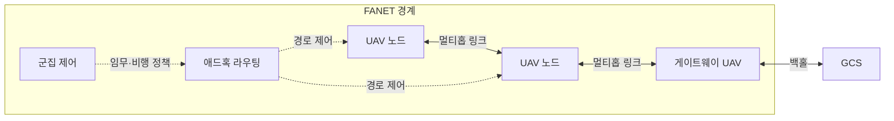
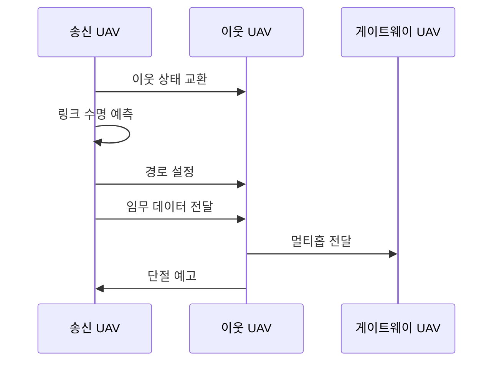

---
sidebar:
  order: 52
  label: "052. FANET 드론 애드혹 네트워크 (FANET Drone Network)"
  badge:
    text: "기출 · 30%"
    variant: note
title: "FANET 드론 애드혹 네트워크 (FANET Drone Network)"
date: "2026-07-27T23:59:59+09:00"
tags:
  - "notes-network"
weight: 52
extra:
  question_no: "052"
  source_status: "기출"
  source_history: "126회"
  priority: 30
  priority_note: "설명형: 126회 FANET 단답, Drone 특화"
---

## 미리 알고가기

- **비행 애드혹 네트워크(Flying Ad Hoc Network, FANET)**: ‘파넷’으로 읽고 네 영문 핵심어의 머리글자를 딴 표기이며 드론 간 공중 경로를 구성함
- **무인 항공기(Unmanned Aerial Vehicle, UAV)**: ‘유에이브이’로 읽고 세 영문 단어의 머리글자를 딴 표기이며 원격·자율 비행 임무를 수행함
- **지상 관제소(Ground Control Station, GCS)**: ‘지시에스’로 읽고 세 영문 단어의 머리글자를 딴 표기이며 드론 임무와 통신을 관리함
- **이동 애드혹 네트워크(Mobile Ad Hoc Network, MANET)**: ‘매넷’으로 읽고 네 영문 핵심어의 머리글자를 딴 표기이며 이동 단말의 임시망을 구성함
- **차량 애드혹 네트워크(Vehicular Ad Hoc Network, VANET)**: ‘바넷’으로 읽고 네 영문 핵심어의 머리글자를 딴 표기이며 차량 간 도로망을 구성함
- **위성 위치확인 시스템(Global Positioning System, GPS)**: ‘지피에스’로 읽고 세 영문 단어의 머리글자를 딴 표기이며 드론 위치를 측정함
- **멀티홉(Multi-hop)**: 중간 드론을 거쳐 전달

## Ⅰ. 개요

- 정의/개념: 3차원 이동 드론이 **자율 구성하는 멀티홉 애드혹망**
- 기존 한계: 지상 인프라 단독 통신의 **비가시·원거리 군집 연결 단절**

### 쉽게 이해하기 (학습용)

- 드론들이 서로 패킷을 중계해 지상 관제소와 연결되는 범위를 넓힌다.

## Ⅱ. 특징

- 고속 3차원 이동의 **빈번한 토폴로지 변화**
- 위치·비행 계획의 **링크 수명·경로 예측**
- 비행·통신의 **공유 배터리 제약**

### 쉽게 이해하기 (학습용)

- 현재 신호만 보지 않고 드론 이동 방향으로 연결 유지 시간을 예측해 중계자를 정한다.

## Ⅲ. 아키텍처 및 구성요소

| 설계 요소 | 설명 |
|:---|:---|
| UAV 노드 | 센서 데이터 생성과 패킷 중계 |
| 게이트웨이 UAV | FANET과 지상 백홀 연결 |
| 애드혹 라우팅 | 이동·에너지로 멀티홉 경로 선택 |
| 군집 제어 | 임무 역할·비행·데이터 우선순위 조정 |

> 요약: UAV 멀티홉 경로 및 GCS 연동 수행

### 쉽게 이해하기 (학습용)

- 각 드론은 비행하면서 데이터를 만들고 다른 드론의 패킷도 다음 드론으로 전달한다.

## Ⅳ. 원리 및 절차 흐름도

| 절차 | 설명 |
|:---|:---|
| 이웃 상태 교환 | 위치·속도·링크 품질·에너지 공유 |
| 링크 수명 예측 | 상대 이동으로 연결 유지 시간 추정 |
| 경로 설정 | 수명·에너지 조건을 만족하는 중계 선택 |
| 임무 데이터 전달 | 제어·안전 패킷을 우선 전송 |
| 멀티홉 전달 | 중간 UAV가 게이트웨이까지 중계 |
| 단절 예고 | 링크 만료 전에 대체 경로 탐색 |

> 요약: 예측 기반 단절 전 경로 복구 수행

### 쉽게 이해하기 (학습용)

- 중계 드론이 통신 범위를 벗어나기 전에 다음 경로를 준비해야 패킷 손실을 줄일 수 있다.

## Ⅴ. 종류 및 비교

| 애드혹 이동망 | FANET | MANET | VANET |
|:---|:---|:---|:---|
| 적용 기준 | 공중 **드론 군집 임무** | 일반 단말 **임시 지상망** | 도로 기반 **차량 통신망** |
| 핵심 특징 | 고속 **3차원 비행 토폴로지** | 자유로운 **지상 단말 이동** | 도로 제약의 **고속 이동** |
| 한계 | 짧은 링크 수명·**에너지 제약** | 이동 예측·**경로 유지 곤란** | 밀집·단절 **구간 반복** |

> 요약: 3차원 이동성으로 중계 경로 선택

### 쉽게 이해하기 (학습용)

- 자동차는 도로를 따라가지만 드론은 높이와 방향까지 바뀌므로 다음 연결을 예측하기 더 어렵다.

## Ⅵ. 실무 사례

1. 재난 수색 드론은 링크 만료 전 중계 UAV 전환

### 쉽게 이해하기 (학습용)

- 수색 드론이 멀어지기 전에 배터리가 남은 드론으로 중계 경로를 바꾼다

## Ⅶ. 결론

- 고속 이동 드론망의 빈번한 경로 단절을 줄이기 위해 상대 속도·예상 링크 수명·잔여 에너지·임무 중요도를 검토하여, FANET 중계 경로를 선제 전환해야 한다.

### 쉽게 이해하기 (학습용)

- 가장 짧은 길보다 오래 연결되고 배터리를 감당할 경로를 선택한다
