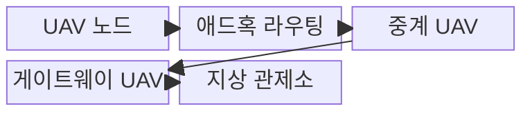
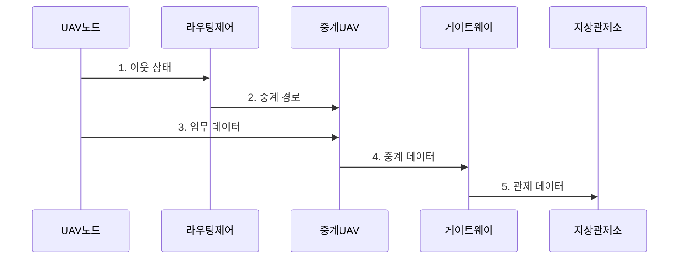

---
sidebar:
  order: 52
  label: "052. FANET 드론 애드혹 네트워크 (FANET Drone Network)"
  badge:
    text: "기출 · 30%"
    variant: note
title: "FANET 드론 애드혹 네트워크 (FANET Drone Network)"
date: "2026-07-31T10:59:30+09:00"
tags:
  - "notes-network"
weight: 52
extra:
  question_no: "052"
  source_status: "기출"
  source_history: "126회"
  priority: 30
  priority_note: "설명형: 126회 FANET 단답, Drone 특화"
---

## 미리 알고가기

- **비행 애드혹 네트워크(Flying Ad Hoc Network, FANET)**: 드론 간 공중 경로를 구성하는 이동 애드혹 네트워크
- **무인 항공기(Unmanned Aerial Vehicle, UAV)**: 원격·자율 비행 임무를 수행하는 항공기
- **지상 관제소(Ground Control Station, GCS)**: 드론 임무와 통신을 관리하는 지상 설비
- **이동 애드혹 네트워크(Mobile Ad Hoc Network, MANET)**: 이동 단말이 기반 시설 없이 구성하는 임시망
- **차량 애드혹 네트워크(Vehicular Ad Hoc Network, VANET)**: 차량 간 도로 환경에 특화된 애드혹망
- **위성 위치확인 시스템(Global Positioning System, GPS)**: 위성 신호로 드론 위치를 측정하는 시스템
- **멀티홉(Multi-hop)**: 중간 드론을 거쳐 전달
- **링크 수명(Link Lifetime)**: 두 노드 간 연결이 유지될 예상 시간
- **토폴로지(Topology)**: 노드와 통신 링크의 연결 구조
- **백홀(Backhaul)**: 무선 접속망과 외부망을 잇는 전송 구간

## Ⅰ. 개요

- 정의/개념: 3차원 이동 UAV가 중계 경로를 자율 구성하는 **FANET 멀티홉 애드혹망**
- 배경/필요성: 지상 관제소 직접 링크만으로는 장애물·원거리 드론의 **연결 유지 불가**

### 쉽게 이해하기 (학습용)

- 드론들이 서로 패킷을 중계해 지상 관제소와 연결되는 범위를 넓힌다.

## Ⅱ. 특징

- 고속 3차원 이동으로 **토폴로지 변화·링크 단절** 빈발
- GPS 위치·비행 계획을 이용한 **링크 수명·경로 예측**
- 중계 부하가 집중될수록 **배터리 소진·임무 시간 단축**

### 쉽게 이해하기 (학습용)

- 현재 신호만 보지 않고 드론 이동 방향으로 연결 유지 시간을 예측해 중계자를 정한다.

## Ⅲ. 구조 및 구성요소

| 구성요소 | 책임 |
|:---|:---|
| UAV 노드 | **센서 데이터** 생성과 이웃 상태 제공 |
| 애드혹 라우팅 | 이동·에너지를 반영한 **멀티홉 경로** 선택 |
| 중계 UAV | 선택된 경로의 **임무 데이터** 중계 |
| 게이트웨이 UAV | FANET과 지상 **백홀** 연결 |
| 지상 관제소 | 임무 데이터 수신과 **드론 임무** 관리 |

### 쉽게 이해하기 (학습용)

- 각 드론은 비행하면서 데이터를 만들고 다른 드론의 패킷도 다음 드론으로 전달한다.

## Ⅳ. 흐름도

**동작 원리**

1. **이웃 상태**: 위치·속도·링크 품질·에너지 제공
2. **중계 경로**: 예상 링크 수명과 잔여 에너지로 중계 UAV 선택
3. **임무 데이터**: 제어·안전 우선순위에 따라 데이터 전송
4. **중계 데이터**: 선택된 멀티홉 경로로 게이트웨이까지 전달
5. **관제 데이터**: 백홀을 통해 지상 관제소에 임무 데이터 제공

### 쉽게 이해하기 (학습용)

- 중계 드론이 통신 범위를 벗어나기 전에 다음 경로를 준비해야 패킷 손실을 줄일 수 있다.

## Ⅴ. 종류 및 비교

| 애드혹 이동망 | FANET | MANET | VANET |
|:---|:---|:---|:---|
| 적용 환경 | 공중 **드론 군집 임무** | 일반 단말 **임시 지상망** | 도로 기반 **차량 통신망** |
| 이동 특성 | 고속 **3차원 자유 이동** | 자유로운 **지상 단말 이동** | 도로 제약의 **고속 이동** |
| 경로 제약 | 짧은 링크 수명과 **배터리 제약** | 불규칙 이동에 따른 **경로 유지 곤란** | 밀집·음영 구간의 **연결 변동** |

> 요약: 3차원 이동성으로 중계 경로 선택

### 쉽게 이해하기 (학습용)

- 자동차는 도로를 따라가지만 드론은 높이와 방향까지 바뀌므로 다음 연결을 예측하기 더 어렵다.

## Ⅵ. 실무 고려사항 및 대책

| 고려사항 | 대책 | 효과 |
|:---|:---|:---|
| 현재 신호만 보면 이동 중 링크 단절 | 속도·방향으로 **링크 수명** 예측 | 단절 전 경로 전환으로 **전송 연속성** 확보 |
| 특정 중계 UAV에 부하가 집중되면 배터리 소진 | 잔여 에너지·임무 중요도로 **중계 부하** 분산 | 군집의 **임무 지속시간** 연장 |
| 단일 게이트웨이 장애로 지상 연결 상실 | 복수 게이트웨이와 **임시 지상 경로** 구성 | 장애 중에도 **백홀 연속성** 유지 |

### 쉽게 이해하기 (학습용)

- 수색 드론이 멀어지기 전에 배터리가 남은 드론으로 중계 경로를 바꾼다

## Ⅶ. 결론

- 예상 링크 수명·잔여 에너지가 임무 기준을 충족하는 경로만 **FANET 중계 경로**로 선택

### 쉽게 이해하기 (학습용)

- 가장 짧은 길보다 오래 연결되고 배터리를 감당할 중계 경로를 선택해야 한다.
