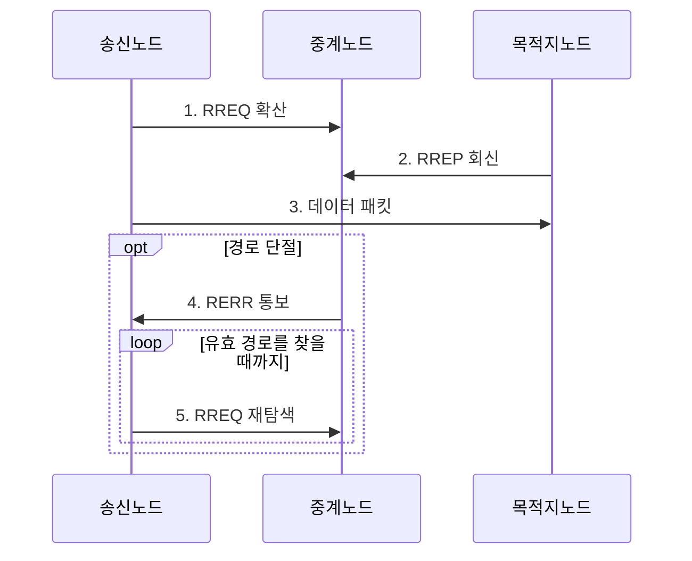

---
sidebar:
  order: 53
  label: "053. 애드혹 네트워크와 AODV (Ad-hoc AODV)"
  badge:
    text: "기출 • 30%"
    variant: note
title: "애드혹 네트워크와 AODV (Ad-hoc AODV)"
date: "2026-08-05T08:00:00+09:00"
tags:
  - "notes-network"
weight: 53
extra:
  question_no: "053"
  source_status: "기출"
  source_history: "129회"
  priority: 30
  priority_note: "설명•비교형: 129회 AODV 장문 출제"
---

## Ⅰ. 개요

<details>
<summary>핵심 용어</summary>

- **애드혹 주문형 거리 벡터(Ad Hoc On-Demand Distance Vector, AODV)**: 데이터 전송 요구가 생겼을 때 목적지 경로를 탐색하고 단절 시 재탐색하는 반응형 애드혹 라우팅 방식이다.

</details>

- 정의/개념: 전송 요구가 생기면 목적지 경로를 탐색•유지하는 **AODV 반응형 라우팅**
- 배경/필요성: 선제형 방식은 이동할 때 미사용 경로까지 갱신해 **제어 트래픽 증가**

#### 한줄 요약

- 보낼 데이터가 생겼을 때만 목적지까지 길을 묻고 답을 받아 경로를 만든다.

## Ⅱ. 특징

<details>
<summary>핵심 용어</summary>

- **역방향•순방향 경로**: 경로 요청이 온 이전 홉을 기록한 경로로 경로 응답이 돌아오고 그 응답을 따라 목적지 방향 경로가 생성된다.
- **목적지 순차 번호**: 목적지가 발급하며 값이 클수록 최신 경로임을 나타내는 번호이다.
- **경로 요청(Route Request, RREQ)**: 목적지 경로를 찾기 위해 확산하는 요청 메시지
- **경로 응답(Route Reply, RREP)**: 목적지 또는 최신 경로 보유 노드가 회신하는 메시지

</details>

- **RREQ** 확산의 **송신자 역방향 경로 생성**
- **RREP** 회신의 **목적지 순방향 경로 생성**
- 목적지 순차 번호의 **최신성•루프 억제**

#### 한줄 요약

- 길을 먼저 알려 온 노드보다 목적지가 발급한 순차 번호가 큰 경로를 최신 길로 선택한다

## Ⅲ. 구조 및 구성요소

<details>
<summary>핵심 용어</summary>

- **라우팅 테이블**: 목적지•다음 홉•홉 수•순차 번호•경로 수명을 저장하는 노드별 경로 정보이다.

</details>

송신 노드는 **RREQ**를 확산하고 목적지 또는 최신 경로 보유 노드는 **RREP**를 회신한다.

```text
 [송신 노드] -- [중계 노드] -- [목적지 노드]
        \              |              /
             [노드별 라우팅 테이블]
```

선의 의미: 송신•중계•목적지 노드가 애드혹 멀티홉 토폴로지를 이루고, 각 노드가 공통 형식의 노드별 라우팅 테이블을 소유하는 정적 관계이다.

| 구성요소 | 책임 |
|:---|:---|
| 송신 노드 | 경로가 없으면 **RREQ 탐색** 시작 |
| 중계 노드 | 중복 **RREQ 제거** 와 패킷 중계 |
| 목적지 노드 | 최신 순차 번호를 담은 **RREP 생성** |
| 노드별 라우팅 테이블 | 목적지•다음 홉•홉 수•**경로 수명** 저장 |

#### 한줄 요약

- 길을 묻는 요청이 지나온 방향을 기록하면 목적지의 응답이 그 기록을 거슬러 송신자까지 돌아온다.

## Ⅳ. 흐름도

<details>
<summary>핵심 용어</summary>

- **경로 오류(Route Error, RERR)**: 다음 홉 단절로 사용할 수 없게 된 목적지를 알리는 메시지
- **생존 시간(Time to Live, TTL)**: 패킷이 통과할 수 있는 최대 홉 수를 제한하는 값

</details>



**동작 원리**

1. **RREQ 확산**: 중복 제거•**TTL** 감소•역경로 기록
2. **RREP 회신**: 최신 순차 번호로 순방향 경로 형성
3. **데이터 패킷**: 라우팅 테이블의 다음 홉을 따라 전송
4. **RERR 통보**: 단절 목적지를 선행 노드에 알림
5. **RREQ 재탐색**: 유효 경로가 없으면 탐색 재시작

#### 한줄 요약

- 각 노드는 같은 요청을 한 번만 전달하고 최대 이동 횟수를 줄여 요청이 끝없이 퍼지지 않게 한다.

## Ⅴ. 종류 및 비교

<details>
<summary>핵심 용어</summary>

- **반응형 라우팅**: 통신 요구가 생겼을 때 경로를 탐색해 유휴 제어량을 줄이는 방식이다.
- **선제형 라우팅**: 모든 목적지 경로를 주기적으로 갱신해 첫 패킷을 즉시 전달하는 방식이다.

</details>

| 애드혹 라우팅 | AODV 반응형 | 선제형 라우팅 |
|:---|:---|:---|
| 적용 환경 | 이동이 많고 **통신 간헐적** | 토폴로지가 안정되고 **통신 빈번** |
| 핵심 특징 | 요구 시 **RREQ•RREP 탐색** | 모든 경로의 **주기적 갱신** |
| 한계 | 첫 전송 지연•**RREQ 폭증** | 미사용 경로 **제어량 증가** |

> 요약: AODV는 **유휴 제어량** 을 줄이지만 **첫 패킷 지연** 증가

#### 한줄 요약

- 가끔 통신하면 필요할 때 길을 찾고 자주 통신하면 미리 유지한 길을 바로 사용한다.

## Ⅵ. 실무 고려사항 및 대책

<details>
<summary>핵심 용어</summary>

- **확장 링 탐색**: 작은 생존 시간으로 가까운 범위부터 탐색하고 실패할 때 값을 늘려 방송 범위를 확대하는 방식이다.
- **블랙홀 공격**: 공격 노드가 거짓 최적 경로 응답을 보내 패킷을 가로채고 폐기하는 공격이다.

</details>

| 문제 | 대책 | 효과 |
|:---|:---|:---|
| 전체 범위 **RREQ** 반복으로 방송 부하 증가 | **확장 링 탐색•요청률 제한** 적용 | 불필요한 **제어 트래픽** 감소 |
| 오래된 **RREP**를 수용하면 경로 순환•공격 노출 | 목적지 순차 번호와 **RREP 출처** 검증 | 경로 순환과 **블랙홀 공격** 억제 |
| 짧은 경로 수명으로 첫 데이터 탐색 반복 | 통신 빈도에 맞춰 **경로 수명** 조정 | 재탐색 횟수와 **초기 지연** 완화 |

#### 한줄 요약

- 가까운 범위부터 길을 찾고 실패할 때만 **TTL**을 늘려 전체 방송을 줄인다.

## Ⅶ. 결론

<details>
<summary>핵심 용어</summary>

- **유휴 제어량**: 실제 데이터 전송이 없을 때도 경로 유지를 위해 발생하는 라우팅 제어 트래픽의 양이다.

</details>

- 이동성이 높고 통신이 간헐적이면 제어량 절감을 위해 **AODV 반응형 경로** 선택

#### 한줄 요약

- 이동이 잦고 통신이 간헐적일 때만 필요 시 경로를 찾는 AODV가 유리하다.
