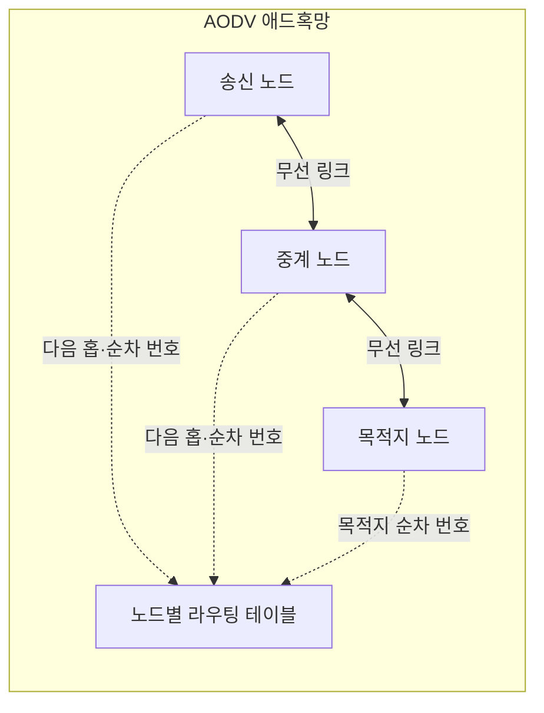
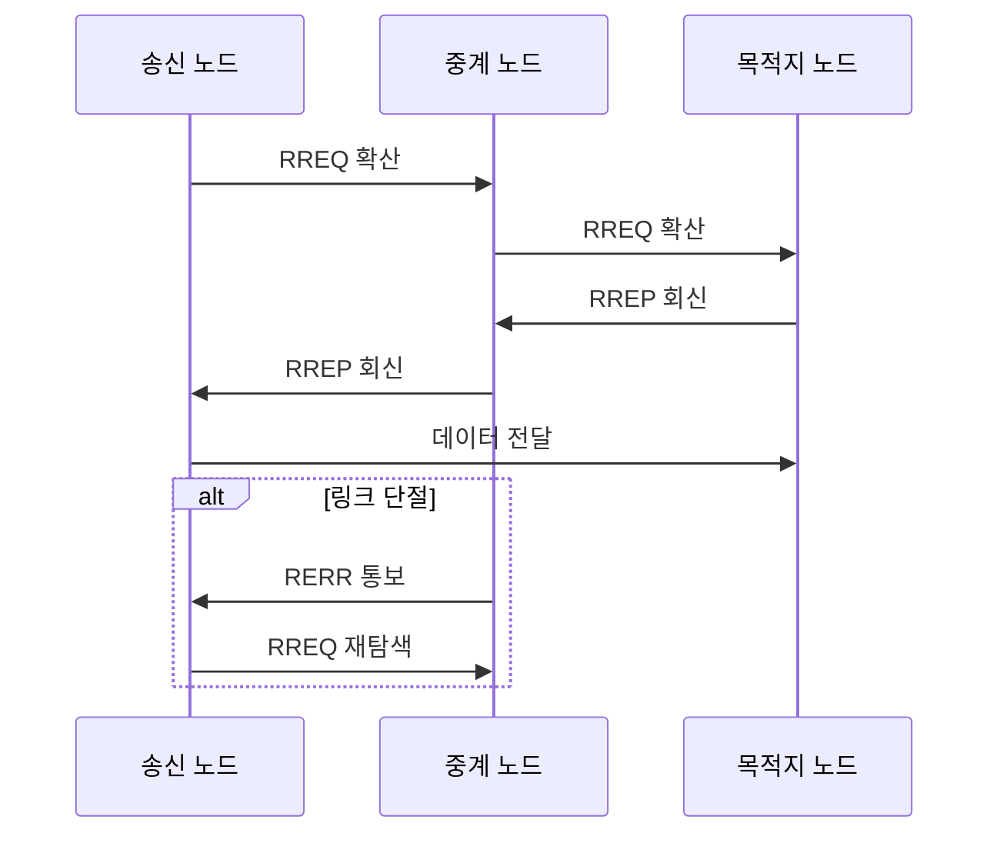

---
sidebar:
  order: 53
  label: "053. 애드혹 네트워크와 AODV (Ad-hoc AODV)"
  badge:
    text: "기출 · 30%"
    variant: note
title: "애드혹 네트워크와 AODV (Ad-hoc AODV)"
date: "2026-07-27T23:59:59+09:00"
tags:
  - "notes-network"
weight: 53
extra:
  question_no: "053"
  source_status: "기출"
  source_history: "129회"
  priority: 30
  priority_note: "설명·비교형: 129회 AODV 장문 출제"
---

## 미리 알고가기

- **애드혹 네트워크(Ad Hoc Network)**: 고정 기반망 없이 이동 노드끼리 경로를 구성하는 자율 무선망임
- **애드혹 요구 기반 거리 벡터(Ad Hoc On-Demand Distance Vector, AODV)**: ‘에이오디브이’로 읽고 영문 핵심어의 머리글자를 딴 표기이며 전송할 때만 목적지 경로를 탐색함
- **경로 요청(Route Request, RREQ)**: ‘알알이큐’로 읽고 Route와 Request의 축약 글자를 결합한 표기이며 목적지 경로를 찾도록 주변 노드에 확산함
- **경로 응답(Route Reply, RREP)**: ‘알알이피’로 읽고 Route와 Reply의 축약 글자를 결합한 표기이며 목적지나 최신 경로 보유 노드가 송신자에게 회신함
- **경로 오류(Route Error, RERR)**: ‘알이알알’로 읽고 Route와 Error의 축약 글자를 결합한 표기이며 다음 홉 단절을 선행 노드에 알림
- **목적지 순차 번호(Destination Sequence Number)**: 목적지가 발급하며 큰 값일수록 최신 경로임을 나타내는 번호임
- **생존 시간(Time To Live, TTL)**: ‘티티엘’로 읽고 세 영문 핵심어의 머리글자를 딴 표기이며 패킷이 통과할 최대 홉 수를 제한함
- **요청 식별자(Request Identifier, Request ID)**: ‘리퀘스트 아이디’로 읽고 Identifier를 ID로 줄인 표기이며 송신 주소와 함께 같은 RREQ의 중복 수신을 판별함
- **역방향 경로(Reverse Route)**: RREQ가 온 이전 홉을 기록해 RREP가 송신자에게 돌아가게 하는 경로임
- **선행자 목록(Precursor List)**: 해당 경로를 사용하는 상류 노드로 RERR을 전달하기 위한 목록임

## Ⅰ. 개요

- **정의/개념**: 전송 요구 시 **목적지 경로를 탐색·유지하는 반응형 라우팅**
- **기존 한계**: 이동망 전체 경로 유지의 **미사용 갱신 제어량 증가**

### 쉽게 이해하기 (학습용)

- 보낼 데이터가 생겼을 때만 목적지까지 길을 묻고 답을 받아 경로를 만든다

## Ⅱ. 특징

- RREQ 확산의 **송신자 역방향 경로 생성**
- RREP 회신의 **목적지 순방향 경로 생성**
- 목적지 순차 번호의 **최신성·루프 억제**

### 쉽게 이해하기 (학습용)

- 길을 먼저 알려 온 노드보다 목적지가 발급한 순차 번호가 큰 경로를 최신 길로 선택한다

## Ⅲ. 아키텍처 및 구성요소

| 설계 요소 | 설명 |
|:---|:---|
| 송신 노드 | 경로가 없을 때 RREQ 탐색 시작 |
| 중계 노드 | 중복 RREQ 제거와 패킷 중계 |
| 목적지 노드 | 최신 순차 번호를 담은 RREP 생성 |
| 노드별 라우팅 테이블 | 목적지·다음 홉·홉 수·수명 저장 |

> 요약: RREQ 역경로로 RREP 회신

### 쉽게 이해하기 (학습용)

- 길을 묻는 요청이 지나온 방향을 기록하면 목적지의 응답이 그 기록을 거슬러 송신자까지 돌아온다.

## Ⅳ. 원리 및 절차 흐름도

| 절차 | 설명 |
|:---|:---|
| RREQ 확산 | 중복 제거·TTL 감소·역경로 기록 |
| RREP 회신 | 최신 순차 번호로 순방향 경로 형성 |
| 데이터 전달 | 라우팅 테이블의 다음 홉으로 전송 |
| RERR 통보 | 단절 목적지를 선행 노드에 알림 |
| RREQ 재탐색 | 유효 경로가 없으면 탐색 재시작 |

> 요약: 전송 전 경로 탐색, 단절 시 재탐색

### 쉽게 이해하기 (학습용)

- 각 노드는 같은 요청을 한 번만 전달하고 최대 이동 횟수를 줄여 요청이 끝없이 퍼지지 않게 한다.

## Ⅴ. 종류 및 비교

| 애드혹 라우팅 | AODV 반응형 | 선제형 라우팅 |
|:---|:---|:---|
| 적용 기준 | 이동 많고 **통신 간헐적** | 토폴로지 안정·**통신 빈번** |
| 핵심 특징 | 요구 시 **RREQ·RREP 경로 탐색** | 모든 경로의 **주기적 갱신** |
| 한계 | 첫 전송 지연·**RREQ 폭증** | 미사용 경로 **제어량 증가** |

> 요약: AODV는 유휴 제어량과 첫 탐색 지연 상충

### 쉽게 이해하기 (학습용)

- 가끔 통신하면 필요할 때 길을 찾고 자주 통신하면 미리 유지한 길을 바로 사용한다.

## Ⅵ. 실무 사례

1. 재난 단말망은 확장 링 탐색으로 RREQ 범위 제한
2. 이동 로봇망은 RERR 수신 즉시 대체 경로 탐색

### 쉽게 이해하기 (학습용)

- 가까운 범위부터 길을 찾고 실패할 때만 TTL을 늘려 전체 방송을 줄인다
- 중계 로봇이 끊기면 오류를 받은 송신 로봇이 새 경로를 찾는다

## Ⅶ. 결론

- 이동성·통신 빈도로 요구형 경로 탐색 선택

### 쉽게 이해하기 (학습용)

- 이동이 잦고 가끔 통신해 미사용 경로 유지비가 클 때 AODV를 선택한다
