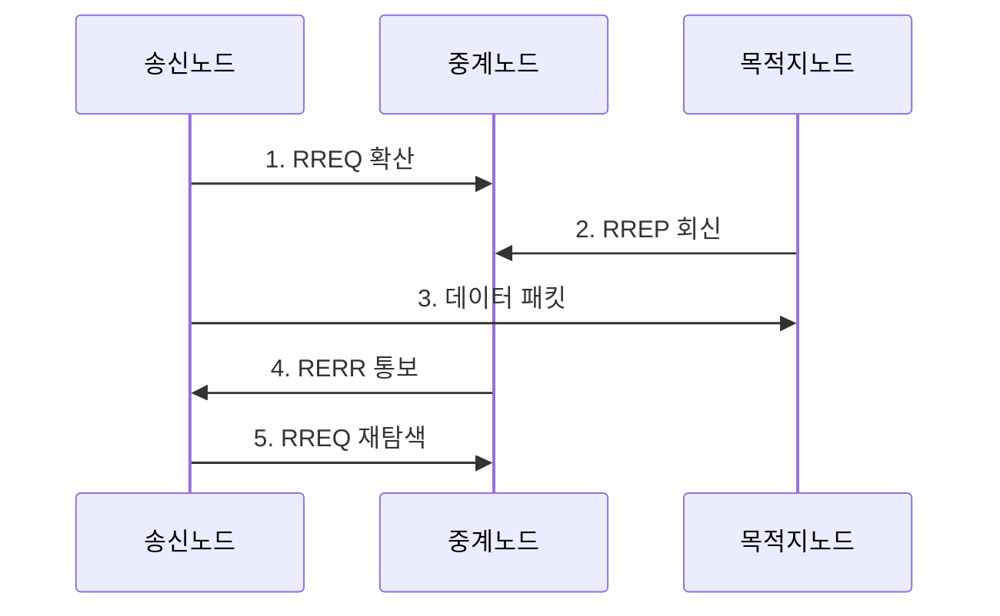

---
sidebar:
  order: 53
  label: "053. 애드혹 네트워크와 AODV (Ad-hoc AODV)"
  badge:
    text: "기출 · 30%"
    variant: note
title: "애드혹 네트워크와 AODV (Ad-hoc AODV)"
date: "2026-07-31T01:04:11+09:00"
tags:
  - "notes-network"
weight: 53
extra:
  question_no: "053"
  source_status: "기출"
  source_history: "129회"
  priority: 30
  priority_note: "설명·비교형: 129회 AODV 장문 출제"
---

## 미리 알고가기

- **애드혹 네트워크(Ad Hoc Network)**: 고정 기반망 없이 이동 노드끼리 경로를 구성하는 자율 무선망
- **애드혹 요구 기반 거리 벡터(Ad Hoc On-Demand Distance Vector, AODV)**: 전송할 때만 목적지 경로를 탐색하는 반응형 라우팅
- **경로 요청(Route Request, RREQ)**: 목적지 경로를 찾도록 주변 노드에 확산하는 메시지
- **경로 응답(Route Reply, RREP)**: 목적지나 최신 경로 보유 노드가 송신자에게 회신하는 메시지
- **경로 오류(Route Error, RERR)**: 다음 홉 단절을 선행 노드에 알리는 메시지
- **목적지 순차 번호(Destination Sequence Number)**: 큰 값일수록 최신 경로임을 나타내는 목적지 발급 번호
- **생존 시간(Time To Live, TTL)**: 패킷이 통과할 최대 홉 수를 제한하는 값
- **요청 식별자(Request Identifier, Request ID)**: 송신 주소와 함께 같은 RREQ의 중복 수신을 판별하는 값
- **역방향 경로(Reverse Route)**: RREQ가 온 이전 홉을 기록해 RREP가 돌아가는 경로
- **선행자 목록(Precursor List)**: 해당 경로를 사용하는 상류 노드의 목록
- **확장 링 탐색(Expanding Ring Search)**: TTL을 점차 늘려 탐색 범위를 확대하는 방식
- **블랙홀 공격(Blackhole Attack)**: 거짓 최적 경로 응답으로 패킷을 가로채 폐기하는 공격

## Ⅰ. 개요

- 정의/개념: 전송 요구가 생기면 목적지 경로를 탐색·유지하는 **반응형 애드혹 라우팅**
- 배경/필요성: 선제형 방식은 이동할 때 미사용 경로까지 갱신해 **제어 트래픽 증가**

### 쉽게 이해하기 (학습용)

- 보낼 데이터가 생겼을 때만 목적지까지 길을 묻고 답을 받아 경로를 만든다

## Ⅱ. 특징

- RREQ 확산의 **송신자 역방향 경로 생성**
- RREP 회신의 **목적지 순방향 경로 생성**
- 목적지 순차 번호의 **최신성·루프 억제**

### 쉽게 이해하기 (학습용)

- 길을 먼저 알려 온 노드보다 목적지가 발급한 순차 번호가 큰 경로를 최신 길로 선택한다

## Ⅲ. 구조 및 구성요소

| 구성요소 | 책임 |
|:---|:---|
| 송신 노드 | 경로가 없으면 **RREQ 탐색** 시작 |
| 중계 노드 | 중복 **RREQ 제거**와 패킷 중계 |
| 목적지 노드 | 최신 순차 번호를 담은 **RREP 생성** |
| 노드별 라우팅 테이블 | 목적지·다음 홉·홉 수·**경로 수명** 저장 |

### 쉽게 이해하기 (학습용)

- 길을 묻는 요청이 지나온 방향을 기록하면 목적지의 응답이 그 기록을 거슬러 송신자까지 돌아온다.

## Ⅳ. 흐름도

**동작 원리**

1. **RREQ 확산**: 중복 제거·TTL 감소·역경로 기록
2. **RREP 회신**: 최신 순차 번호로 순방향 경로 형성
3. **데이터 패킷**: 라우팅 테이블의 다음 홉을 따라 전송
4. **RERR 통보**: 단절 목적지를 선행 노드에 알림
5. **RREQ 재탐색**: 유효 경로가 없으면 탐색 재시작

### 쉽게 이해하기 (학습용)

- 각 노드는 같은 요청을 한 번만 전달하고 최대 이동 횟수를 줄여 요청이 끝없이 퍼지지 않게 한다.

## Ⅴ. 종류 및 비교

| 애드혹 라우팅 | AODV 반응형 | 선제형 라우팅 |
|:---|:---|:---|
| 적용 환경 | 이동이 많고 **통신 간헐적** | 토폴로지가 안정되고 **통신 빈번** |
| 핵심 특징 | 요구 시 **RREQ·RREP 경로 탐색** | 모든 경로의 **주기적 갱신** |
| 한계 | 첫 전송 지연·**RREQ 폭증** | 미사용 경로 **제어량 증가** |

> 요약: AODV는 유휴 제어량과 첫 탐색 지연 상충

### 쉽게 이해하기 (학습용)

- 가끔 통신하면 필요할 때 길을 찾고 자주 통신하면 미리 유지한 길을 바로 사용한다.

## Ⅵ. 실무 고려사항 및 대책

| 고려사항 | 대책 | 효과 |
|:---|:---|:---|
| 전체 범위 RREQ 반복으로 방송 부하 증가 | **확장 링 탐색·요청률 제한** 적용 | 불필요한 **제어 트래픽** 감소 |
| 오래된 RREP를 수용하면 경로 순환·공격 노출 | 목적지 순차 번호와 **RREP 출처** 검증 | 경로 순환과 **블랙홀 공격** 억제 |
| 짧은 경로 수명으로 첫 데이터 탐색 반복 | 통신 빈도에 맞춰 **경로 수명** 조정 | 재탐색 횟수와 **초기 지연** 완화 |

### 쉽게 이해하기 (학습용)

- 가까운 범위부터 길을 찾고 실패할 때만 TTL을 늘려 전체 방송을 줄인다

## Ⅶ. 결론

- 이동성이 높고 통신이 간헐적이면 제어량 절감을 위해 **AODV 반응형 경로** 선택

### 쉽게 이해하기 (학습용)

- 이동이 잦고 통신이 간헐적일 때만 필요 시 경로를 찾는 AODV가 유리하다.
