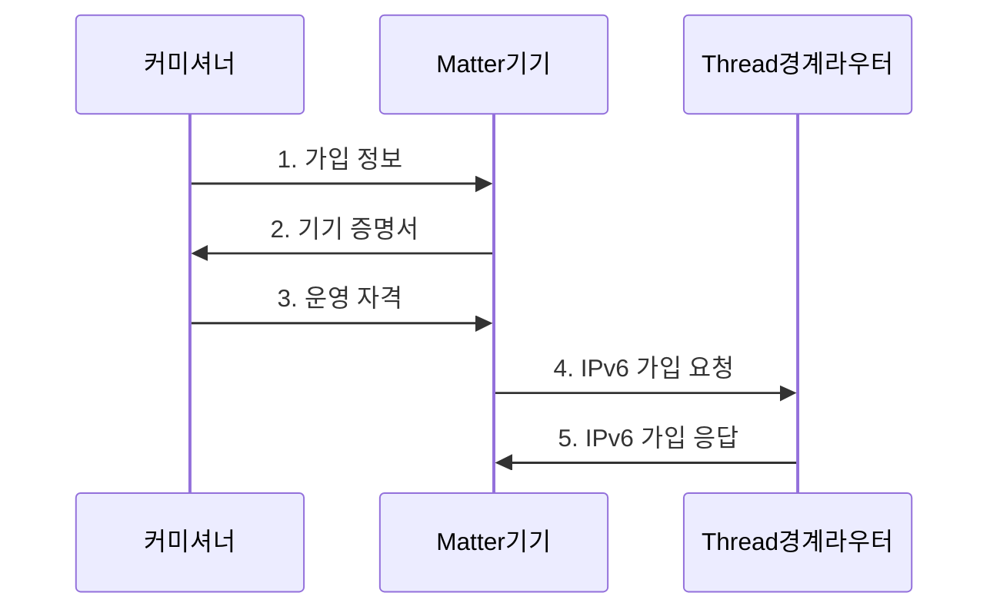

---
sidebar:
  order: 54
  label: "054. Zigbee, Thread, Matter"
  badge:
    text: "기출 · 30%"
    variant: note
title: "Zigbee, Thread, Matter"
date: "2026-07-31T01:04:51+09:00"
tags:
  - "notes-network"
weight: 54
extra:
  question_no: "054"
  source_status: "기출"
  source_history: "131회"
  priority: 30
  priority_note: "비교·설계형: 131회 Matter·Thread 연계"
---

## 미리 알고가기

- **지그비(Zigbee)**: IEEE 802.15.4 위에서 자체 네트워크·응용 계층을 사용하는 규격
- **스레드(Thread)**: IEEE 802.15.4 위에서 IPv6 패킷을 전달하는 메시망 규격
- **매터(Matter)**: IP망에서 기기 모델·명령·보안·가입 절차를 통일하는 응용 표준
- **인터넷 프로토콜 버전 6(Internet Protocol Version 6, IPv6)**: 128비트 주소로 발신지·목적지를 식별하는 인터넷 프로토콜
- **IEEE 802.15.4**: 저전력 개인 영역 무선망의 물리·매체접근제어 계층 표준
- **블루투스 저에너지(Bluetooth Low Energy, BLE)**: 매터 기기의 초기 발견과 가입 연결에 쓰는 저전력 무선 기술
- **경계 라우터(Border Router)·매터 브리지(Matter Bridge)**: 경계 라우터는 스레드와 외부 IPv6망을 연결하고 브리지는 비 매터 기기 모델을 변환
- **커미셔닝·커미셔너(Commissioning·Commissioner)**: 커미셔닝은 기기 진위·네트워크 자격·운영 권한의 등록 절차이고 커미셔너는 가입 승인자
- **패브릭·컨트롤러(Fabric·Controller)**: 패브릭은 운영 키를 공유하는 신뢰 영역이고 컨트롤러는 기기 상태 조회·명령 전송자
- **빠른 응답 코드(Quick Response Code, QR Code)**: 신규 기기의 가입 정보를 카메라로 전달하는 이차원 코드
- **기기 증명서(Device Attestation Certificate)**: 제조사가 발급한 기기의 출처·진위 확인 정보

## Ⅰ. 개요

- 정의/개념: Zigbee·Thread·Matter는 각각 자체망·**IPv6 메시망·IP 응용**을 담당하는 IoT 표준
- 배경/필요성: 제조사별 기기 규격은 **명령·보안 상호운용 곤란**

### 쉽게 이해하기 (학습용)

- Thread는 IP 패킷 길을 만들고 Matter는 그 길에서 기기 명령의 뜻을 통일한다

## Ⅱ. 특징

- **Zigbee**의 자체 메시망·응용 프로파일 사용
- **Thread**의 802.15.4 기반 IPv6 메시 경로 제공
- **Matter**의 IP 기기 모델·명령·보안 통일

### 쉽게 이해하기 (학습용)

- BLE로 기기를 처음 등록한 뒤 운영 명령은 Wi-Fi나 Thread의 IP 경로로 전달한다.

## Ⅲ. 구조 및 구성요소

| 구성요소 | 책임 |
|:---|:---|
| 컨트롤러·커미셔너 | **가입 승인·Matter 명령** 제어 |
| IP 네트워크 | **Matter 메시지** 전달 기반 |
| Thread 경계 라우터 | Thread·외부 **IPv6망 라우팅** |
| Thread Matter 기기 | **Matter 명령·상태** 교환 |
| 매터 브리지 | Zigbee·**Matter 모델** 변환 |

### 쉽게 이해하기 (학습용)

- 경계 라우터는 IP 패킷을 이어 주고 브리지는 서로 다른 기기 명령과 상태를 번역한다.

## Ⅳ. 흐름도

**동작 원리**

1. **가입 정보**: BLE·QR 정보로 신규 기기와 보안 세션 수립
2. **기기 증명서**: 제조사 발급 정보로 기기 진위 증명
3. **운영 자격**: 검증된 기기에 Thread 접속·패브릭 자격 전달
4. **IPv6 가입 요청**: 운영 자격으로 Thread 네트워크 접속 요청
5. **IPv6 가입 응답**: 가입 승인과 IPv6 경로 정보 제공

### 쉽게 이해하기 (학습용)

- 커미셔닝은 기기가 진짜인지 확인하고 네트워크 접속 정보와 운영 권한을 등록한다.

## Ⅴ. 종류 및 비교

| IoT 연결·응용 표준 | Zigbee | Thread | Matter |
|:---|:---|:---|:---|
| 적용 기준 | 기존 **Zigbee 기기** 연동 | 저전력 **IP 메시 경로** | 제조사 간 **응용 상호운용** |
| 핵심 특징 | 비 IP망·**응용 프로파일** | 저전력 **IPv6 메시망** | IP **기기 모델·명령** |
| 한계 | **허브·브리지** 종속 | **경계 라우터** 구성 오류 | **인증서·권한** 오설정 |

> 요약: Zigbee·Thread는 망, Matter는 응용이다.

### 쉽게 이해하기 (학습용)

- Zigbee 기기는 IP로 직접 통신하지 않으므로 Matter에서 제어하려면 브리지가 명령을 변환해야 한다.

## Ⅵ. 실무 고려사항 및 대책

| 고려사항 | 대책 | 효과 |
|:---|:---|:---|
| 전송망과 응용 표준을 혼동하면 계층 책임 누락 | Thread 경로와 **Matter 모델** 분리 설계 | 계층별 책임 명확화로 **연동 오류** 방지 |
| 기기 증명서를 검증하지 않으면 위조 기기 가입 | 제조사 증명서와 **운영 인증서** 확인 | 신뢰 기기만 허용해 **위조 기기** 차단 |
| 기존 Zigbee 모델이 Matter와 달라 제어 불가 | 브리지의 **모델·명령 매핑** 시험 | 기존 기기의 **단계적 전환** 지원 |

### 쉽게 이해하기 (학습용)

- 기존 조명의 Zigbee 켜기·밝기 명령을 Matter 명령으로 바꿔 함께 제어한다

## Ⅶ. 결론

- 저전력 IP 경로는 **Thread**, 제조사 간 제어는 **Matter**, 기존 Zigbee는 브리지 선택

### 쉽게 이해하기 (학습용)

- 저전력 전송망과 멀티벤더 제어 요구를 나눠 Thread·Matter·브리지를 조합해야 한다.
