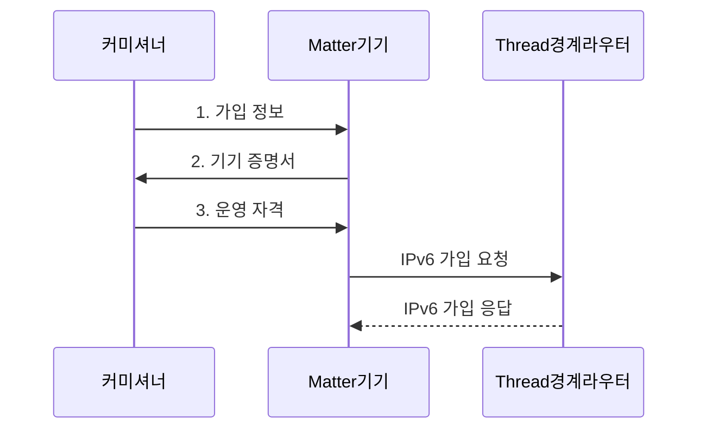

---
sidebar:
  order: 54
  label: "054. Zigbee, Thread, Matter"
  badge:
    text: "기출 · 30%"
    variant: note
title: "Zigbee, Thread, Matter"
date: "2026-07-31T10:59:30+09:00"
tags:
  - "notes-network"
weight: 54
extra:
  question_no: "054"
  source_status: "기출"
  source_history: "131회"
  priority: 30
  priority_note: "비교·설계형: 131회 Matter·Thread 연계"
---

## Ⅰ. 개요

핵심 용어

- **Zigbee·Thread·Matter**: 각각 자체 IoT망·IPv6 메시 경로·IP 응용 상호운용을 담당하는 IoT 표준이다.

- 정의/개념: Zigbee·Thread·Matter는 각각 자체망·**IPv6 메시망·IP 응용**을 담당하는 IoT 표준
- 배경/필요성: 제조사별 기기 규격은 **명령·보안 상호운용 곤란**

#### 한줄 요약

- Thread는 IP 패킷 길을 만들고 Matter는 그 길에서 기기 명령의 뜻을 통일한다

## Ⅱ. 특징

핵심 용어

- **Zigbee·Thread**: Zigbee는 자체 네트워크·응용 계층을 사용하고 Thread는 IEEE 802.15.4 위에서 IPv6 패킷을 전달한다.
- **Matter**: IP망에서 기기 모델·명령·보안·가입 절차를 통일하는 응용 표준이다.

- **Zigbee**의 자체 메시망·응용 프로파일 사용
- **Thread**의 802.15.4 기반 IPv6 메시 경로 제공
- **Matter**의 IP 기기 모델·명령·보안 통일

#### 한줄 요약

- BLE로 기기를 처음 등록한 뒤 운영 명령은 Wi-Fi나 Thread의 IP 경로로 전달한다.

## Ⅲ. 구조 및 구성요소

핵심 용어

- **Thread 경계 라우터**: Thread 메시망과 외부 IPv6망 사이에서 IP 패킷을 라우팅하는 장치이다.
- **Matter 브리지**: Zigbee 등 비 Matter 기기의 모델과 명령을 Matter 형식으로 변환하는 장치이다.

| 구성요소 | 책임 |
|:---|:---|
| 컨트롤러·커미셔너 | **가입 승인·Matter 명령** 제어 |
| IP 네트워크 | **Matter 메시지** 전달 기반 |
| Thread 경계 라우터 | Thread·외부 **IPv6망 라우팅** |
| Thread Matter 기기 | **Matter 명령·상태** 교환 |
| 매터 브리지 | Zigbee·**Matter 모델** 변환 |

#### 한줄 요약

- 경계 라우터는 IP 패킷을 이어 주고 브리지는 서로 다른 기기 명령과 상태를 번역한다.

## Ⅳ. 흐름도

핵심 용어

- **커미셔닝**: 기기 진위·네트워크 자격·운영 권한을 검증하고 신뢰 영역에 등록하는 절차이다.
- **기기 증명서**: 제조사가 발급해 신규 기기의 출처와 진위를 확인하게 하는 정보이다.

**동작 원리**

1. **가입 정보**: BLE·QR 정보로 신규 기기와 보안 세션 수립
2. **기기 증명서**: 제조사 발급 정보로 기기 진위 증명
3. **운영 자격**: 검증된 기기에 Thread 접속·패브릭 자격 전달

#### 한줄 요약

- 커미셔닝은 기기가 진짜인지 확인하고 네트워크 접속 정보와 운영 권한을 등록한다.

## Ⅴ. 종류 및 비교

핵심 용어

- **망 계층·응용 계층**: Zigbee·Thread는 데이터 전달 경로를 구성하고 Matter는 그 경로에서 기기 명령의 의미를 통일한다.
- **IPv6 메시망**: 여러 저전력 노드가 패킷을 중계하며 IPv6 도달성을 제공하는 네트워크이다.

| IoT 연결·응용 표준 | Zigbee | Thread | Matter |
|:---|:---|:---|:---|
| 적용 기준 | 기존 **Zigbee 기기** 연동 | 저전력 **IP 메시 경로** | 제조사 간 **응용 상호운용** |
| 핵심 특징 | 비 IP망·**응용 프로파일** | 저전력 **IPv6 메시망** | IP **기기 모델·명령** |
| 한계 | **허브·브리지** 종속 | **경계 라우터** 구성 오류 | **인증서·권한** 오설정 |

> 요약: **Zigbee·Thread**는 망 계층, **Matter**는 응용 계층

#### 한줄 요약

- Zigbee 기기는 IP로 직접 통신하지 않으므로 Matter에서 제어하려면 브리지가 명령을 변환해야 한다.

## Ⅵ. 실무 고려사항 및 대책

핵심 용어

- **모델·명령 매핑**: 비 Matter 기기의 속성과 동작을 대응하는 Matter 기기 모델과 명령으로 변환하는 규칙이다.
- **운영 인증서**: 검증된 Matter 기기가 특정 패브릭에서 명령을 교환하도록 권한을 증명하는 인증서이다.

| 문제 | 대책 | 효과 |
|:---|:---|:---|
| 전송망과 응용 표준을 혼동하면 계층 책임 누락 | Thread 경로와 **Matter 모델** 분리 설계 | 계층별 책임 명확화로 **연동 오류** 방지 |
| 기기 증명서를 검증하지 않으면 위조 기기 가입 | 제조사 증명서와 **운영 인증서** 확인 | 신뢰 기기만 허용해 **위조 기기** 차단 |
| 기존 Zigbee 모델이 Matter와 달라 제어 불가 | 브리지의 **모델·명령 매핑** 시험 | 기존 기기의 **단계적 전환** 지원 |

#### 한줄 요약

- 기존 조명의 Zigbee 켜기·밝기 명령을 Matter 명령으로 바꿔 함께 제어한다

## Ⅶ. 결론

핵심 용어

- **패브릭**: 운영 키와 신뢰 관계를 공유해 Matter 기기·컨트롤러가 안전하게 통신하는 논리 영역이다.

- 저전력 IP 경로는 **Thread**, 제조사 간 제어는 **Matter**, 기존 Zigbee는 브리지 선택

#### 한줄 요약

- 저전력 전송망과 멀티벤더 제어 요구를 나눠 Thread·Matter·브리지를 조합해야 한다.
