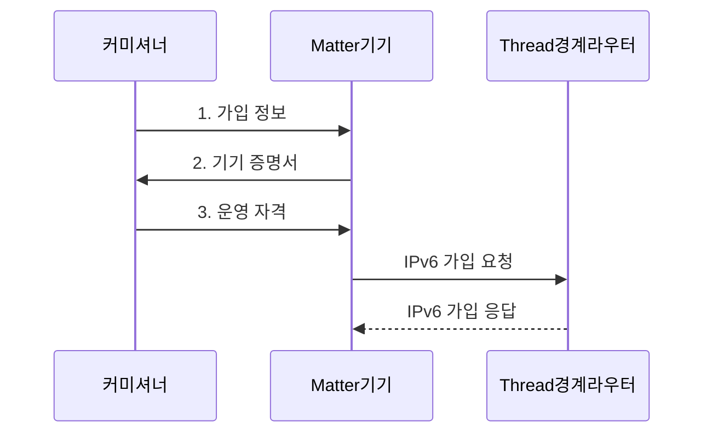

---
sidebar:
  order: 54
  label: "054. Zigbee, Thread, Matter"
  badge:
    text: "기출 • 30%"
    variant: note
title: "Zigbee, Thread, Matter"
date: "2026-08-05T08:00:00+09:00"
tags:
  - "notes-network"
weight: 54
extra:
  question_no: "054"
  source_status: "기출"
  source_history: "131회"
  priority: 30
  priority_note: "비교•설계형: 131회 Matter•Thread 연계"
---

## Ⅰ. 개요

<details>
<summary>핵심 용어</summary>

- **지그비(Zigbee)**: 자체 메시망과 응용 프로파일로 저전력 기기를 연결하는 표준
- **스레드(Thread)**: 저전력 IPv6 메시 전달 경로를 제공하는 망 표준
- **매터(Matter)**: 기기 모델•명령•보안 의미를 통일하는 응용 표준
- **인터넷 프로토콜 버전 6(Internet Protocol version 6, IPv6)**: 128비트 주소를 사용하는 IP 규격
- **인터넷 프로토콜(Internet Protocol, IP)**: 패킷 주소 지정과 전달을 담당하는 네트워크 프로토콜
- **사물인터넷(Internet of Things, IoT)**: 사물이 네트워크로 상태와 명령을 교환하는 체계

</details>

- 정의/개념: Zigbee•Thread•Matter는 자체망•**IPv6 경로•IP 응용**을 담당하는 **IoT 표준**
- 배경/필요성: 제조사별 기기 규격은 **명령•보안 상호운용 곤란**

#### 한줄 요약

- 스레드는 IP 패킷 경로를 만들고 매터는 그 경로에서 기기 명령의 의미를 통일한다.

## Ⅱ. 특징

<details>
<summary>핵심 용어</summary>

- **전기전자공학자협회(Institute of Electrical and Electronics Engineers, IEEE)**: 전기•전자•통신 표준을 개발하는 전문기관
- **블루투스 저에너지(Bluetooth Low Energy, BLE)**: 저전력 근거리 무선 통신 기술

</details>

- **Zigbee** 의 자체 메시망•응용 프로파일 사용
- **Thread**의 **IEEE 802.15.4** 기반 **IPv6 메시 경로** 제공
- **Matter**의 **IP 기기 모델•명령•보안** 통일

#### 한줄 요약

- **BLE**로 기기를 처음 등록한 뒤 운영 명령은 Wi-Fi나 Thread의 IP 경로로 전달한다.

## Ⅲ. 구조 및 구성요소

<details>
<summary>핵심 용어</summary>

- **Thread 경계 라우터**: Thread 메시망과 외부 IPv6망 사이에서 IP 패킷을 라우팅하는 장치이다.
- **Matter 브리지**: Zigbee 등 비 Matter 기기의 모델과 명령을 Matter 형식으로 변환하는 장치이다.

</details>

Thread 경계 라우터는 **IPv6** 패킷을 전달하고 Matter 브리지는 비 Matter 기기의 모델과 명령을 변환한다.

```text
             [컨트롤러•커미셔너]
                       |
                 [IP 네트워크]
                  /           \
      [Thread 경계 라우터]   [매터 브리지]
                  |
         [Thread Matter 기기]
```

선의 의미: 컨트롤러•커미셔너가 IP 네트워크를 통해 Thread 경계 라우터와 매터 브리지에 연결되고, 경계 라우터 아래에 Thread Matter 기기가 놓이는 정적 계층•경계 관계이다.

| 구성요소 | 책임 |
|:---|:---|
| 컨트롤러•커미셔너 | **가입 승인•Matter 명령** 제어 |
| IP 네트워크 | **Matter 메시지** 전달 기반 |
| Thread 경계 라우터 | Thread•외부 **IPv6망 라우팅** |
| Thread Matter 기기 | **Matter 명령•상태** 교환 |
| 매터 브리지 | Zigbee•**Matter 모델** 변환 |

#### 한줄 요약

- 경계 라우터는 IP 패킷을 이어 주고 브리지는 서로 다른 기기 명령과 상태를 번역한다.

## Ⅳ. 흐름도

<details>
<summary>핵심 용어</summary>

- **커미셔닝**: 기기 진위•네트워크 자격•운영 권한을 검증하고 신뢰 영역에 등록하는 절차이다.
- **기기 증명서**: 제조사가 발급해 신규 기기의 출처와 진위를 확인하게 하는 정보이다.
- **빠른 응답 코드(Quick Response Code, QR Code)**: 기기 가입 정보를 광학적으로 전달하는 이차원 코드

</details>



**동작 원리**

1. **가입 정보**: **BLE•QR Code 정보**로 신규 기기와 보안 세션 수립
2. **기기 증명서**: 제조사 발급 정보로 기기 진위 증명
3. **운영 자격**: 검증된 기기에 Thread 접속•패브릭 자격 전달

#### 한줄 요약

- 커미셔닝은 기기가 진짜인지 확인하고 네트워크 접속 정보와 운영 권한을 등록한다.

## Ⅴ. 종류 및 비교

| 표준 | 담당 계층•범위 | 연계 역할 |
|:---|:---|:---|
| **Zigbee** | **비 IP 메시망•응용 프로파일** | 기존 Zigbee 기기의 자체 생태계 구성 |
| **Thread** | **저전력 IPv6 메시 전달** | Matter 기기의 IP 경로 제공 |
| **Matter** | **기기 모델•명령•보안 상호운용** | Thread•Wi-Fi•유선망 위 응용 계층 제공 |

> 요약: Zigbee는 자체 생태계, Thread는 IP 경로, Matter는 응용 상호운용을 담당

#### 한줄 요약

- Zigbee 기기는 IP로 직접 통신하지 않으므로 Matter에서 제어하려면 브리지가 명령을 변환해야 한다.

## Ⅵ. 실무 고려사항 및 대책

<details>
<summary>핵심 용어</summary>

- **모델•명령 매핑**: 비 Matter 기기의 속성과 동작을 대응하는 Matter 기기 모델과 명령으로 변환하는 규칙이다.
- **운영 인증서**: 검증된 Matter 기기가 특정 패브릭에서 명령을 교환하도록 권한을 증명하는 인증서이다.

</details>

| 문제 | 대책 | 효과 |
|:---|:---|:---|
| 전송망과 응용 표준을 혼동하면 계층 책임 누락 | Thread 경로와 **Matter 모델** 분리 설계 | 계층별 책임 명확화로 **연동 오류** 방지 |
| 기기 증명서를 검증하지 않으면 위조 기기 가입 | 제조사 증명서와 **운영 인증서** 확인 | 신뢰 기기만 허용해 **위조 기기** 차단 |
| 기존 Zigbee 모델이 Matter와 달라 제어 불가 | 브리지의 **모델•명령 매핑** 시험 | 기존 기기의 **단계적 전환** 지원 |

#### 한줄 요약

- 기존 조명의 지그비 켜기•밝기 명령을 매터 명령으로 바꿔 함께 제어한다.

## Ⅶ. 결론

<details>
<summary>핵심 용어</summary>

- **패브릭**: 운영 키와 신뢰 관계를 공유해 Matter 기기•컨트롤러가 안전하게 통신하는 논리 영역이다.

</details>

- 저전력 **IP 경로**는 **Thread**, 제조사 간 제어는 **Matter**, 기존 Zigbee는 브리지 선택

#### 한줄 요약

- 저전력 전송망과 멀티벤더 제어 요구를 나눠 Thread•Matter•브리지를 조합해야 한다.
