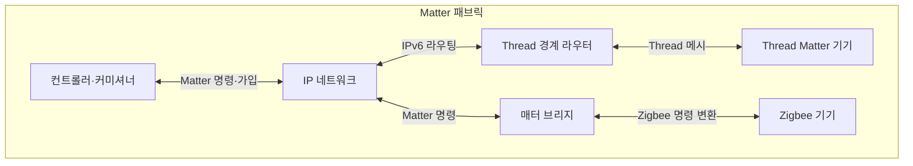
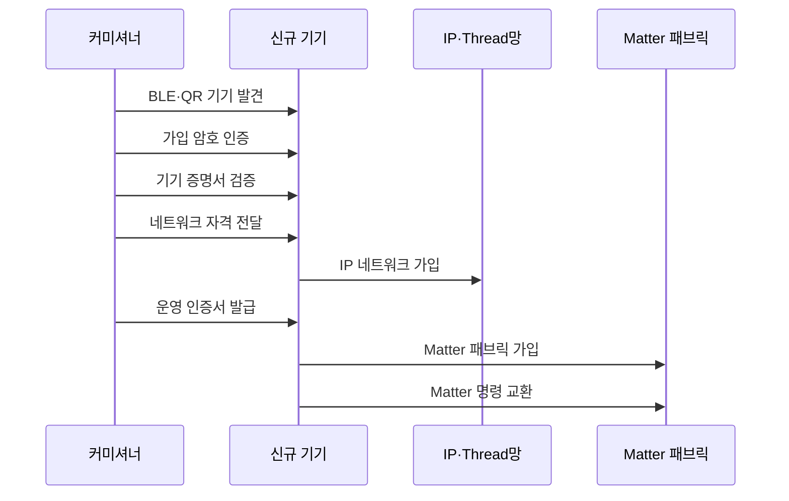

---
sidebar:
  order: 54
  label: "054. Zigbee, Thread, Matter"
  badge:
    text: "기출 · 30%"
    variant: note
title: "Zigbee, Thread, Matter"
date: "2026-07-27T23:59:59+09:00"
tags:
  - "notes-network"
weight: 54
extra:
  question_no: "054"
  source_status: "기출"
  source_history: "131회"
  priority: 30
  priority_note: "비교·설계형: 131회 Matter·Thread 연계"
---

## 미리 알고가기

- **지그비(Zigbee)**: ‘지그비’로 읽는 공식 규격 이름으로 별도 약어 확장을 만들지 않으며 IEEE 802.15.4 위에서 자체 네트워크·응용 계층을 사용함
- **스레드(Thread)**: ‘스레드’로 읽는 공식 규격 이름으로 별도 약어 확장을 만들지 않으며 IEEE 802.15.4 위에서 IPv6 패킷을 전달함
- **매터(Matter)**: ‘매터’로 읽는 공식 표준 이름으로 별도 약어 확장을 만들지 않으며 IP망에서 기기 데이터 모델·명령·보안·가입 절차를 통일함
- **인터넷 프로토콜 버전 6(Internet Protocol Version 6, IPv6)**: ‘아이피브이식스’로 읽고 IP와 버전 숫자 6을 결합한 표기이며 128비트 주소로 발신지·목적지를 식별함
- **IEEE 802.15.4**: ‘아이 트리플 이 팔공이 점 십오 점 사’로 읽고 위원회·작업반 번호를 점(.)으로 잇는 표기이며 저전력 개인 영역 무선망의 물리·매체접근제어 계층 표준임
- **블루투스 저에너지(Bluetooth Low Energy, BLE)**: ‘비엘이’로 읽고 세 영문 단어의 머리글자를 딴 표기이며 매터 기기의 초기 발견과 가입 연결에 쓰임
- **경계 라우터(Border Router)·매터 브리지(Matter Bridge)**: 경계 라우터는 스레드와 외부 IPv6망 사이 패킷을 전달하고 브리지는 비 매터 기기의 명령·상태를 매터 모델로 변환함
- **커미셔닝·커미셔너(Commissioning·Commissioner)**: 커미셔닝은 기기 진위·네트워크 자격·운영 권한을 등록하는 절차이고 커미셔너는 패브릭 가입을 승인하는 역할임
- **패브릭·컨트롤러(Fabric·Controller)**: 패브릭은 공통 인증기관과 운영 키를 공유하는 신뢰 영역이고 컨트롤러는 기기 상태를 조회하고 명령을 보냄
- **빠른 응답 코드(Quick Response Code, QR Code)**: ‘큐알 코드’로 읽고 두 영문 핵심어의 머리글자를 딴 표기이며 신규 기기의 가입 정보를 카메라로 전달함

## Ⅰ. 개요

- 정의/개념: Zigbee는 자체망, Thread는 **IPv6 메시망**, Matter는 **응용 표준**
- **배경/필요성**: 제조사별 기기 규격은 **명령·보안 상호운용 곤란**

### 쉽게 이해하기 (학습용)

- Thread는 IP 패킷 길을 만들고 Matter는 그 길에서 기기 명령의 뜻을 통일한다

## Ⅱ. 특징

- **Zigbee**는 자체 메시망·응용 프로파일을 사용한다.
- **Thread**는 802.15.4 위에서 IPv6 메시 경로를 제공한다.
- **Matter**는 IP망의 기기 모델·명령·보안을 통일한다.

### 쉽게 이해하기 (학습용)

- BLE로 기기를 처음 등록한 뒤 운영 명령은 Wi-Fi나 Thread의 IP 경로로 전달한다.

## Ⅲ. 아키텍처 및 구성요소

| 설계 요소 | 설명 |
|:---|:---|
| 컨트롤러·커미셔너 | **가입 승인·Matter 명령 제어** |
| IP 네트워크 | **Matter 메시지 전달 기반** |
| Thread 경계 라우터 | **Thread·외부 IPv6망 라우팅** |
| Thread Matter 기기 | **Matter 명령·상태 교환** |
| 매터 브리지 | **Zigbee·Matter 모델 변환** |
| Zigbee 기기 | **비 IP 메시망 통신** |

> 요약: Thread는 IP 경로, Matter는 응용 표준

### 쉽게 이해하기 (학습용)

- 경계 라우터는 IP 패킷을 이어 주고 브리지는 서로 다른 기기 명령과 상태를 번역한다.

## Ⅳ. 원리 및 절차 흐름도

| 절차 | 설명 |
|:---|:---|
| BLE·QR 기기 발견 | 가입 정보로 신규 기기 연결 |
| 가입 암호 인증 | 설정 암호로 보안 세션 수립 |
| 기기 증명서 검증 | 제조사 증명서로 진위 확인 |
| 네트워크 자격 전달 | Wi-Fi·Thread 접속 정보를 암호화 전달 |
| IP 네트워크 가입 | 전달받은 자격으로 운영망 접속 |
| 운영 인증서 발급 | 패브릭 신원·운영 권한 부여 |
| Matter 패브릭 가입 | 공통 신뢰 영역에 기기 등록 |
| Matter 명령 교환 | 공통 데이터 모델로 상태·명령 교환 |

> 요약: 증명·가입 후 공통 모델 명령 교환 수행

### 쉽게 이해하기 (학습용)

- 커미셔닝은 기기가 진짜인지 확인하고 네트워크 접속 정보와 운영 권한을 등록한다.

## Ⅴ. 종류 및 비교

| IoT 연결·응용 표준 | Zigbee | Thread | Matter |
|:---|:---|:---|:---|
| 적용 기준 | 기존 Zigbee 기기 연동 | 저전력 IP 메시 경로 | 멀티벤더 응용 상호운용 |
| 핵심 특징 | 비 IP 망·응용 프로파일 | 저전력 IPv6 메시망 | IP 기기 모델·명령 |
| 한계 | 허브·브리지 종속 | 경계 라우터 구성 오류 | 인증서·권한 오설정 |

> 요약: Zigbee·Thread는 망, Matter는 응용이다.

### 쉽게 이해하기 (학습용)

- Zigbee 기기는 IP로 직접 통신하지 않으므로 Matter에서 제어하려면 브리지가 명령을 변환해야 한다.

## Ⅵ. 실무 사례

1. 스마트홈은 **Thread 경계 라우터 이중화**
2. Zigbee 조명은 **매터 브리지로 명령 변환**

### 쉽게 이해하기 (학습용)

- 경계 라우터 하나가 꺼져도 다른 장치가 같은 Thread망을 IP망에 연결한다
- 기존 조명의 Zigbee 켜기·밝기 명령을 Matter 명령으로 바꿔 함께 제어한다

## Ⅶ. 결론

- 기존 비 IP 기기는 **Zigbee 브리지**, 신규 IP 기기는 **Thread·Matter**

### 쉽게 이해하기 (학습용)

- 저전력 전송망과 멀티벤더 제어 요구를 나눠 필요한 표준을 조합한다
