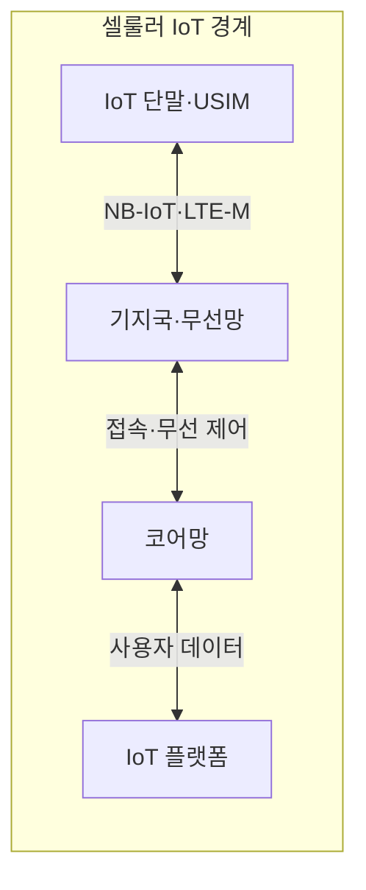
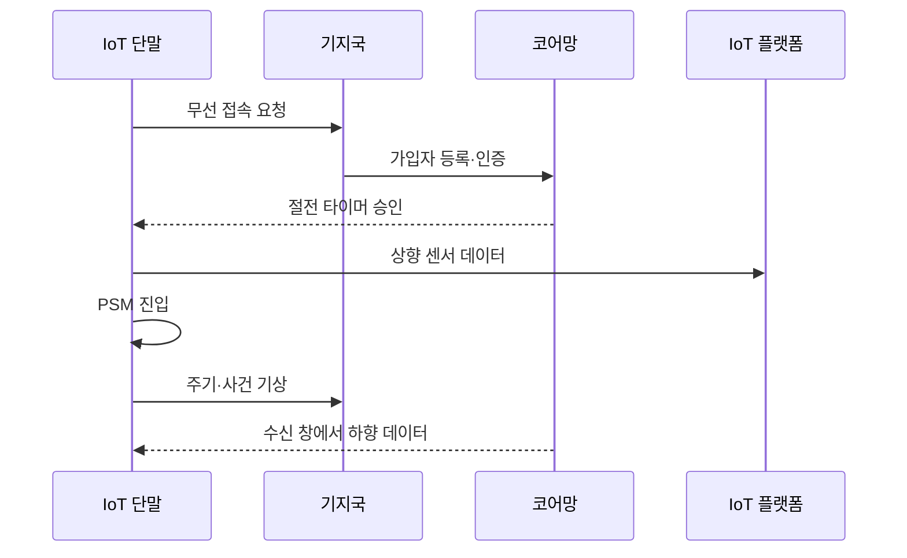

---
sidebar:
  order: 55
  label: "055. NB-IoT와 LTE-M (NB-IoT LTE-M)"
  badge:
    text: "기출 · 30%"
    variant: note
title: "NB-IoT와 LTE-M (NB-IoT LTE-M)"
date: "2026-07-27T23:59:59+09:00"
tags:
  - "notes-network"
weight: 55
extra:
  question_no: "055"
  source_status: "기출"
  source_history: "125회"
  priority: 30
  priority_note: "비교형: 125회 NB-IoT 동작 Mode 출제"
---

## 미리 알고가기

- **저전력 광역망(Low-Power Wide-Area Network, LPWAN)**: ‘엘피완’으로 읽고 네 영문 핵심어의 머리글자를 딴 표기이며 적은 전력과 낮은 전송률로 넓은 지역의 단말을 연결함
- **협대역 사물인터넷(Narrowband Internet of Things, NB-IoT)**: ‘엔비 아이오티’로 읽고 Narrowband의 NB와 IoT를 붙임표로 이은 표기이며 180kHz 협대역으로 소량 데이터를 전달함
- **기계형 장기 진화(Long-Term Evolution for Machines, LTE-M)**: ‘엘티이 엠’으로 읽고 LTE와 Machines의 M을 붙임표로 이은 표기이며 이동성·음성·중간 전송률을 지원함
- **절전 모드(Power Saving Mode, PSM)**: ‘피에스엠’으로 읽고 세 영문 단어의 머리글자를 딴 표기이며 망 등록을 유지한 채 무선 회로를 꺼 전력을 줄임
- **확장 불연속 수신(Extended Discontinuous Reception, eDRX)**: ‘이디알엑스’로 읽고 extended를 소문자 e로 구분한 뒤 DRX와 결합한 표기이며 하향 호출 확인 주기를 늘려 수신 대기 전력을 줄임
- **범용 가입자 식별 모듈(Universal Subscriber Identity Module, USIM)**: ‘유심’으로 읽고 네 영문 단어의 머리글자를 딴 표기이며 가입자 식별자와 인증 키를 저장함
- **킬로헤르츠(kilohertz, kHz)**: ‘킬로헤르츠’로 읽고 주파수 접두사 k와 헤르츠 기호 Hz를 결합한 표기이며 180kHz는 NB-IoT의 채널 폭을 나타냄
- **도달 가능 시간·반복 전송(Reachability Time·Repetition)**: 도달 가능 시간은 단말이 하향 수신을 확인하는 구간이고 반복 전송은 같은 정보를 여러 번 보내 음영 지역의 성공률을 높임
- **대역 내·보호 대역·독립 운용(In-Band·Guard-Band·Standalone)**: NB-IoT를 LTE 자원 블록 안, LTE 채널 가장자리, 별도 주파수에 배치하는 세 가지 운용 방식임

## Ⅰ. 개요

- **정의/개념**: 면허 대역 기반 **NB-IoT·LTE-M 셀룰러 LPWAN**
- **배경/필요성**: 기존 셀룰러 모뎀은 **소량 센서에 전력·비용 과다**

### 쉽게 이해하기 (학습용)

- 이동통신 기지국을 쓰되 단말은 대부분 잠들어 배터리를 아낀다

## Ⅱ. 특징

- **NB-IoT**는 180kHz·반복 전송으로 깊은 실내에 도달한다.
- **LTE-M**은 핸드오버·음성·중간 전송률을 지원한다.
- **PSM·eDRX**는 배터리 수명과 하향 응답 시간이 상충한다.

### 쉽게 이해하기 (학습용)

- 오래 잠들수록 배터리는 절약되지만 서버 명령을 늦게 받는다

## Ⅲ. 아키텍처 및 구성요소

| 설계 요소 | 설명 |
|:---|:---|
| IoT 단말·USIM | **센서 데이터·가입자 인증** |
| 기지국·무선망 | **자원·반복 전송·접속 제어** |
| 코어망 | **등록·이동성·절전 타이머 관리** |
| IoT 플랫폼 | **단말·회선·업무 데이터 연동** |

> 요약: 단말과 망의 PSM·eDRX 기반 전력 조절

### 쉽게 이해하기 (학습용)

- 단말 배터리는 데이터를 보낼 때뿐 아니라 망에 등록하고 실패한 전송을 다시 시도하며 호출을 확인할 때도 소모된다.

## Ⅳ. 원리 및 절차 흐름도

| 절차 | 설명 |
|:---|:---|
| 무선 접속 요청 | NB-IoT·LTE-M 자원 요청 |
| 가입자 등록·인증 | USIM 인증 후 등록 상태 생성 |
| 절전 타이머 승인 | PSM·eDRX·도달 시간 협상 |
| 상향 센서 데이터 | 코어망을 거쳐 플랫폼에 전달 |
| PSM 진입 | 등록을 유지하며 무선 회로를 끔 |
| 주기·사건 기상 | 타이머·센서 사건으로 접속 재개 |
| 수신 창에서 하향 데이터 | 수신 가능 구간에 서버 명령 전달 |

> 요약: 등록·송수신 후 절전 및 기상 반복 수행

### 쉽게 이해하기 (학습용)

- 서버 명령을 빨리 받으려면 단말이 더 자주 깨어 수신 창을 열어야 하므로 배터리를 더 쓴다.

## Ⅴ. 종류 및 비교

| 셀룰러 LPWAN | NB-IoT | LTE-M |
|:---|:---|:---|
| 적용 기준 | 고정·소량·지연 허용 센서 | 이동·응답 중심 단말 |
| 핵심 특징 | 180kHz·깊은 실내 도달 | 핸드오버·음성·중간 전송률 |
| 한계 | 긴 하향 응답·제한 이동성 | 모듈·전력 비용 증가 |

> 요약: NB-IoT 고정형, LTE-M 이동 응답형

### 쉽게 이해하기 (학습용)

- 지하의 고정 계량기는 좁은 대역으로 깊은 곳까지 닿는 NB-IoT를 쓰고 이동 추적기는 셀 전환을 지원하는 LTE-M을 쓴다.

## Ⅵ. 실무 사례

1. 지하 수도 계량기는 **NB-IoT 반복 전송**
2. 이동 자산 추적기는 **LTE-M 핸드오버**

### 쉽게 이해하기 (학습용)

- 지하에서 신호가 약하면 같은 계량값을 반복 전송해 도달률을 높인다
- 이동 중 셀이 바뀌어도 추적 데이터 연결을 유지한다

## Ⅶ. 결론

- 고정·지연 허용은 **NB-IoT**, 이동·빠른 응답은 **LTE-M**

### 쉽게 이해하기 (학습용)

- 고정 센서면 NB-IoT, 이동하며 빨리 응답해야 하면 LTE-M을 선택한다
