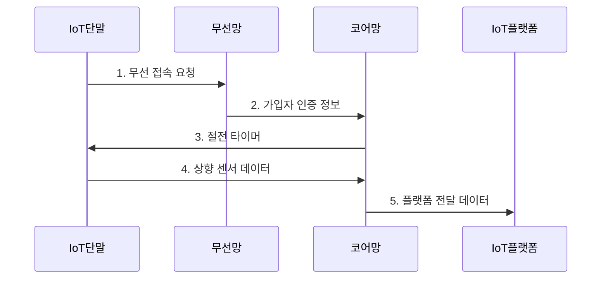

---
sidebar:
  order: 55
  label: "055. NB-IoT와 LTE-M (NB-IoT LTE-M)"
  badge:
    text: "기출 · 30%"
    variant: note
title: "NB-IoT와 LTE-M (NB-IoT LTE-M)"
date: "2026-07-31T01:05:39+09:00"
tags:
  - "notes-network"
weight: 55
extra:
  question_no: "055"
  source_status: "기출"
  source_history: "125회"
  priority: 30
  priority_note: "비교형: 125회 NB-IoT 동작 Mode 출제"
---

## 미리 알고가기

- **저전력 광역망(Low-Power Wide-Area Network, LPWAN)**: 적은 전력과 낮은 전송률로 넓은 지역의 단말을 연결하는 망
- **협대역 사물인터넷(Narrowband Internet of Things, NB-IoT)**: 180kHz 협대역으로 소량 데이터를 전달하는 셀룰러 LPWAN
- **기계형 장기 진화(Long-Term Evolution for Machines, LTE-M)**: 이동성·음성·중간 전송률을 지원하는 셀룰러 LPWAN
- **절전 모드(Power Saving Mode, PSM)**: 망 등록을 유지한 채 무선 회로를 꺼 전력을 줄이는 모드
- **확장 불연속 수신(Extended Discontinuous Reception, eDRX)**: 하향 호출 확인 주기를 늘려 수신 대기 전력을 줄이는 방식
- **범용 가입자 식별 모듈(Universal Subscriber Identity Module, USIM)**: 가입자 식별자와 인증 키를 저장하는 모듈
- **킬로헤르츠(kilohertz, kHz)**: 초당 천 번의 주기를 나타내는 주파수 단위
- **도달 가능 시간·반복 전송(Reachability Time·Repetition)**: 도달 가능 시간은 하향 수신 확인 구간이고 반복 전송은 같은 정보의 재전송
- **대역 내·보호 대역·독립 운용(In-Band·Guard-Band·Standalone)**: NB-IoT를 LTE 자원 안·가장자리·별도 주파수에 배치하는 방식
- **핸드오버(Handover)**: 이동 단말의 연결을 인접 기지국으로 넘기는 절차
- **코어망(Core Network)**: 가입자 인증·이동성·외부망 연결을 담당하는 이동통신 중심망

## Ⅰ. 개요

- 정의/개념: 면허 대역에서 저전력 단말을 광역 연결하는 **NB-IoT·LTE-M 셀룰러 LPWAN**
- 배경/필요성: 기존 셀룰러 모뎀은 **소량 센서에 전력·비용 과다**

### 쉽게 이해하기 (학습용)

- 이동통신 기지국을 쓰되 단말은 대부분 잠들어 배터리를 아낀다

## Ⅱ. 특징

- **NB-IoT**의 180kHz·반복 전송을 통한 깊은 실내 도달
- **LTE-M**의 핸드오버·음성·중간 전송률 지원
- **PSM·eDRX**의 배터리 수명과 하향 응답 시간 상충

### 쉽게 이해하기 (학습용)

- 오래 잠들수록 배터리는 절약되지만 서버 명령을 늦게 받는다

## Ⅲ. 구조 및 구성요소

| 구성요소 | 책임 |
|:---|:---|
| IoT 단말·USIM | 센서 데이터 생성과 **가입자 인증** |
| 기지국·무선망 | 무선 자원·반복 전송·**접속 제어** |
| 코어망 | 등록·이동성·**절전 타이머** 관리 |
| IoT 플랫폼 | 단말·회선과 **업무 데이터** 연동 |

### 쉽게 이해하기 (학습용)

- 단말 배터리는 데이터를 보낼 때뿐 아니라 망에 등록하고 실패한 전송을 다시 시도하며 호출을 확인할 때도 소모된다.

## Ⅳ. 흐름도

**동작 원리**

1. **무선 접속 요청**: NB-IoT·LTE-M 자원 요청
2. **가입자 인증 정보**: USIM 정보로 가입자 인증·등록 요청
3. **절전 타이머**: PSM·eDRX·도달 가능 시간 제공
4. **상향 센서 데이터**: 절전 해제 후 측정 데이터를 코어망에 전송
5. **플랫폼 전달 데이터**: 코어망이 가입자 정보와 센서 데이터를 플랫폼에 전달

### 쉽게 이해하기 (학습용)

- 서버 명령을 빨리 받으려면 단말이 더 자주 깨어 수신 창을 열어야 하므로 배터리를 더 쓴다.

## Ⅴ. 종류 및 비교

| 셀룰러 LPWAN | NB-IoT | LTE-M |
|:---|:---|:---|
| 적용 기준 | 고정·소량·**지연 허용 센서** | 이동·**빠른 응답 단말** |
| 핵심 특징 | 180kHz·**깊은 실내 도달** | 핸드오버·음성·**중간 전송률** |
| 배치 방식 | **대역 내·보호 대역·독립 운용** | LTE 대역 내 **자원 배치** |
| 한계 | 긴 하향 응답·**제한된 이동성** | 모듈 비용·**소비 전력 증가** |

> 요약: NB-IoT 고정형, LTE-M 이동 응답형

### 쉽게 이해하기 (학습용)

- 지하의 고정 계량기는 좁은 대역으로 깊은 곳까지 닿는 NB-IoT를 쓰고 이동 추적기는 셀 전환을 지원하는 LTE-M을 쓴다.

## Ⅵ. 실무 고려사항 및 대책

| 고려사항 | 대책 | 효과 |
|:---|:---|:---|
| 긴 절전 주기로 하향 응답 기한 초과 | PSM·eDRX·**수신 창** 공동 산정 | 배터리 수명과 **응답 기한** 균형 |
| 이동 단말에 NB-IoT를 적용하면 연결 단절 | 이동성 요구 시 **LTE-M** 선택 | 핸드오버를 통한 **세션 연속성** 확보 |
| 깊은 실내에서 재전송 증가로 배터리 소모 | 반복 횟수·송신 전력·**커버리지** 실측 | 환경별 **배터리 수명** 예측 |

### 쉽게 이해하기 (학습용)

- 깊은 실내의 저속 고정 단말은 NB-IoT를, 이동하며 연결을 유지할 단말은 LTE-M을 선택한다

## Ⅶ. 결론

- 고정·저속·깊은 실내는 **NB-IoT**, 이동·빠른 응답은 **LTE-M** 선택

### 쉽게 이해하기 (학습용)

- 고정 저속 센서는 NB-IoT, 이동하며 빠른 하향 응답이 필요하면 LTE-M이 유리하다.
