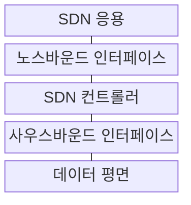
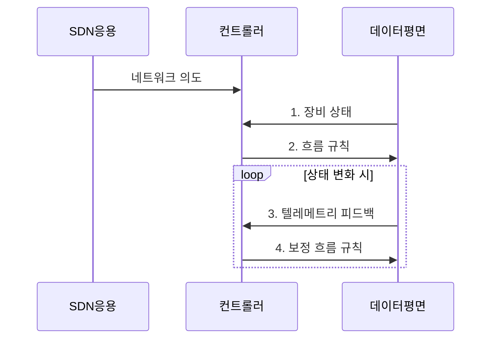

---
sidebar:
  order: 56
  label: "056. SDN (Software Defined Networking, 소프트웨어 정의 네트워킹)"
  badge:
    text: "기출 · 50%"
    variant: note
title: "SDN (Software Defined Networking, 소프트웨어 정의 네트워킹)"
date: "2026-07-31T10:59:30+09:00"
tags:
  - "notes-network"
weight: 56
extra:
  question_no: "056"
  source_status: "기출"
  source_history: "129회, 131회"
  priority: 50
  priority_note: "설계형: 131회 SDN·ML Traffic 최적화"
---

## 미리 알고가기

- **소프트웨어 정의 네트워킹(Software-Defined Networking, SDN)**: 제어·데이터 평면을 분리하고 개방 API로 망을 프로그래밍하는 구조
- **제어 평면·데이터 평면(Control Plane·Data Plane)**: 제어 평면은 경로와 규칙을 결정하고 데이터 평면은 규칙에 따라 패킷을 전달
- **응용 프로그래밍 인터페이스(Application Programming Interface, API)**: 소프트웨어 기능과 데이터의 호출 방식을 정의한 접점
- **노스바운드·사우스바운드 인터페이스(Northbound·Southbound Interface)**: 노스바운드는 응용 의도를 전달하고 사우스바운드는 장비 규칙·상태를 교환
- **네트워크 의도(Network Intent)**: 운영자가 원하는 연결·격리·품질 결과를 선언한 정책
- **텔레메트리(Telemetry)**: 장비의 트래픽·지연·오류·상태를 지속 수집하는 기능
- **흐름 규칙(Flow Rule)**: 패킷 조건과 전달·폐기·수정 동작을 결합한 데이터 평면 규칙
- **기계학습(Machine Learning, ML)**: 관측 데이터의 패턴을 학습해 예측·분류하는 기술
- **토폴로지(Topology)**: 네트워크 장비와 링크의 연결 구조

## Ⅰ. 개요

- 정의/개념: 제어 평면과 데이터 평면을 분리해 망을 프로그래밍하는 **네트워크 제어 구조**
- 배경/필요성: 장비별 분산 설정은 **전역 정책 일관성·변경 속도 한계**

### 쉽게 이해하기 (학습용)

- 각 스위치가 길을 따로 정하지 않고 중앙 제어기가 전체 지도를 보고 전달 규칙을 내려준다

## Ⅱ. 특징

- **논리적 중앙 제어**를 통한 토폴로지·정책의 전역 관리
- **개방 API**를 통한 응용 의도의 장비 흐름 규칙 변환
- **텔레메트리 폐루프**를 통한 규칙 결과 관측·보정

### 쉽게 이해하기 (학습용)

- 중앙처럼 보이는 여러 제어기가 같은 망 상태를 공유해야 서로 다른 길을 지시하지 않는다

## Ⅲ. 구조 및 구성요소

| 구성요소 | 책임 |
|:---|:---|
| SDN 응용 | 연결·보안·품질 **네트워크 의도** 정의 |
| 노스바운드 인터페이스 | 응용의 **의도·정책** 전달 |
| SDN 컨트롤러 | 전역 경로·**흐름 규칙** 계산 |
| 사우스바운드 인터페이스 | 장비 **규칙 설치·상태 수집** |
| 데이터 평면 | 흐름 규칙 기반 **패킷 처리** |

### 쉽게 이해하기 (학습용)

- 응용이 원하는 통신 결과를 말하면 컨트롤러가 장비가 실행할 세부 규칙으로 바꾼다

## Ⅳ. 흐름도

**동작 원리**

1. **장비 상태**: 데이터 평면이 토폴로지·링크 상태 제공
2. **흐름 규칙**: 컨트롤러가 장비별 패킷 조건·동작 배포
3. **텔레메트리 피드백**: 장비가 트래픽·지연·오류 상태 보고
4. **보정 흐름 규칙**: 관측 결과와 정책 차이를 반영한 규칙 재배포

### 쉽게 이해하기 (학습용)

- 규칙을 내린 뒤 실제 패킷이 원하는 길로 가는지 확인하고 어긋나면 다시 계산한다

## Ⅴ. 종류 및 비교

| 네트워크 제어 구조 | SDN 논리적 중앙 제어 | 전통적 분산 제어 |
|:---|:---|:---|
| 적용 기준 | 일관된 **전역 정책·자동화** | 국소 자율성과 **분산 복구** |
| 핵심 특징 | **전역 상태** 기반 규칙 계산 | **이웃 정보** 기반 경로 계산 |
| 한계 | 컨트롤러 장애·**상태 불일치** | 정책 분산·**수렴 지연** |

> 요약: 분산 제어는 **국소 자율**, SDN은 **전역 정책** 중심

### 쉽게 이해하기 (학습용)

- 전체 망을 한 정책으로 바꾸려면 SDN, 중앙 제어 없이 장비끼리 복구해야 하면 분산 제어가 맞다

## Ⅵ. 실무 고려사항 및 대책

| 고려사항 | 대책 | 효과 |
|:---|:---|:---|
| 컨트롤러 상태가 다르면 장비별 정책 충돌 | 상태 동기화 후 **흐름 규칙** 배포 | 장비 간 **전역 정책 일관성** 확보 |
| 단일 컨트롤러 장애로 규칙 변경 중단 | 다중 컨트롤러와 **자동 절체** 구성 | 장애 중에도 **제어 평면 가용성** 유지 |
| 규칙 결과를 검증하지 않으면 혼잡 경로 지속 | 텔레메트리와 **ML 혼잡 예측**으로 재계산 | 정책 오적용 탐지와 **경로 최적화** |

### 쉽게 이해하기 (학습용)

- 여러 컨트롤러가 같은 망 지도를 확인한 뒤 스위치에 같은 길을 지시한다

## Ⅶ. 결론

- 전역 정책 자동화가 우선이면 **SDN**, 독립 복구가 우선이면 **분산 제어** 선택

### 쉽게 이해하기 (학습용)

- 여러 제어기가 같은 상태를 보고 규칙 결과를 검증할 때 논리적 중앙 제어의 이점을 얻는다.
