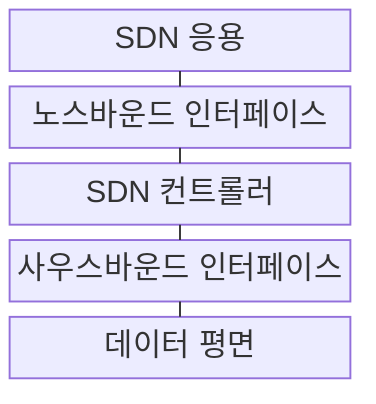
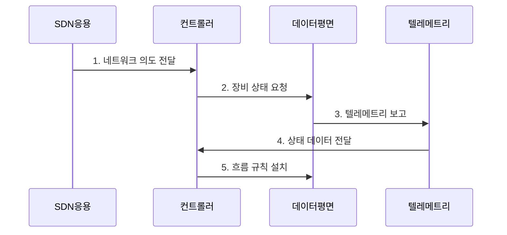

---
sidebar:
  order: 56
  label: "056. SDN (Software Defined Networking, 소프트웨어 정의 네트워킹)"
  badge:
    text: "기출 · 50%"
    variant: note
title: "SDN (Software Defined Networking, 소프트웨어 정의 네트워킹)"
date: "2026-07-29T23:30:00+09:00"
tags:
  - "notes-network"
weight: 56
extra:
  question_no: "056"
  source_status: "기출"
  source_history: "129회, 131회"
  priority: 50
  priority_note: "설계형: 131회 SDN·ML Traffic 최적화"
---

## 미리 알고가기

- **소프트웨어 정의 네트워킹(Software-Defined Networking, SDN)**: ‘에스디엔’으로 읽고 세 영문 핵심어의 머리글자를 딴 표기이며 제어·데이터 평면을 분리하고 개방 API로 망을 프로그래밍함
- **제어 평면·데이터 평면(Control Plane·Data Plane)**: 제어 평면은 패킷 경로와 규칙을 결정하고 데이터 평면은 설치된 규칙에 따라 패킷을 전달함
- **응용 프로그래밍 인터페이스(Application Programming Interface, API)**: ‘에이피아이’로 읽고 세 영문 단어의 머리글자를 딴 표기이며 소프트웨어 기능과 데이터의 호출 방식을 정의함
- **노스바운드·사우스바운드 인터페이스(Northbound·Southbound Interface)**: 노스바운드는 응용 의도를 컨트롤러에 전달하고 사우스바운드는 장비 규칙 설치와 상태 수집에 쓰임
- **네트워크 의도(Network Intent)**: 운영자가 원하는 연결·격리·품질 결과를 장비 명령과 분리해 선언한 정책임
- **텔레메트리(Telemetry)**: 장비의 트래픽·지연·오류·상태를 지속 수집해 제어기에 전달하는 기능임
- **흐름 규칙(Flow Rule)**: 패킷 헤더 조건과 전달·폐기·수정 동작을 결합한 데이터 평면 규칙임
- **기계학습(Machine Learning, ML)**: ‘엠엘’로 읽고 두 영문 단어의 머리글자를 딴 표기이며 텔레메트리에서 혼잡 패턴을 학습해 SDN 경로 최적화에 활용함

## Ⅰ. 개요

- 정의/개념: **제어·데이터 평면 분리**로 망을 프로그래밍하는 구조
- 배경/필요성: 장비별 분산 설정은 **전역 정책 일관성·변경 속도 한계**

### 쉽게 이해하기 (학습용)

- 각 스위치가 길을 따로 정하지 않고 중앙 제어기가 전체 지도를 보고 전달 규칙을 내려준다

## Ⅱ. 특징

- **논리적 중앙 제어**로 토폴로지·정책을 전역 관리한다.
- **개방 API**로 응용 의도를 장비 흐름 규칙으로 변환한다.
- **텔레메트리 폐루프**로 결과를 관측하며 상태 불일치를 제어한다.

### 쉽게 이해하기 (학습용)

- 중앙처럼 보이는 여러 제어기가 같은 망 상태를 공유해야 서로 다른 길을 지시하지 않는다

## Ⅲ. 구조 및 구성요소

| 구성요소 | 책임 |
|:---|:---|
| SDN 응용 | 연결·보안·품질 의도 정의 |
| 노스바운드 인터페이스 | 응용 의도·정책 전달 |
| SDN 컨트롤러 | 전역 경로·흐름 규칙 계산 |
| 사우스바운드 인터페이스 | 장비 규칙 설치·상태 수집 |
| 데이터 평면 | 흐름 규칙 기반 패킷 처리 |

### 쉽게 이해하기 (학습용)

- 응용이 원하는 통신 결과를 말하면 컨트롤러가 장비가 실행할 세부 규칙으로 바꾼다

## Ⅳ. 흐름도

**동작 원리**

1. **네트워크 의도 전달**: 응용이 연결·격리·품질 목표 선언
2. **장비 상태 요청**: 컨트롤러가 토폴로지·포트 상태 조회
3. **텔레메트리 보고**: 장비가 트래픽·지연·오류를 전달
4. **상태 데이터 전달**: 전역 상태와 정책으로 경로를 계산할 관측값 제공
5. **흐름 규칙 설치**: 장비별 일치 조건·동작을 배포

### 쉽게 이해하기 (학습용)

- 규칙을 내린 뒤 실제 패킷이 원하는 길로 가는지 확인하고 어긋나면 다시 계산한다

## Ⅴ. 종류 및 비교

| 네트워크 제어 구조 | SDN 논리적 중앙 제어 | 전통적 분산 제어 |
|:---|:---|:---|
| 적용 기준 | 일관된 전역 정책·자동화 | 국소 자율성과 분산 복구 |
| 핵심 특징 | 전역 상태로 규칙 계산 | 이웃 정보로 경로 계산 |
| 한계 | 제어기 장애·상태 불일치 | 정책 분산·수렴 지연 |

> 요약: 분산 제어는 국소 자율, SDN은 전역 정책이다.

### 쉽게 이해하기 (학습용)

- 전체 망을 한 정책으로 바꾸려면 SDN, 중앙 제어 없이 장비끼리 복구해야 하면 분산 제어가 맞다

## Ⅵ. 실무 고려사항 및 대책

| 고려사항 | 대책 | 효과 |
|:---|:---|:---|
| 컨트롤러 상태 불일치 | 합의 후 흐름 규칙 배포 | 전역 정책 일관성 |
| 제어기 단일 장애 | 다중 인스턴스·리더 절체 | 제어면 가용성 |
| 규칙 결과 미검증 | 종단 텔레메트리 폐루프 | 정책 오적용 탐지 |

### 쉽게 이해하기 (학습용)

- 여러 컨트롤러가 같은 망 지도를 확인한 뒤 스위치에 같은 길을 지시한다

## Ⅶ. 결론

- **컨트롤러 일관성·복구·결과 검증을 갖춘 SDN 적용**

### 쉽게 이해하기 (학습용)

- 여러 제어기가 같은 상태를 보고 규칙 결과를 검증할 때 논리적 중앙 제어의 이점을 얻는다.
