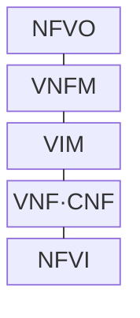
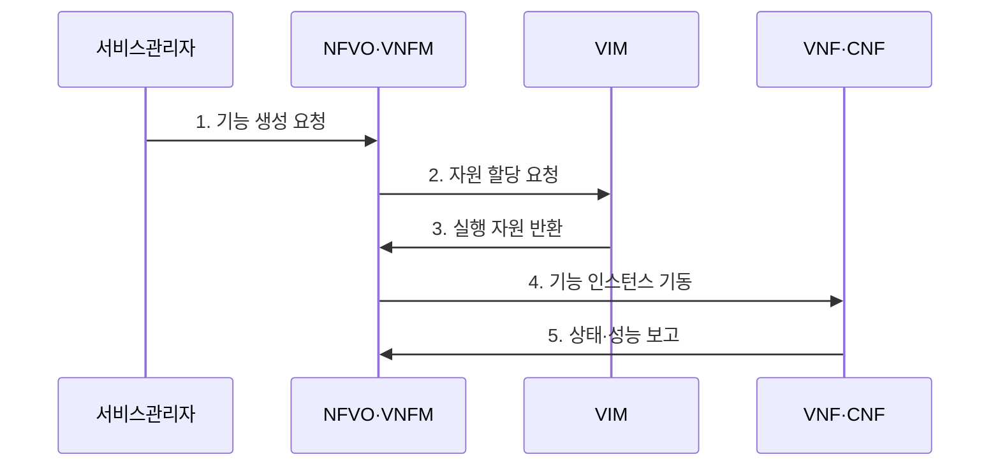

---
sidebar:
  order: 57
  label: "057. NFV (Network Functions Virtualization, 네트워크 기능 가상화)"
  badge:
    text: "기출 · 50%"
    variant: note
title: "NFV (Network Functions Virtualization, 네트워크 기능 가상화)"
date: "2026-07-29T23:30:00+09:00"
tags:
  - "notes-network"
weight: 57
extra:
  question_no: "057"
  source_status: "기출"
  source_history: "129회, 131회"
  priority: 50
  priority_note: "비교·설계형: SDN 연계 가상화 기반축"
---

## 미리 알고가기

- **네트워크 기능 가상화(Network Functions Virtualisation, NFV)**: ‘엔에프브이’로 읽고 세 영문 핵심어의 머리글자를 딴 표기이며 전용 통신 장비 기능을 범용 서버의 소프트웨어로 구현함
- **가상 네트워크 기능(Virtualised Network Function, VNF)**: ‘브이엔에프’로 읽고 세 영문 단어의 머리글자를 딴 표기이며 가상머신에서 방화벽·라우터 같은 망 기능을 실행함
- **컨테이너 네트워크 기능(Containerised Network Function, CNF)**: ‘시엔에프’로 읽고 세 영문 단어의 머리글자를 딴 표기이며 컨테이너와 클라우드 네이티브 방식으로 망 기능을 실행함
- **NFV 인프라(NFV Infrastructure, NFVI)**: ‘엔에프브이아이’로 읽고 NFV 뒤에 Infrastructure의 I를 붙인 표기이며 VNF·CNF에 컴퓨팅·저장·네트워크 자원을 제공함
- **관리·오케스트레이션(Management and Orchestration, MANO)**: ‘마노’로 읽고 세 영문 핵심어의 머리글자를 딴 표기이며 네트워크 서비스와 가상 기능·인프라의 수명주기를 관리함
- **NFV 오케스트레이터(NFV Orchestrator, NFVO)**: ‘엔에프브이오’로 읽고 NFV 뒤에 Orchestrator의 O를 붙인 표기이며 서비스 수명주기와 인프라 배치를 조정함
- **가상 네트워크 기능 관리자(VNF Manager, VNFM)**: ‘브이엔에프엠’으로 읽고 VNF 뒤에 Manager의 M을 붙인 표기이며 기능 인스턴스의 생성·확장·치유·종료를 관리함
- **가상 인프라 관리자(Virtualised Infrastructure Manager, VIM)**: ‘빔’으로 읽고 세 영문 단어의 머리글자를 딴 표기이며 NFVI 자원을 할당·회수함
- **네트워크 서비스 기술자(Network Service Descriptor, NSD)**: ‘엔에스디’로 읽고 세 영문 단어의 머리글자를 딴 표기이며 연결할 가상 기능과 배치·연결 요구를 선언함
- **유럽전기통신표준협회(European Telecommunications Standards Institute, ETSI)**: ‘엣시’로 읽고 네 영문 핵심어의 머리글자를 딴 표기이며 NFV 관리 구조와 인터페이스를 표준화함

## Ⅰ. 개요

- 정의/개념: 전용 망 기능을 **범용 인프라의 VNF·CNF로 구현**
- 배경/필요성: 전용 장비는 **조달·증설 지연과 공급자 종속** 발생

### 쉽게 이해하기 (학습용)

- 전용 장비를 새로 사는 대신 범용 서버에 필요한 방화벽·라우터 소프트웨어를 띄운다

## Ⅱ. 특징

- **기능·하드웨어 수명주기 분리**로 독립 배치·교체한다.
- **MANO**가 VNF·CNF의 배치·확장·치유를 자동화한다.
- **상태 동기화·가상화 오버헤드**가 확장성과 성능을 제한한다.

### 쉽게 이해하기 (학습용)

- 기능은 쉽게 복제할 수 있어도 연결 상태를 가진 방화벽은 상태까지 옮겨야 세션이 끊기지 않는다

## Ⅲ. 구조 및 구성요소

| 구성요소 | 책임 |
|:---|:---|
| NFVO | 서비스 구성·인프라 자원 조정 |
| VNFM | 기능 인스턴스 수명주기 관리 |
| VIM | NFVI 자원 할당·감시·회수 |
| VNF·CNF | 소프트웨어 망 기능 실행 |
| NFVI | 컴퓨팅·저장·네트워크 제공 |

### 쉽게 이해하기 (학습용)

- NFVO가 서비스 전체를 조립하고 VNFM이 기능을 관리하며 VIM이 실행할 서버 자원을 내준다

## Ⅳ. 흐름도

**동작 원리**

1. **기능 생성 요청**: NSD에 따라 필요한 기능 지정
2. **자원 할당 요청**: 기능 요구량·위치에 맞는 자원 요청
3. **실행 자원 반환**: VIM이 NFVI 자원 식별자 제공
4. **기능 인스턴스 기동**: 검증된 이미지로 기능 실행
5. **상태·성능 보고**: 장애·부하와 인스턴스 상태 전달

### 쉽게 이해하기 (학습용)

- 기능 명세가 필요한 자원을 알려 주면 MANO가 서버를 배정하고 장애나 부하에 따라 복제한다

## Ⅴ. 종류 및 비교

| 네트워크 기능 구현 | NFV | 전용 어플라이언스 |
|:---|:---|:---|
| 적용 기준 | 탄력 확장·서비스 조합 | 고정 부하·전용 성능 |
| 핵심 특징 | 기능·범용 하드웨어 분리 | 기능·전용 하드웨어 통합 |
| 한계 | 가상화 오버헤드·상태 이동 | 증설 지연·공급자 종속 |

> 요약: 전용 장비는 고성능, NFV는 민첩한 확장에 적합

### 쉽게 이해하기 (학습용)

- 부하에 따라 기능을 자주 늘리고 바꾸면 NFV, 일정한 최고 성능이 우선이면 전용 장비가 맞다

## Ⅵ. 실무 고려사항 및 대책

| 고려사항 | 대책 | 효과 |
|:---|:---|:---|
| 상태 기능의 무중단 확장 | 세션 동기화 후 트래픽 전환 | 기존 연결 유지 |
| 가상화 처리량 부족 | 가속기·NUMA·코어 고정 시험 | 성능 예측 가능성 |
| 이미지 공급망 변조 | 서명·취약점·출처 검증 | 망 기능 무결성 |

### 쉽게 이해하기 (학습용)

- 방화벽 복제본에 현재 연결 상태를 옮긴 뒤 트래픽을 나눠야 기존 접속이 끊기지 않는다

## Ⅶ. 결론

- **상태 이전·성능·오케스트레이션 비용을 검증한 NFV 적용**

### 쉽게 이해하기 (학습용)

- 기능 복제 이득이 상태 이전과 가상화 성능 비용보다 큰 기능부터 NFV로 전환해야 한다.
