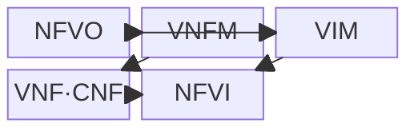
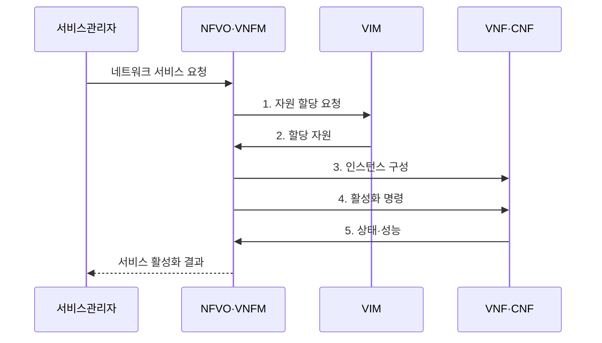

---
sidebar:
  order: 57
  label: "057. NFV (Network Functions Virtualization, 네트워크 기능 가상화)"
  badge:
    text: "기출 · 50%"
    variant: note
title: "NFV (Network Functions Virtualization, 네트워크 기능 가상화)"
date: "2026-07-31T01:07:12+09:00"
tags:
  - "notes-network"
weight: 57
extra:
  question_no: "057"
  source_status: "기출"
  source_history: "129회, 131회"
  priority: 50
  priority_note: "비교·설계형: SDN 연계 가상화 기반축"
---

## Ⅰ. 개요

핵심 용어

- **NFV**: 전용 장비의 네트워크 기능을 범용 인프라의 VNF·CNF 소프트웨어로 구현하는 기능 가상화 구조이다.

- 정의/개념: 전용 장비의 망 기능을 범용 인프라의 VNF·CNF로 구현하는 **기능 가상화 구조**
- 배경/필요성: 전용 장비는 **조달·증설 지연과 공급자 종속** 발생

#### 한줄 요약

- 전용 장비를 새로 사는 대신 범용 서버에 필요한 방화벽·라우터 소프트웨어를 띄운다

## Ⅱ. 특징

핵심 용어

- **MANO**: 네트워크 서비스와 가상 기능·인프라의 배치·확장·치유·종료를 관리하는 체계이다.
- **상태 동기화**: 기능 인스턴스를 확장·이동할 때 기존 세션 정보를 복제본과 일치시키는 과정이다.

- **기능·하드웨어 수명주기 분리**를 통한 독립 배치·교체
- **MANO**를 통한 VNF·CNF 배치·확장·치유 자동화
- **상태 동기화·가상화 오버헤드**에 따른 확장성·성능 제약

#### 한줄 요약

- 기능은 쉽게 복제할 수 있어도 연결 상태를 가진 방화벽은 상태까지 옮겨야 세션이 끊기지 않는다

## Ⅲ. 구조 및 구성요소

핵심 용어

- **NFVO·VNFM·VIM**: NFVO는 서비스와 배치를 조정하고 VNFM은 기능 수명주기를, VIM은 NFVI 자원을 관리한다.
- **VNF·CNF**: 가상머신 또는 컨테이너에서 방화벽·라우터 같은 네트워크 기능을 실행하는 소프트웨어이다.

| 구성요소 | 책임 |
|:---|:---|
| NFVO | 서비스 구성과 **인프라 자원** 조정 |
| VNFM | 기능 인스턴스의 **수명주기 관리** |
| VIM | NFVI 자원의 **할당·감시·회수** |
| VNF·CNF | 소프트웨어 **네트워크 기능** 실행 |
| NFVI | **컴퓨팅·저장·네트워크** 제공 |

#### 한줄 요약

- NFVO가 서비스 전체를 조립하고 VNFM이 기능을 관리하며 VIM이 실행할 서버 자원을 내준다

## Ⅳ. 흐름도

핵심 용어

- **NSD**: 가상 기능의 구성과 배치·연결·자원 요구를 선언한 네트워크 서비스 명세이다.
- **NFVI**: VNF·CNF에 컴퓨팅·저장·네트워크 자원을 제공하는 범용 인프라이다.

**동작 원리**

1. **자원 할당 요청**: NSD의 기능 요구량·위치에 맞는 자원 요청
2. **할당 자원**: VIM이 NFVI 자원 식별자 제공
3. **인스턴스 구성**: 검증된 이미지와 연결 정책 배포
4. **활성화 명령**: 구성된 VNF·CNF 실행 지시
5. **상태·성능**: 장애·부하와 인스턴스 상태 제공

#### 한줄 요약

- 기능 명세가 필요한 자원을 알려 주면 MANO가 서버를 배정하고 장애나 부하에 따라 복제한다

## Ⅴ. 종류 및 비교

핵심 용어

- **NFV**: 범용 하드웨어와 소프트웨어 기능의 수명주기를 분리해 탄력적으로 확장하는 구현 방식이다.
- **전용 어플라이언스**: 네트워크 기능과 전용 하드웨어를 하나의 장비로 통합한 구현 방식이다.

| 네트워크 기능 구현 | NFV | 전용 어플라이언스 |
|:---|:---|:---|
| 적용 기준 | **탄력 확장·서비스 조합** | 고정 부하·**전용 성능** |
| 핵심 특징 | 기능과 **범용 하드웨어** 분리 | 기능과 **전용 하드웨어** 통합 |
| 한계 | **가상화 오버헤드·상태 이동** | 증설 지연·**공급자 종속** |

> 요약: 전용 장비는 고성능, NFV는 민첩한 확장에 적합

#### 한줄 요약

- 부하에 따라 기능을 자주 늘리고 바꾸면 NFV, 일정한 최고 성능이 우선이면 전용 장비가 맞다

## Ⅵ. 실무 고려사항 및 대책

핵심 용어

- **가상화 오버헤드**: 가상 실행 계층 때문에 네트워크 기능 처리에 추가되는 CPU·메모리·입출력 비용이다.
- **이미지 서명**: 배포할 소프트웨어 이미지의 출처와 무결성을 암호학적으로 검증하는 값이다.

| 문제 | 대책 | 효과 |
|:---|:---|:---|
| 상태 기능을 즉시 복제하면 기존 세션 단절 | 세션 동기화 후 **트래픽 전환** | 확장 중에도 **기존 연결** 유지 |
| 가상화 계층의 처리 비용으로 목표 처리량 미달 | 가속기·메모리 근접성·**코어 고정** 시험 | 부하별 **성능 예측 가능성** 확보 |
| 변조된 이미지 배포로 망 기능 장악 | 이미지 **서명·취약점·출처** 검증 | 실행 기능의 **무결성** 확보 |

#### 한줄 요약

- 방화벽 복제본에 현재 연결 상태를 옮긴 뒤 트래픽을 나눠야 기존 접속이 끊기지 않는다

## Ⅶ. 결론

핵심 용어

- **탄력 확장**: 부하 변화에 맞춰 네트워크 기능 인스턴스와 자원을 자동으로 늘리거나 줄이는 능력이다.

- 탄력 확장 이득이 상태 이전·가상화 비용보다 크면 **NFV**, 아니면 **전용 장비** 선택

#### 한줄 요약

- 기능 복제 이득이 상태 이전과 가상화 성능 비용보다 큰 기능부터 NFV로 전환해야 한다.
