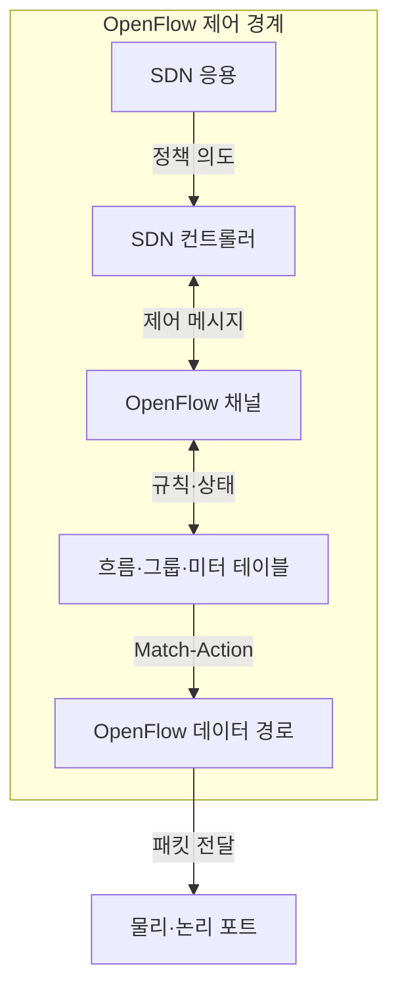
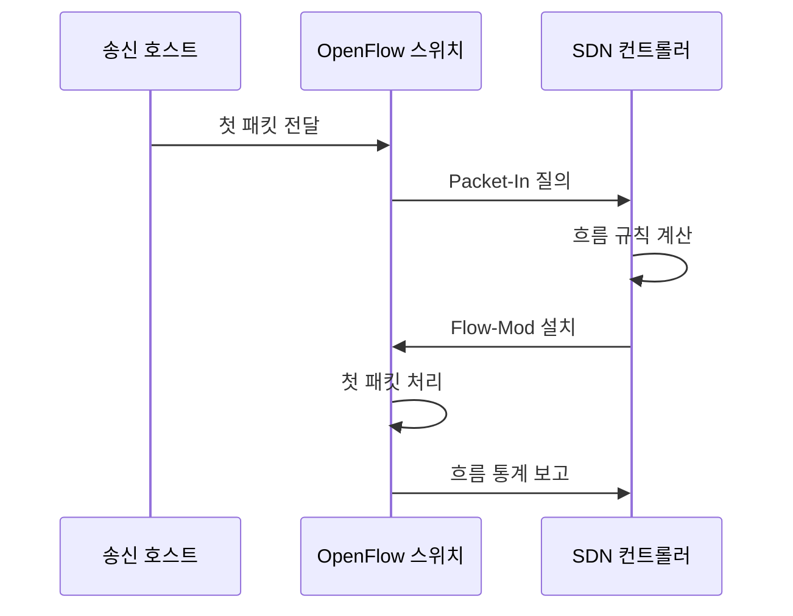

---
sidebar:
  order: 58
  label: "058. SDN 컨트롤러와 OpenFlow (SDN Controller & OpenFlow)"
  badge:
    text: "기출 · 30%"
    variant: note
title: "SDN 컨트롤러와 OpenFlow (SDN Controller & OpenFlow)"
date: "2026-07-27T23:59:59+09:00"
tags:
  - "notes-network"
weight: 58
extra:
  question_no: "058"
  source_status: "기출"
  source_history: "129회, 131회"
  priority: 30
  priority_note: "설명형: Controller·OpenFlow 제어 경계"
---

## 미리 알고가기

- **소프트웨어 정의 네트워킹(Software-Defined Networking, SDN)**: ‘에스디엔’으로 읽고 세 영문 핵심어의 머리글자를 딴 표기이며 제어·데이터 평면을 분리하고 개방 API로 망을 프로그래밍함
- **오픈플로(OpenFlow)**: ‘오픈플로’로 읽는 공식 프로토콜 이름으로 별도 약어 확장을 만들지 않으며 SDN 컨트롤러와 스위치가 흐름 규칙·포트·통계를 교환함
- **일치-동작(Match-Action)**: 조건과 실행 동작을 붙임표로 이은 표기이며 패킷 헤더가 일치하면 전달·폐기·수정 같은 동작을 실행함
- **패킷 입력(Packet-In)·흐름 수정(Flow-Mod)**: 붙임표로 메시지 유형을 나타내며 Packet-In은 미일치 패킷을 컨트롤러에 알리고 Flow-Mod는 흐름 규칙을 변경함
- **테이블 불일치(Table-Miss)**: 붙임표로 상태를 잇는 표기이며 패킷이 흐름 테이블의 어떤 규칙과도 일치하지 않는 상태임
- **삼진 내용 주소화 메모리(Ternary Content-Addressable Memory, TCAM)**: ‘티캠’으로 읽고 네 영문 핵심어의 머리글자를 딴 표기이며 0·1·무관 비트를 병렬 비교해 흐름 규칙을 찾음
- **삼진 비트(0·1·무관)**: ‘영·일·무관’으로 읽고 세 상태를 가운데점으로 병기한 표기이며 TCAM이 정확 일치와 마스크 조건을 한 번에 검색하게 함
- **그룹·미터 테이블(Group·Meter Table)**: 그룹은 복수 출력·장애 전환을, 미터는 흐름별 전송률 제한·표시·폐기를 실행함
- **유휴 제한 시간(Idle Timeout)**: 흐름에 일치하는 패킷이 없을 때 규칙을 제거하기까지의 시간임

## Ⅰ. 개요

- **정의/개념**: 컨트롤러가 경로를 계산하고 **OpenFlow로 규칙 제어**
- **배경/필요성**: 장비별 설정은 **중앙 정책의 Match-Action 반영 곤란**

### 쉽게 이해하기 (학습용)

- 컨트롤러가 길을 정하면 OpenFlow가 스위치에 어떤 패킷을 어디로 보낼지 규칙을 전달한다

## Ⅱ. 특징

- **다단 Match-Action 테이블**로 패킷 동작을 실행한다.
- **Table-Miss→Packet-In→Flow-Mod**로 규칙을 설치한다.
- **Group·Meter**는 경로·속도를 제어하나 Packet-In 폭증에 취약하다.

### 쉽게 이해하기 (학습용)

- 스위치가 모르는 패킷을 모두 컨트롤러에 물으면 질문이 몰려 제어기가 느려질 수 있다

## Ⅲ. 아키텍처 및 구성요소

| 설계 요소 | 설명 |
|:---|:---|
| SDN 응용 | **연결·보안·품질 정책 요청** |
| SDN 컨트롤러 | **전역 상태로 흐름 규칙 계산** |
| OpenFlow 채널 | **컨트롤러·스위치 제어 교환** |
| 흐름·그룹·미터 테이블 | **조건·동작·경로·속도 저장** |
| OpenFlow 데이터 경로 | **규칙 실행·통계 계수** |

> 요약: 컨트롤러가 OpenFlow로 규칙 제어

### 쉽게 이해하기 (학습용)

- 응용의 정책을 컨트롤러가 규칙으로 바꾸고 스위치의 여러 표가 패킷마다 동작을 실행한다

## Ⅳ. 원리 및 절차 흐름도

| 절차 | 설명 |
|:---|:---|
| 첫 패킷 전달 | 흐름 테이블에서 일치 규칙 조회 |
| Packet-In 질의 | Table-Miss 패킷 정보를 제어기에 전달 |
| 흐름 규칙 계산 | 토폴로지·정책으로 출력 동작 결정 |
| Flow-Mod 설치 | 우선순위·시간 제한과 규칙을 배포 |
| 첫 패킷 처리 | 설치 규칙으로 보류 패킷 전달 |
| 흐름 통계 보고 | 패킷·바이트 수로 정책 결과 관측 |

> 요약: 불일치 패킷을 질의해 규칙을 설치

### 쉽게 이해하기 (학습용)

- 처음 보는 패킷은 컨트롤러에 길을 묻고 규칙이 생긴 뒤부터 스위치가 혼자 빠르게 처리한다

## Ⅴ. 종류 및 비교

| OpenFlow 규칙 설치 | 반응형 제어 | 선제형 제어 |
|:---|:---|:---|
| 적용 기준 | 미지·단기 흐름의 동적 제어 | 핵심·반복 경로의 즉시 전달 |
| 핵심 특징 | Packet-In 후 규칙 설치 | 트래픽 전에 규칙 설치 |
| 한계 | 첫 패킷 지연·제어기 폭주 | TCAM 점유·규칙 노후화 |

> 요약: 기본 규칙은 선제형, 예외 플로우는 반응형 적합

### 쉽게 이해하기 (학습용)

- 늘 쓰는 길은 미리 깔고 예외적인 길만 첫 패킷이 왔을 때 만들면 지연과 메모리를 나눌 수 있다

## Ⅵ. 실무 사례

1. 미지 트래픽은 **Packet-In 제한·기본 폐기**
2. 핵심 서비스는 **선제 규칙·유휴 시간 분리**

### 쉽게 이해하기 (학습용)

- 모르는 패킷이 몰려도 컨트롤러 질문 수를 제한하고 나머지는 스위치에서 버린다
- 항상 쓰는 서비스 길은 미리 설치하고 잠깐 쓰는 길만 일정 시간 후 지운다

## Ⅶ. 결론

- 즉시 전달은 **선제형**, 미지·단기 흐름은 **반응형**

### 쉽게 이해하기 (학습용)

- 첫 패킷을 늦출 수 없으면 미리 설치하고 규칙 메모리가 부족하면 필요한 때만 설치한다
