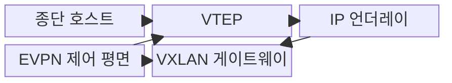
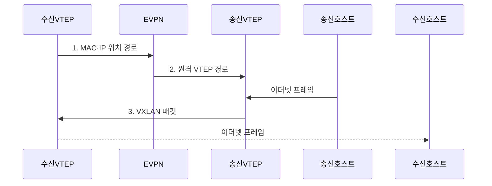

---
sidebar:
  order: 59
  label: "059. VXLAN과 오버레이 네트워크 (VXLAN Overlay Network)"
  badge:
    text: "기출 · 50%"
    variant: note
title: "VXLAN과 오버레이 네트워크 (VXLAN Overlay Network)"
date: "2026-07-31T10:59:30+09:00"
tags:
  - "notes-network"
weight: 59
extra:
  question_no: "059"
  source_status: "기출"
  source_history: "123회"
  priority: 50
  priority_note: "설계형: 123회 VXLAN과 EVPN 통합 우산"
---

## 미리 알고가기

- **사용자 데이터그램 프로토콜(User Datagram Protocol, UDP)**: 연결 설정 없이 데이터그램을 전달하는 전송 계층 프로토콜
- **인터넷 프로토콜(Internet Protocol, IP)**: 주소를 이용해 서로 다른 네트워크 사이에 패킷을 전달하는 프로토콜
- **매체 접근 제어 주소(Media Access Control Address, MAC Address)**: 이더넷 인터페이스를 식별하는 주소
- **계층 기호(L2·L3)**: L2는 이더넷 프레임 전달, L3는 IP 패킷 라우팅 계층
- **가상 확장 근거리망(Virtual eXtensible Local Area Network, VXLAN)**: 이더넷 프레임을 UDP/IP로 캡슐화해 3계층망 위에 2계층 오버레이를 만드는 기술
- **VXLAN 네트워크 식별자(VXLAN Network Identifier, VNI)**: VXLAN 논리 세그먼트를 구분하는 24비트 식별자
- **VXLAN 터널 종단점(VXLAN Tunnel Endpoint, VTEP)**: 이더넷 프레임의 VXLAN 캡슐화·역캡슐화를 수행하는 장치
- **경계 경로 프로토콜(Border Gateway Protocol, BGP)**: 네트워크 간 도달 경로를 교환하는 경로 제어 프로토콜
- **이더넷 가상 사설망(Ethernet Virtual Private Network, EVPN)**: BGP로 MAC·IP와 VTEP 위치 정보를 배포하는 제어 평면
- **언더레이(Underlay)**: VTEP 사이 IP 도달성과 물리 전송 경로를 제공하는 기반망
- **오버레이(Overlay)**: 언더레이 위의 터널로 논리적 연결과 테넌트 분리를 제공하는 가상망
- **동일 비용 다중 경로(Equal-Cost Multi-Path, ECMP)**: 비용이 같은 여러 IP 경로로 흐름을 분산하는 방식
- **방송·미상 유니캐스트·멀티캐스트(Broadcast, Unknown Unicast, Multicast, BUM)**: 목적 VTEP를 하나로 정할 수 없어 복제 전달이 필요한 트래픽
- **최대 전송 단위(Maximum Transmission Unit, MTU)**: 한 링크에서 분할 없이 보낼 수 있는 최대 패킷 크기
- **가상 근거리망·식별자(Virtual Local Area Network·VLAN Identifier, VLAN·VID)**: 하나의 물리망을 논리적으로 분리하고 각 영역을 식별하는 기술과 값
- **테넌트(Tenant)**: 공유 인프라에서 독립된 논리 자원과 정책을 사용하는 고객 영역

> **키워드:** VXLAN과 오버레이 네트워크 (VXLAN Overlay Network)

## Ⅰ. 개요

- 정의/개념: 이더넷 프레임을 **UDP/IP로 캡슐화한 L2 오버레이**
- 배경/필요성: VLAN 12비트 식별자와 광역 L2 확장으로 **테넌트 규모·장애 격리** 제약

### 쉽게 이해하기 (학습용)

- 서버의 이더넷 프레임을 IP 소포에 넣어 멀리 떨어진 데이터센터 스위치까지 운반한다

## Ⅱ. 특징

- **24비트 VNI**를 통한 대규모 테넌트 논리망 분리
- **VTEP의 UDP/IP 캡슐화**를 통한 L3 언더레이·ECMP 활용
- **EVPN 위치 배포**에 따른 BUM 감소와 캡슐화 MTU 요구

### 쉽게 이해하기 (학습용)

- VNI가 같은 세입자끼리 묶고 EVPN이 목적 서버가 어느 터널 끝에 있는지 알려 준다

## Ⅲ. 구조 및 구성요소

| 구성요소 | 책임 |
|:---|:---|
| 종단 호스트 | 원본 **이더넷 프레임** 송수신 |
| VTEP | VNI별 **캡슐화·역캡슐화** |
| IP 언더레이 | VTEP 간 **도달성·ECMP** 제공 |
| EVPN 제어 평면 | **MAC·IP·VTEP 위치** 배포 |
| VXLAN 게이트웨이 | VNI 간 **패킷 라우팅** |

### 쉽게 이해하기 (학습용)

- EVPN이 목적 서버의 터널 끝을 알려 주면 송신 VTEP가 프레임을 싸서 IP망으로 보낸다

## Ⅳ. 흐름도

**동작 원리**

1. **MAC·IP 위치 경로**: 수신 VTEP가 종단 호스트의 위치를 EVPN에 광고
2. **원격 VTEP 경로**: EVPN이 목적 MAC과 원격 VTEP 대응 정보를 배포
3. **VXLAN 패킷**: 송신 VTEP가 VNI·UDP·IP 헤더를 붙여 원격 VTEP로 전달

### 쉽게 이해하기 (학습용)

- 목적 서버 위치를 알면 한 터널로 보내고 모르면 필요한 VTEP들에 프레임을 복제한다

## Ⅴ. 종류 및 비교

| 네트워크 세그먼트 | VXLAN | VLAN |
|:---|:---|:---|
| 적용 기준 | 대규모 **테넌트·다중 경로** | 소규모 **단일 L2 영역** |
| 핵심 특징 | 24비트 VNI·**L3 터널** | 12비트 VID·**L2 구간** |
| 한계 | MTU·BUM·**제어 평면 복잡성** | **식별자 한계·광역 L2 장애 확산** |

> 요약: 소규모 단일 L2는 **VLAN**, 대규모 오버레이는 **VXLAN**

### 쉽게 이해하기 (학습용)

- 한 건물의 작은 망은 VLAN, IP망을 넘어 많은 세입자를 나누려면 VXLAN이 맞다

## Ⅵ. 실무 고려사항 및 대책

| 고려사항 | 대책 | 효과 |
|:---|:---|:---|
| 캡슐화 헤더로 언더레이 MTU를 초과하면 패킷 폐기 | VXLAN 헤더를 포함해 **언더레이 MTU** 설정 | 단편화·폐기를 방지해 **전송 안정성** 확보 |
| 미지 목적지 학습이 부족하면 BUM 복제 폭증 | EVPN으로 **MAC·IP 위치 경로** 배포 | 불필요한 **복제 트래픽** 감소 |
| VTEP 간 언더레이 단절로 오버레이 경로 상실 | ECMP·신속 장애 감지·**경로 재수렴** 시험 | 경로 장애 중 **오버레이 가용성** 유지 |

### 쉽게 이해하기 (학습용)

- 원래 프레임에 터널 포장이 더해져도 잘리지 않도록 물리망의 최대 패킷 크기를 키운다

## Ⅶ. 결론

- 대규모 테넌트·L3 확장은 **EVPN VXLAN**, 소규모 단일 구간은 **VLAN** 선택

### 쉽게 이해하기 (학습용)

- 대규모 논리망의 이득과 터널 헤더·BUM 복제 비용을 함께 감당할 수 있어야 한다.
