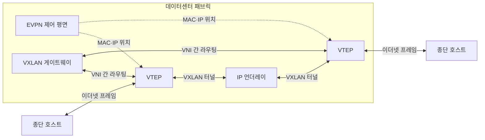
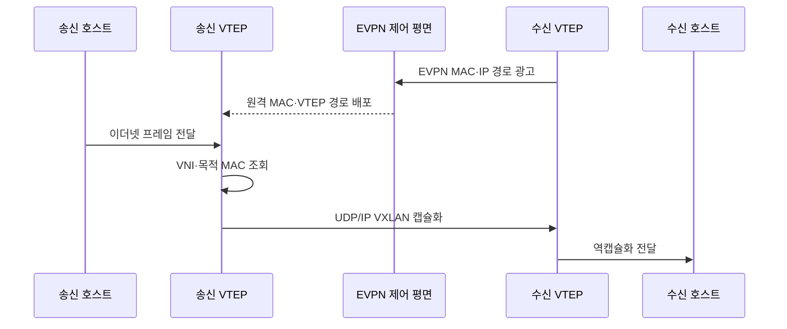

---
sidebar:
  order: 59
  label: "059. VXLAN과 오버레이 네트워크 (VXLAN Overlay Network)"
  badge:
    text: "기출 · 50%"
    variant: note
title: "VXLAN과 오버레이 네트워크 (VXLAN Overlay Network)"
date: "2026-07-27T23:59:59+09:00"
tags:
  - "notes-network"
weight: 59
extra:
  question_no: "059"
  source_status: "기출"
  source_history: "123회"
  priority: 50
  priority_note: "설계형: 123회 VXLAN과 EVPN 통합 우산"
---

## 미리 알고가기

- **가상 확장 근거리망(Virtual eXtensible Local Area Network, VXLAN)**: 이더넷 프레임을 UDP/IP로 캡슐화해 3계층망 위에 2계층 오버레이를 만드는 기술
- **VXLAN 네트워크 식별자(VXLAN Network Identifier, VNI)**: VXLAN 논리 세그먼트를 구분하는 24비트 식별자
- **VXLAN 터널 종단점(VXLAN Tunnel Endpoint, VTEP)**: 이더넷 프레임의 VXLAN 캡슐화·역캡슐화를 수행하는 장치
- **이더넷 가상 사설망(Ethernet Virtual Private Network, EVPN)**: BGP로 MAC·IP와 VTEP 위치 정보를 배포하는 제어 평면
- **언더레이(Underlay)**: VTEP 사이 IP 도달성과 물리 전송 경로를 제공하는 기반망
- **오버레이(Overlay)**: 언더레이 위의 터널로 논리적 연결과 테넌트 분리를 제공하는 가상망
- **동일 비용 다중 경로(Equal-Cost Multi-Path, ECMP)**: 비용이 같은 여러 IP 경로로 흐름을 분산하는 방식
- **방송·미상 유니캐스트·멀티캐스트(Broadcast, Unknown Unicast, Multicast, BUM)**: 목적 VTEP를 하나로 정할 수 없어 복제 전달이 필요한 트래픽
- **최대 전송 단위(Maximum Transmission Unit, MTU)**: 한 링크에서 분할 없이 보낼 수 있는 최대 패킷 크기
- **핵심 약어 읽기와 표기**: VXLAN은 브이엑스랜으로 읽고 확장성을 뜻하는 eXtensible의 X를 강조한 머리글자 표기이며, VNI는 브이엔아이, VTEP는 브이텝, EVPN은 이브이피엔으로 읽고 각각 논리망 식별·터널 종단·위치 정보 배포 역할을 나타냄
- **전송 약어 읽기와 표기**: UDP·IP·BGP·MAC·ECMP·BUM·MTU는 유디피·아이피·비지피·맥·이씨엠피·범·엠티유로 읽고, 영문 머리글자로 캡슐화 전송·경로 배포·주소·다중 경로·복제 트래픽·패킷 크기 역할을 구분함
- **계층 기호(L2·L3, 엘투·엘쓰리)**: Layer의 L과 계층 번호를 결합한 표기이며, L2는 이더넷 전달, L3는 IP 라우팅 계층을 뜻함

## Ⅰ. 개요

- 정의/개념: 이더넷 프레임을 **UDP/IP로 캡슐화한 L2 오버레이**
- **배경/필요성**: VLAN은 **12비트 식별자·L2 장애 범위 확장 한계**

### 쉽게 이해하기 (학습용)

- 서버의 이더넷 프레임을 IP 소포에 넣어 멀리 떨어진 데이터센터 스위치까지 운반한다

## Ⅱ. 특징

- **24비트 VNI**로 대규모 테넌트 논리망을 분리한다.
- **VTEP의 UDP/IP 캡슐화**로 L3 언더레이·ECMP를 활용한다.
- **EVPN 위치 배포**는 BUM을 줄이나 캡슐화 MTU가 필요하다.

### 쉽게 이해하기 (학습용)

- VNI가 같은 세입자끼리 묶고 EVPN이 목적 서버가 어느 터널 끝에 있는지 알려 준다

## Ⅲ. 아키텍처 및 구성요소

| 설계 요소 | 설명 |
|:---|:---|
| VTEP | **VNI별 캡슐화·역캡슐화** |
| IP 언더레이 | **VTEP 도달성·ECMP 제공** |
| EVPN 제어 평면 | **MAC·IP·VTEP 위치 배포** |
| VXLAN 게이트웨이 | **VNI 간 패킷 라우팅** |

> 요약: VTEP가 캡슐화하고 EVPN이 위치를 관리한다

### 쉽게 이해하기 (학습용)

- EVPN이 목적 서버의 터널 끝을 알려 주면 송신 VTEP가 프레임을 싸서 IP망으로 보낸다

## Ⅳ. 원리 및 절차 흐름도

| 절차 | 설명 |
|:---|:---|
| EVPN MAC·IP 경로 광고 | 수신 VTEP가 종단 위치를 광고 |
| 원격 MAC·VTEP 경로 배포 | EVPN이 송신 VTEP에 경로 전달 |
| 이더넷 프레임 전달 | 송신 호스트가 원래 프레임 전송 |
| VNI·목적 MAC 조회 | 설치된 경로로 원격 VTEP 확인 |
| UDP/IP VXLAN 캡슐화 | VNI·UDP·IP 헤더를 붙여 전달 |
| 역캡슐화 전달 | 수신 VTEP가 헤더를 벗겨 호스트 전달 |

> 요약: VTEP 위치를 찾아 캡슐화해 언더레이로 보낸다

### 쉽게 이해하기 (학습용)

- 목적 서버 위치를 알면 한 터널로 보내고 모르면 필요한 VTEP들에 프레임을 복제한다

## Ⅴ. 종류 및 비교

| 네트워크 세그먼트 | VXLAN | VLAN |
|:---|:---|:---|
| 적용 기준 | 대규모 테넌트·다중 경로 | 소규모 단일 L2 영역 |
| 핵심 특징 | 24비트 VNI·L3 터널 | 12비트 VID·L2 구간 |
| 한계 | MTU·BUM·제어 평면 복잡성 | 식별자·장애 범위 확장 한계 |

> 요약: 소규모는 VLAN, 대규모 오버레이는 VXLAN이다

### 쉽게 이해하기 (학습용)

- 한 건물의 작은 망은 VLAN, IP망을 넘어 많은 세입자를 나누려면 VXLAN이 맞다

## Ⅵ. 실무 사례

1. VXLAN 헤더만큼 **언더레이 MTU 확대**
2. EVPN 경로 정책으로 **테넌트 VNI 격리**

### 쉽게 이해하기 (학습용)

- 원래 프레임에 터널 포장이 더해져도 잘리지 않도록 물리망의 최대 패킷 크기를 키운다
- 다른 세입자의 위치 정보가 섞이지 않도록 VNI별 EVPN 경로를 분리한다

## Ⅶ. 결론

- 소규모 L2는 **VLAN**, 대규모 오버레이는 **VXLAN**

### 쉽게 이해하기 (학습용)

- 많은 논리망이 필요하고 터널 크기와 복제 트래픽을 감당할 때 VXLAN을 선택한다
