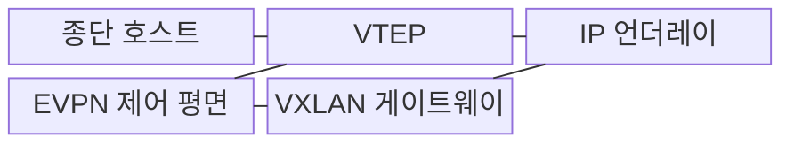
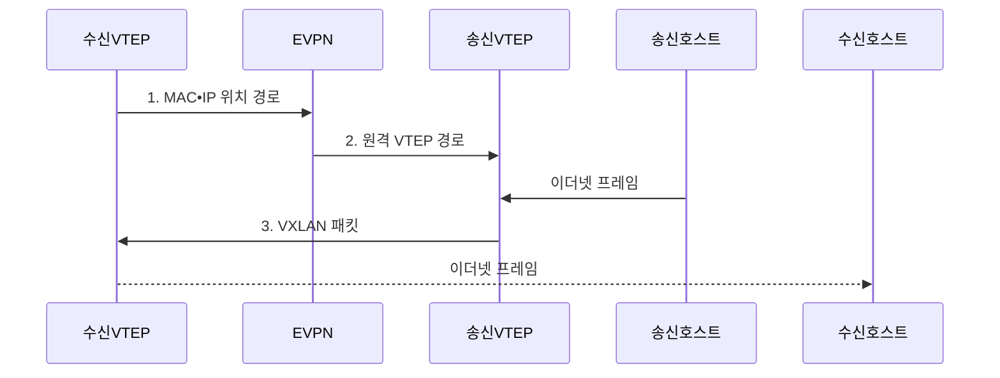

---
sidebar:
  order: 59
  label: "059. VXLAN과 오버레이 네트워크 (VXLAN Overlay Network)"
  badge:
    text: "기출 • 50%"
    variant: note
title: "VXLAN과 오버레이 네트워크 (VXLAN Overlay Network)"
date: "2026-08-04T17:16:00+09:00"
tags:
  - "notes-network"
weight: 59
extra:
  question_no: "059"
  source_status: "기출"
  source_history: "123회"
  priority: 50
  priority_note: "설계형: 123회 VXLAN과 EVPN 통합 우산"
---

## Ⅰ. 개요

핵심 용어

- **가상 확장 근거리 통신망(Virtual Extensible LAN, VXLAN)**: 이더넷 프레임을 UDP/IP로 캡슐화해 L3 위에 L2 오버레이를 구성하는 기술
- **가상 근거리 통신망(Virtual LAN, VLAN)**: 12비트 식별자로 하나의 물리 L2 구간을 논리적으로 분리하는 기술
- **사용자 데이터그램 프로토콜(User Datagram Protocol, UDP)**: 비연결형 데이터그램 전송 프로토콜
- **인터넷 프로토콜(Internet Protocol, IP)**: 패킷 주소 지정과 전달을 담당하는 프로토콜
- **계층 3(Layer 3, L3)**: 패킷의 주소 지정과 경로 선택을 담당하는 계층
- **계층 2(Layer 2, L2)**: 동일 링크의 프레임 전달을 담당하는 계층

- 정의/개념: 이더넷 프레임을 **UDP/IP로 캡슐화한 L2 오버레이**
- 배경/필요성: VLAN 12비트 식별자와 광역 L2 확장으로 **테넌트 규모•장애 격리** 제약

#### 한줄 요약

- 서버의 이더넷 프레임을 IP 소포에 넣어 멀리 떨어진 데이터센터 스위치까지 운반한다

## Ⅱ. 특징

핵심 용어

- **VXLAN 네트워크 식별자(VXLAN Network Identifier, VNI)**: 논리 세그먼트와 테넌트를 구분하는 24비트 식별자
- **이더넷 가상 사설망(Ethernet Virtual Private Network, EVPN)**: BGP로 MAC•IP•VTEP 위치를 배포하는 제어 평면
- **경계 경로 프로토콜(Border Gateway Protocol, BGP)**: 자율시스템 간 경로 정보를 교환하는 프로토콜
- **매체 접근 제어(Media Access Control, MAC)**: 공유 매체 접근과 프레임 전달을 제어하는 계층
- **VXLAN 터널 종단점(VXLAN Tunnel Endpoint, VTEP)**: VXLAN 캡슐화와 역캡슐화를 수행하는 장치
- **등가 비용 다중 경로(Equal-Cost Multi-Path, ECMP)**: 동일 비용의 여러 L3 경로에 트래픽을 분산하는 방식
- **최대 전송 단위(Maximum Transmission Unit, MTU)**: 링크에서 분할 없이 보낼 수 있는 최대 패킷 크기
- **BUM 트래픽(Broadcast, Unknown Unicast, Multicast Traffic)**: 목적지를 특정할 수 없어 여러 종단에 복제하는 트래픽

- **24비트 VNI 기반 대규모 테넌트 논리망 분리**
- **VTEP UDP•IP 캡슐화 기반 L3 언더레이•ECMP 활용**
- **EVPN 위치 배포에 따른 BUM 감소와 캡슐화 MTU 요구**

#### 한줄 요약

- VNI가 같은 세입자끼리 묶고 EVPN이 목적 서버가 어느 터널 끝에 있는지 알려 준다

## Ⅲ. 구조 및 구성요소

핵심 용어

- **언더레이**: VTEP 사이의 IP 도달성을 제공하는 물리 기반망
- **오버레이**: 언더레이 위의 터널로 논리 연결을 제공하는 가상망

| 구성요소 | 책임 |
|:---|:---|
| 종단 호스트 | 원본 **이더넷 프레임** 송수신 |
| VTEP | VNI별 **캡슐화•역캡슐화** |
| IP 언더레이 | VTEP 간 **도달성•ECMP** 제공 |
| EVPN 제어 평면 | **MAC•IP•VTEP 위치** 배포 |
| VXLAN 게이트웨이 | VNI 간 **패킷 라우팅** |

#### 한줄 요약

- EVPN이 목적 서버의 터널 끝을 알려 주면 송신 VTEP가 프레임을 싸서 IP망으로 보낸다

## Ⅳ. 흐름도

핵심 용어

- **MAC•IP 위치 경로**: 종단 주소와 수용 VTEP를 연결해 EVPN으로 배포하는 정보
- **VXLAN 패킷**: 원본 프레임에 VNI•UDP•IP 헤더를 붙인 캡슐화 패킷

**동작 원리**

1. **MAC•IP 위치 경로**: 수신 VTEP가 종단 호스트의 위치를 EVPN에 광고
2. **원격 VTEP 경로**: EVPN이 목적 MAC과 원격 VTEP 대응 정보를 배포
3. **VXLAN 패킷**: 송신 VTEP가 VNI•UDP•IP 헤더를 붙여 원격 VTEP로 전달

#### 한줄 요약

- 목적 서버 위치를 알면 한 터널로 보내고 모르면 필요한 VTEP들에 프레임을 복제한다

## Ⅴ. 종류 및 비교

핵심 용어

- **VLAN 식별자(VLAN Identifier, VID)**: VLAN을 구분하는 12비트 식별자

| 네트워크 세그먼트 | VXLAN | VLAN |
|:---|:---|:---|
| 적용 기준 | 대규모 **테넌트•다중 경로** | 소규모 **단일 L2 영역** |
| 핵심 특징 | 24비트 VNI•**L3 터널** | 12비트 VID•**L2 구간** |
| 한계 | MTU•BUM•**제어 평면 복잡성** | **식별자 한계•광역 L2 장애 확산** |

> 요약: 소규모 단일 L2는 **VLAN**, 대규모 오버레이는 **VXLAN**

#### 한줄 요약

- 한 건물의 작은 망은 VLAN, IP망을 넘어 많은 세입자를 나누려면 VXLAN이 맞다

## Ⅵ. 실무 고려사항 및 대책

| 문제 | 대책 | 효과 |
|:---|:---|:---|
| 캡슐화 헤더로 언더레이 MTU를 초과하면 패킷 폐기 | VXLAN 헤더를 포함해 **언더레이 MTU** 설정 | 단편화•폐기를 방지해 **전송 안정성** 확보 |
| 미지 목적지 학습이 부족하면 BUM 복제 폭증 | EVPN으로 **MAC•IP 위치 경로** 배포 | 불필요한 **복제 트래픽** 감소 |
| VTEP 간 언더레이 단절로 오버레이 경로 상실 | ECMP•신속 장애 감지•**경로 재수렴** 시험 | 경로 장애 중 **오버레이 가용성** 유지 |

#### 한줄 요약

- 원래 프레임에 터널 포장이 더해져도 잘리지 않도록 물리망의 최대 패킷 크기를 키운다

## Ⅶ. 결론

- 대규모 테넌트•L3 확장은 **EVPN VXLAN**, 소규모 단일 구간은 **VLAN** 선택

#### 한줄 요약

- 대규모 논리망의 이득과 터널 헤더•BUM 복제 비용을 함께 감당할 수 있어야 한다.
